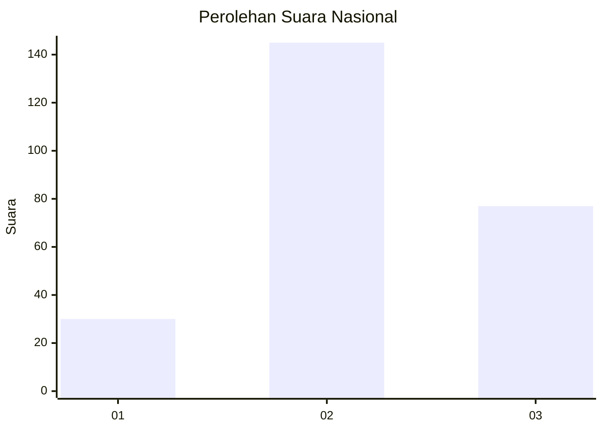
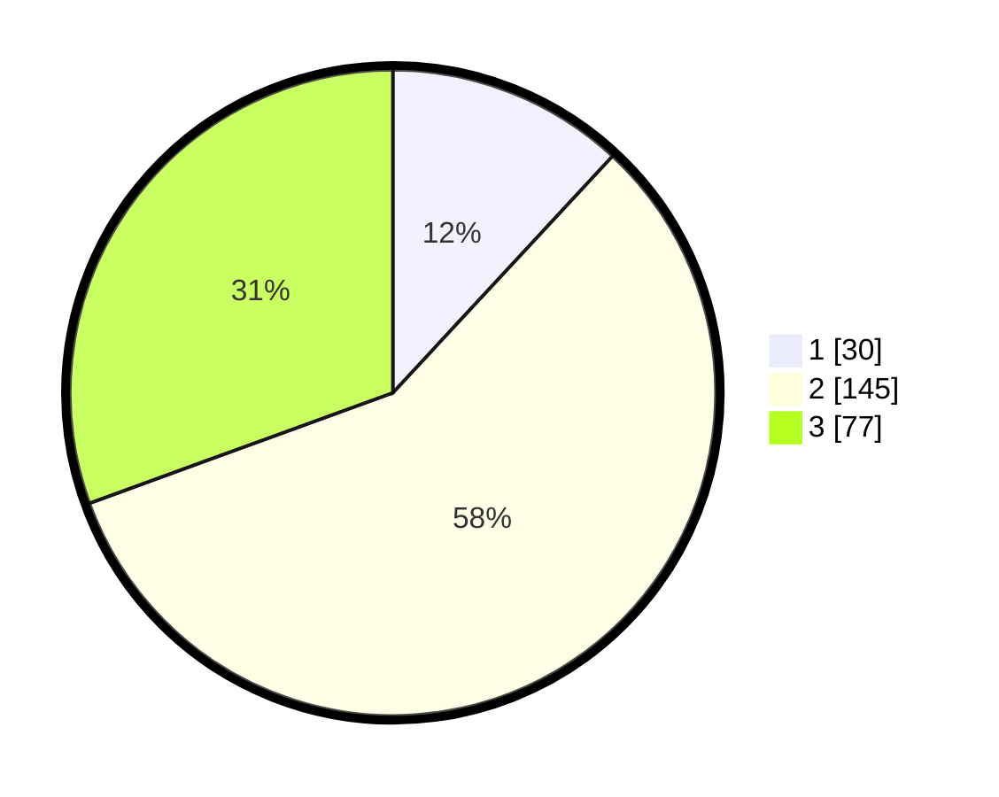

# Hasil

## Grafik

## Tabel

| No. | Nama Paslon    | Suara | Suara (raw) | Persentase |
|:--- |:-------------- | -----:| -----------:| ----------:|
| 1   | ANIES MUHAIMIN | 30    | [30][p-1]   | 11,90      |
| 2   | PRABOWO GIBRAN | 145   | [145][p-2]  | 57,54      |
| 3   | GANJAR MAHFUD  | 77    | [77][p-3]   | 30,56      |

[p-1]: https://github.com/gigit-pemilu/pemilu-2024/blob/main/pilpres/hitung-suara/sub/34-di-yogyakarta/sub/02-bantul/sub/05-bambanglipuro/sub/2003-sumbermulyo/sub/007-tps/sub/paslon-1.txt
[p-2]: https://github.com/gigit-pemilu/pemilu-2024/blob/main/pilpres/hitung-suara/sub/34-di-yogyakarta/sub/02-bantul/sub/05-bambanglipuro/sub/2003-sumbermulyo/sub/007-tps/sub/paslon-2.txt
[p-3]: https://github.com/gigit-pemilu/pemilu-2024/blob/main/pilpres/hitung-suara/sub/34-di-yogyakarta/sub/02-bantul/sub/05-bambanglipuro/sub/2003-sumbermulyo/sub/007-tps/sub/paslon-3.txt

## Foto C Plano

https://sirekap-obj-formc.kpu.go.id/5013/pemilu/ppwp/34/02/05/20/03/3402052003007-20240214-155157--ecc92e36-d631-48fd-b9b5-d2173ead2bb9.jpg

https://sirekap-obj-formc.kpu.go.id/5013/pemilu/ppwp/34/02/05/20/03/3402052003007-20240214-155214--738d810f-77a3-49fc-8322-c5d48548395f.jpg

https://sirekap-obj-formc.kpu.go.id/5013/pemilu/ppwp/34/02/05/20/03/3402052003007-20240214-155144--4f4998dc-1ab2-4871-b038-c3e50b068a74.jpg

## Metadata

| Key        | Value               |
| ---------- | ------------------- |
| Time Stamp | 2024-02-24 22:31:28 |

