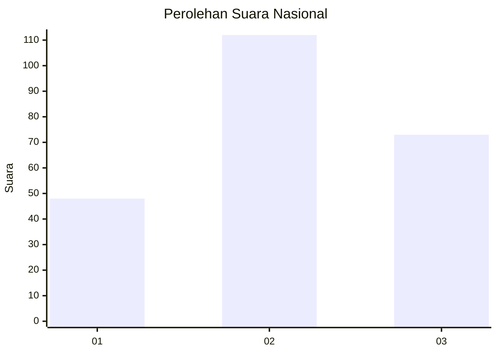
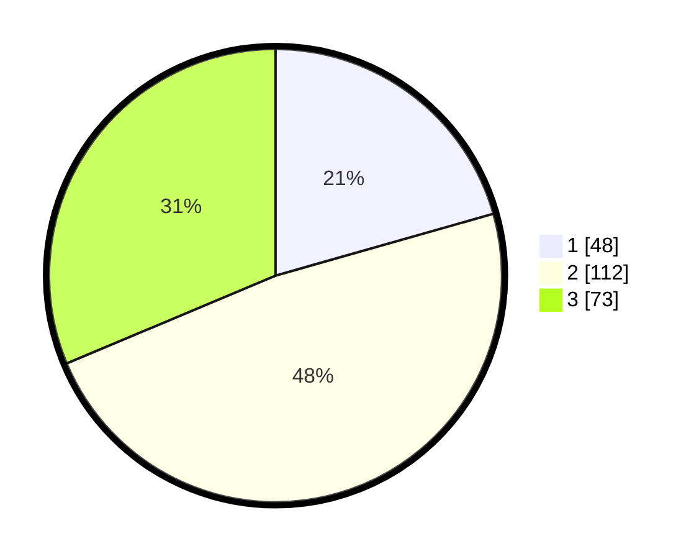

# Hasil

## Grafik

## Tabel

| No. | Nama Paslon    | Suara | Suara (raw) | Persentase |
|:--- |:-------------- | -----:| -----------:| ----------:|
| 1   | ANIES MUHAIMIN | 48    | [48][p-1]   | 20,60      |
| 2   | PRABOWO GIBRAN | 112   | [112][p-2]  | 48,07      |
| 3   | GANJAR MAHFUD  | 73    | [73][p-3]   | 31,33      |

[p-1]: https://github.com/gigit-pemilu/pemilu-2024/blob/main/pilpres/hitung-suara/sub/34-di-yogyakarta/sub/02-bantul/sub/05-bambanglipuro/sub/2003-sumbermulyo/sub/009-tps/sub/paslon-1.txt
[p-2]: https://github.com/gigit-pemilu/pemilu-2024/blob/main/pilpres/hitung-suara/sub/34-di-yogyakarta/sub/02-bantul/sub/05-bambanglipuro/sub/2003-sumbermulyo/sub/009-tps/sub/paslon-2.txt
[p-3]: https://github.com/gigit-pemilu/pemilu-2024/blob/main/pilpres/hitung-suara/sub/34-di-yogyakarta/sub/02-bantul/sub/05-bambanglipuro/sub/2003-sumbermulyo/sub/009-tps/sub/paslon-3.txt

## Foto C Plano

https://sirekap-obj-formc.kpu.go.id/22a7/pemilu/ppwp/34/02/05/20/03/3402052003009-20240217-154829--a987807d-1566-4013-87df-6c8e06fa8f9f.jpg

https://sirekap-obj-formc.kpu.go.id/22a7/pemilu/ppwp/34/02/05/20/03/3402052003009-20240217-154655--f6515155-8dc4-4de3-8461-9576bb330968.jpg

https://sirekap-obj-formc.kpu.go.id/22a7/pemilu/ppwp/34/02/05/20/03/3402052003009-20240217-154957--f3c6926f-209b-4d09-8701-46eb8c376166.jpg

## Metadata

| Key        | Value               |
| ---------- | ------------------- |
| Time Stamp | 2024-02-19 11:00:00 |

