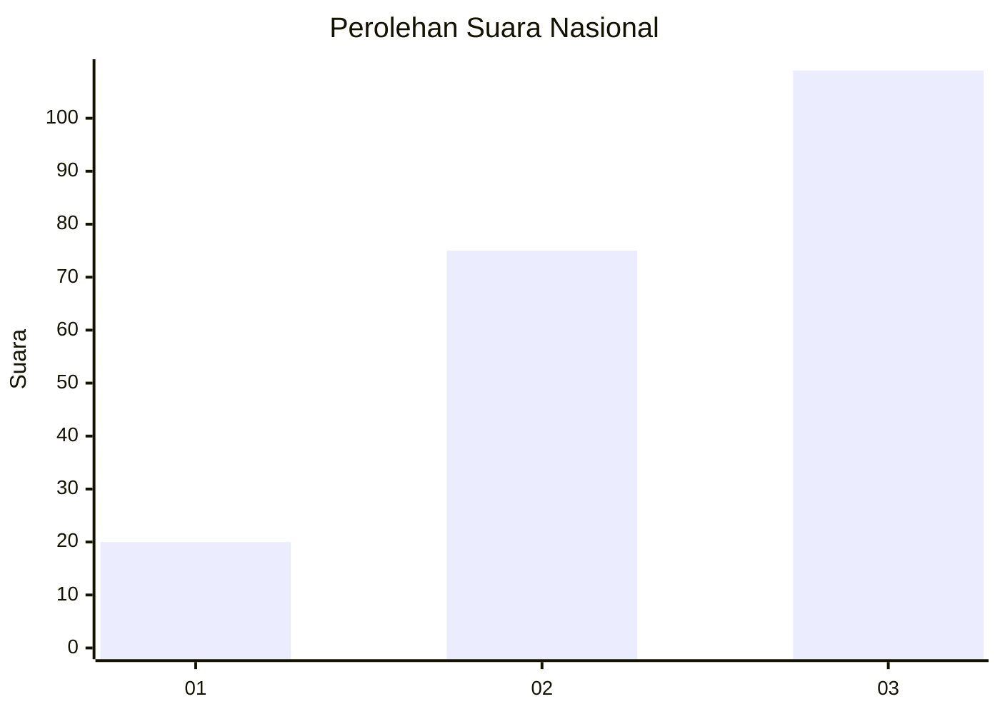
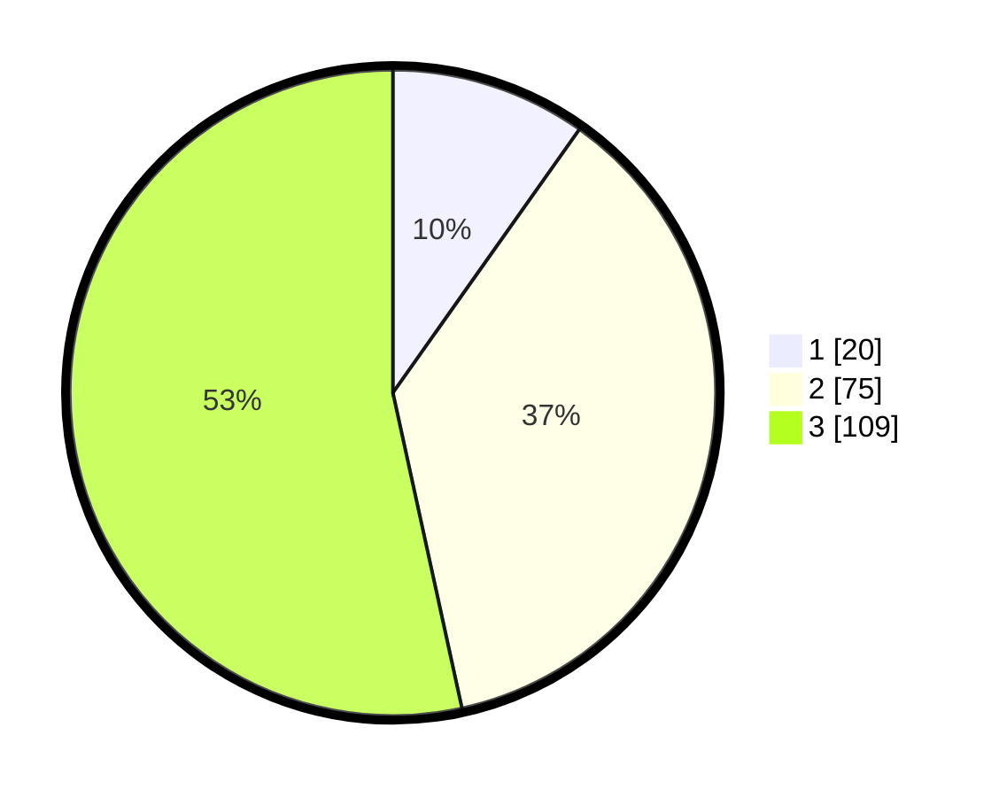

# Hasil

## Grafik

## Tabel

| No. | Nama Paslon    | Suara | Suara (raw) | Persentase |
|:--- |:-------------- | -----:| -----------:| ----------:|
| 1   | ANIES MUHAIMIN | 20    | [20][p-1]   | 9,80       |
| 2   | PRABOWO GIBRAN | 75    | [75][p-2]   | 36,76      |
| 3   | GANJAR MAHFUD  | 109   | [109][p-3]  | 53,43      |

[p-1]: https://github.com/gigit-pemilu/pemilu-2024/blob/main/pilpres/hitung-suara/sub/34-di-yogyakarta/sub/02-bantul/sub/05-bambanglipuro/sub/2003-sumbermulyo/sub/019-tps/sub/paslon-1.txt
[p-2]: https://github.com/gigit-pemilu/pemilu-2024/blob/main/pilpres/hitung-suara/sub/34-di-yogyakarta/sub/02-bantul/sub/05-bambanglipuro/sub/2003-sumbermulyo/sub/019-tps/sub/paslon-2.txt
[p-3]: https://github.com/gigit-pemilu/pemilu-2024/blob/main/pilpres/hitung-suara/sub/34-di-yogyakarta/sub/02-bantul/sub/05-bambanglipuro/sub/2003-sumbermulyo/sub/019-tps/sub/paslon-3.txt

## Foto C Plano

https://sirekap-obj-formc.kpu.go.id/1047/pemilu/ppwp/34/02/05/20/03/3402052003019-20240215-111311--5df4ec56-4e2e-4478-88c1-8998fda3f545.jpg

https://sirekap-obj-formc.kpu.go.id/1047/pemilu/ppwp/34/02/05/20/03/3402052003019-20240215-115015--babeeac1-aa16-4e44-82b4-8cd8e50db5b6.jpg

https://sirekap-obj-formc.kpu.go.id/1047/pemilu/ppwp/34/02/05/20/03/3402052003019-20240215-115023--c7c888ec-0fa4-4a42-b11b-aa506f3a4849.jpg

## Metadata

| Key        | Value               |
| ---------- | ------------------- |
| Time Stamp | 2024-02-26 12:00:00 |

