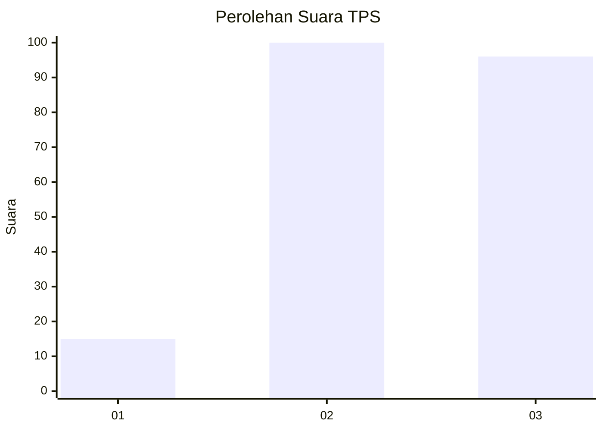
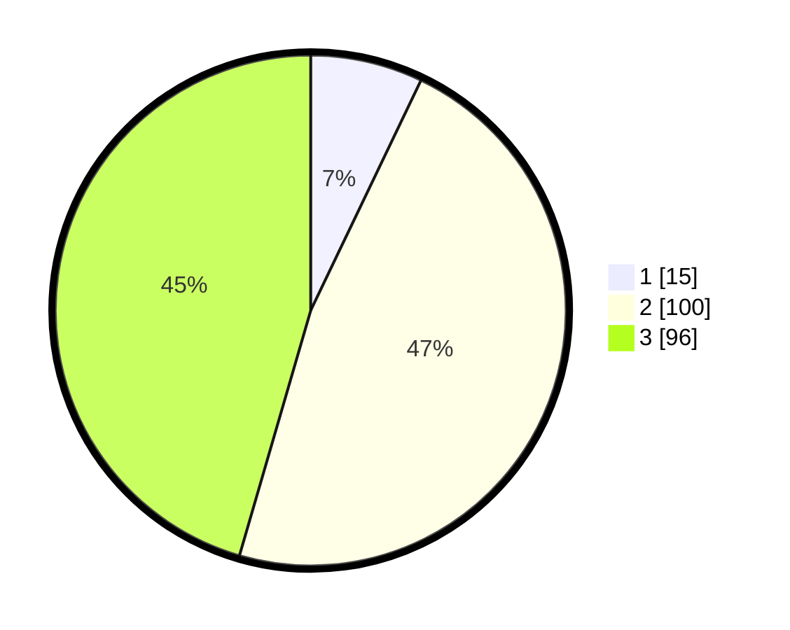

# Hasil

## Grafik

## Tabel

| No. | Nama Paslon    | Suara | Suara (raw) | Persentase |
|:--- |:-------------- | -----:| -----------:| ----------:|
| 1   | ANIES MUHAIMIN | 15    | [15][p-1]   | 7,11       |
| 2   | PRABOWO GIBRAN | 100   | [100][p-2]  | 47,39      |
| 3   | GANJAR MAHFUD  | 96    | [96][p-3]   | 45,50      |

[p-1]: https://github.com/gigit-pemilu/pemilu-2024-34-di-yogyakarta/blob/main/pilpres/hitung-suara/sub/34-di-yogyakarta/sub/02-bantul/sub/05-bambanglipuro/sub/2003-sumbermulyo/sub/020-tps/sub/paslon-1.txt
[p-2]: https://github.com/gigit-pemilu/pemilu-2024-34-di-yogyakarta/blob/main/pilpres/hitung-suara/sub/34-di-yogyakarta/sub/02-bantul/sub/05-bambanglipuro/sub/2003-sumbermulyo/sub/020-tps/sub/paslon-2.txt
[p-3]: https://github.com/gigit-pemilu/pemilu-2024-34-di-yogyakarta/blob/main/pilpres/hitung-suara/sub/34-di-yogyakarta/sub/02-bantul/sub/05-bambanglipuro/sub/2003-sumbermulyo/sub/020-tps/sub/paslon-3.txt

## Foto C Plano

https://sirekap-obj-formc.kpu.go.id/e786/pemilu/ppwp/34/02/05/20/03/3402052003020-20240214-232227--03766030-212a-4df4-9352-63a65bd453e9.jpg

https://sirekap-obj-formc.kpu.go.id/e786/pemilu/ppwp/34/02/05/20/03/3402052003020-20240214-232307--8967aa5c-1494-4c4c-932a-53389901041e.jpg

https://sirekap-obj-formc.kpu.go.id/e786/pemilu/ppwp/34/02/05/20/03/3402052003020-20240214-232340--4d8cdf44-ccd0-4c2f-aed0-ad0b5cde74e0.jpg

## Metadata

| Key        | Value               |
| ---------- | ------------------- |
| Time Stamp | 2024-02-24 22:31:28 |

