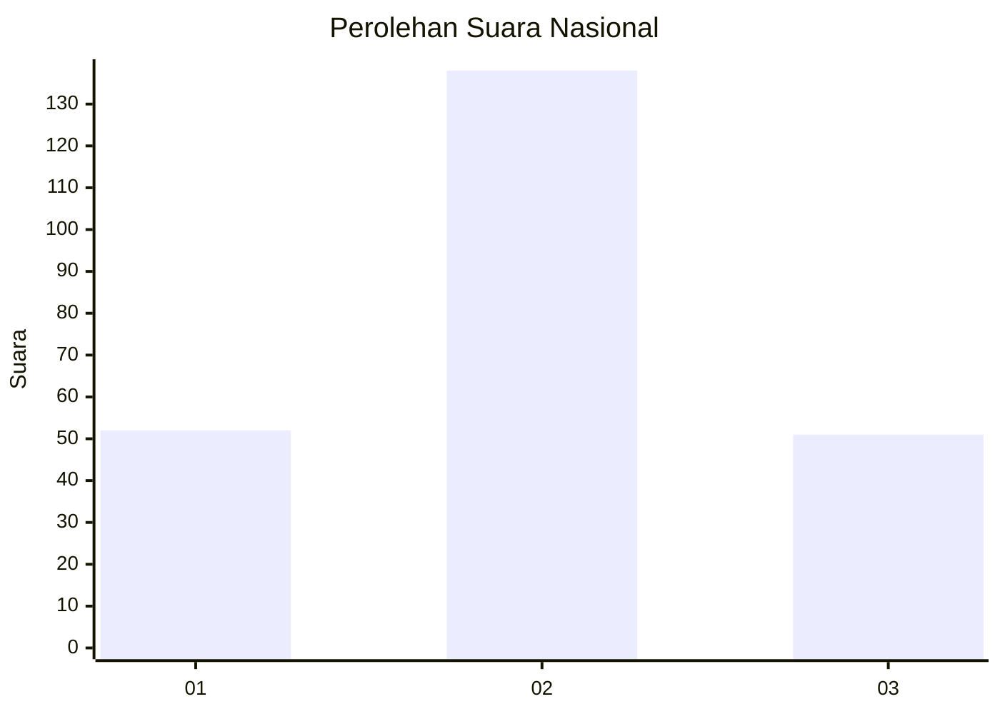
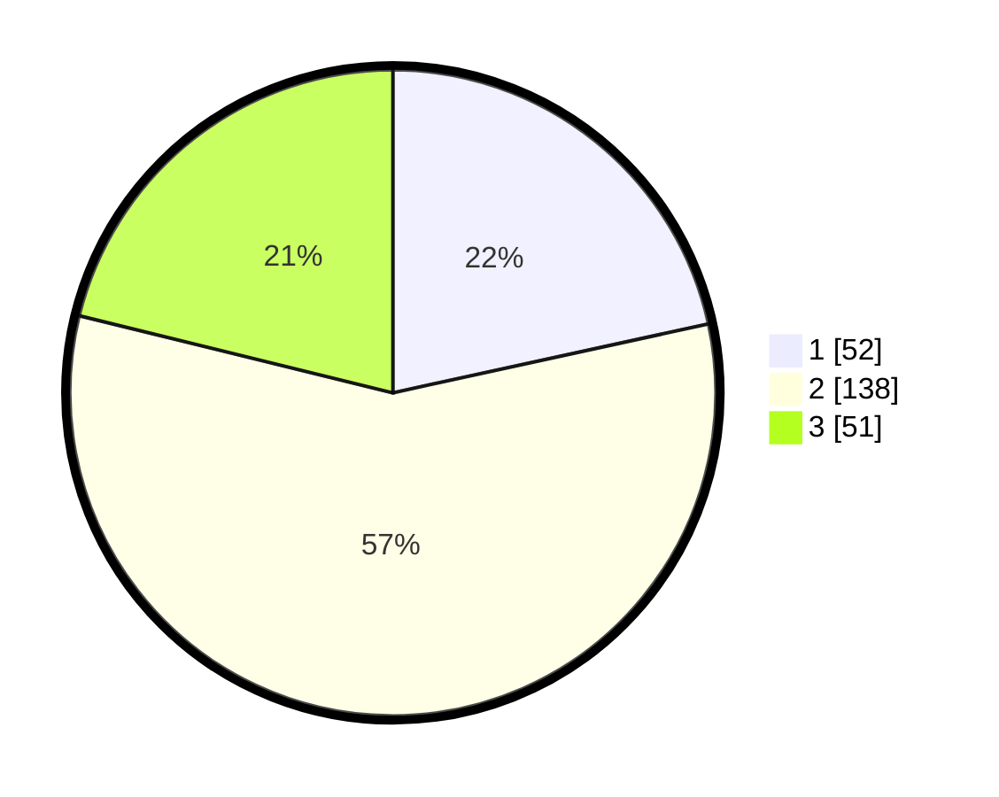

# Hasil

## Grafik

## Tabel

| No. | Nama Paslon    | Suara | Suara (raw) | Persentase |
|:--- |:-------------- | -----:| -----------:| ----------:|
| 1   | ANIES MUHAIMIN | 52    | [52][p-1]   | 21,58      |
| 2   | PRABOWO GIBRAN | 138   | [138][p-2]  | 57,26      |
| 3   | GANJAR MAHFUD  | 51    | [51][p-3]   | 21,16      |

[p-1]: https://github.com/gigit-pemilu/pemilu-2024/blob/main/pilpres/hitung-suara/sub/34-di-yogyakarta/sub/02-bantul/sub/05-bambanglipuro/sub/2003-sumbermulyo/sub/022-tps/sub/paslon-1.txt
[p-2]: https://github.com/gigit-pemilu/pemilu-2024/blob/main/pilpres/hitung-suara/sub/34-di-yogyakarta/sub/02-bantul/sub/05-bambanglipuro/sub/2003-sumbermulyo/sub/022-tps/sub/paslon-2.txt
[p-3]: https://github.com/gigit-pemilu/pemilu-2024/blob/main/pilpres/hitung-suara/sub/34-di-yogyakarta/sub/02-bantul/sub/05-bambanglipuro/sub/2003-sumbermulyo/sub/022-tps/sub/paslon-3.txt

## Foto C Plano

https://sirekap-obj-formc.kpu.go.id/6af8/pemilu/ppwp/34/02/05/20/03/3402052003022-20240216-141939--de34551c-71d6-4cb3-9d95-ba5d7d6b6584.jpg

https://sirekap-obj-formc.kpu.go.id/6af8/pemilu/ppwp/34/02/05/20/03/3402052003022-20240216-141940--89a28caf-d070-4ba7-a374-226a00decf67.jpg

https://sirekap-obj-formc.kpu.go.id/6af8/pemilu/ppwp/34/02/05/20/03/3402052003022-20240216-141939--9e895bf4-6893-4240-8932-186e6b985777.jpg

## Metadata

| Key        | Value               |
| ---------- | ------------------- |
| Time Stamp | 2024-02-20 10:00:00 |

## DATA PEMILIH TETAP

Jumlah pemilih dalam DPT: **273**.
 * L: **129**.
 * P: **144**.

## DATA PENGGUNA HAK PILIH

Jumlah pengguna hak pilih dalam DPT: **235**.
 * L: **107**.
 * P: **128**.

Jumlah pengguna hak pilih dalam DPTb: **10**.
 * L: **0**.
 * P: **10**.

Jumlah pengguna hak pilih dalam DPK: **0**.
 * L: **0**.
 * P: **0**.

Jumlah pengguna hak pilih: **245**.
 * L: **107**.
 * P: **138**.

## JUMLAH SUARA SAH DAN TIDAK SAH

JUMLAH SELURUH SUARA SAH: **241**.

JUMLAH SUARA TIDAK SAH: **4**.

JUMLAH SELURUH SUARA SAH DAN SUARA TIDAK SAH: **245**.

