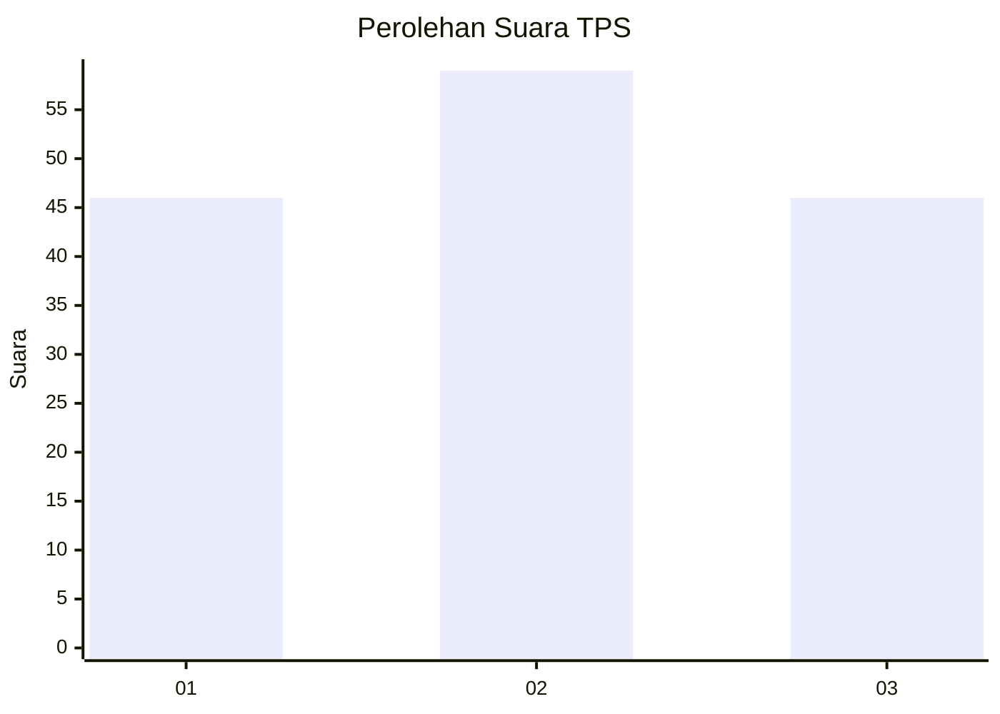
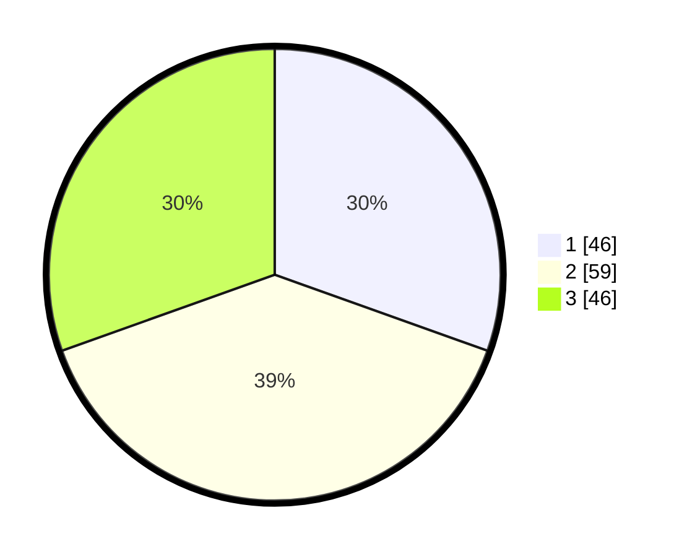

# Hasil

## Grafik

## Tabel

| No. | Nama Paslon    | Suara | Suara (raw) | Persentase |
|:--- |:-------------- | -----:| -----------:| ----------:|
| 1   | ANIES MUHAIMIN | 46    | [46][p-1]   | 30,46      |
| 2   | PRABOWO GIBRAN | 59    | [59][p-2]   | 39,07      |
| 3   | GANJAR MAHFUD  | 46    | [46][p-3]   | 30,46      |

[p-1]: https://github.com/gigit-pemilu/pemilu-2024-34-di-yogyakarta/blob/main/pilpres/hitung-suara/sub/34-di-yogyakarta/sub/02-bantul/sub/05-bambanglipuro/sub/2003-sumbermulyo/sub/023-tps/sub/paslon-1.txt
[p-2]: https://github.com/gigit-pemilu/pemilu-2024-34-di-yogyakarta/blob/main/pilpres/hitung-suara/sub/34-di-yogyakarta/sub/02-bantul/sub/05-bambanglipuro/sub/2003-sumbermulyo/sub/023-tps/sub/paslon-2.txt
[p-3]: https://github.com/gigit-pemilu/pemilu-2024-34-di-yogyakarta/blob/main/pilpres/hitung-suara/sub/34-di-yogyakarta/sub/02-bantul/sub/05-bambanglipuro/sub/2003-sumbermulyo/sub/023-tps/sub/paslon-3.txt

## Foto C Plano

https://sirekap-obj-formc.kpu.go.id/e0d9/pemilu/ppwp/34/02/05/20/03/3402052003023-20240214-224106--14513c58-4e37-4f58-9103-05f5f33a6111.jpg

https://sirekap-obj-formc.kpu.go.id/e0d9/pemilu/ppwp/34/02/05/20/03/3402052003023-20240214-224215--2b463762-6b90-432c-90c9-f991d09df478.jpg

https://sirekap-obj-formc.kpu.go.id/e0d9/pemilu/ppwp/34/02/05/20/03/3402052003023-20240214-224327--b84c916f-daad-4aea-9501-78279a7f9e9a.jpg

## Metadata

| Key        | Value               |
| ---------- | ------------------- |
| Time Stamp | 2024-02-15 15:00:29 |

