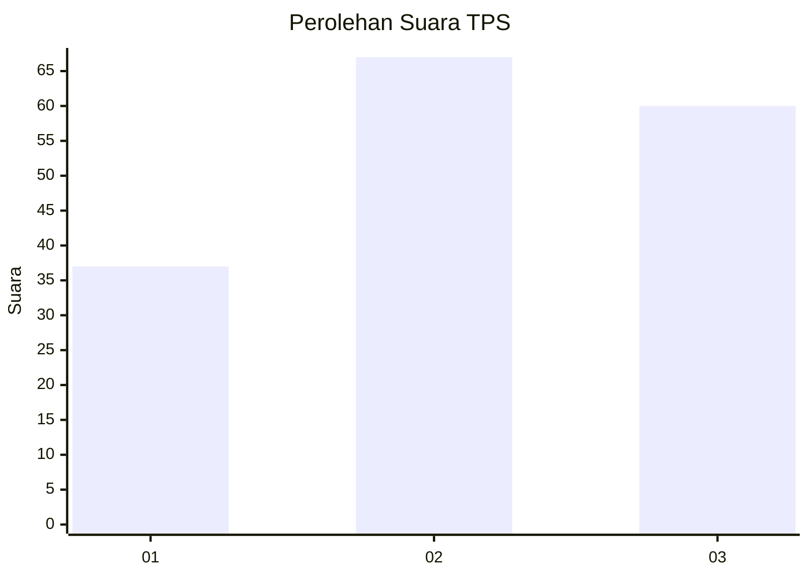
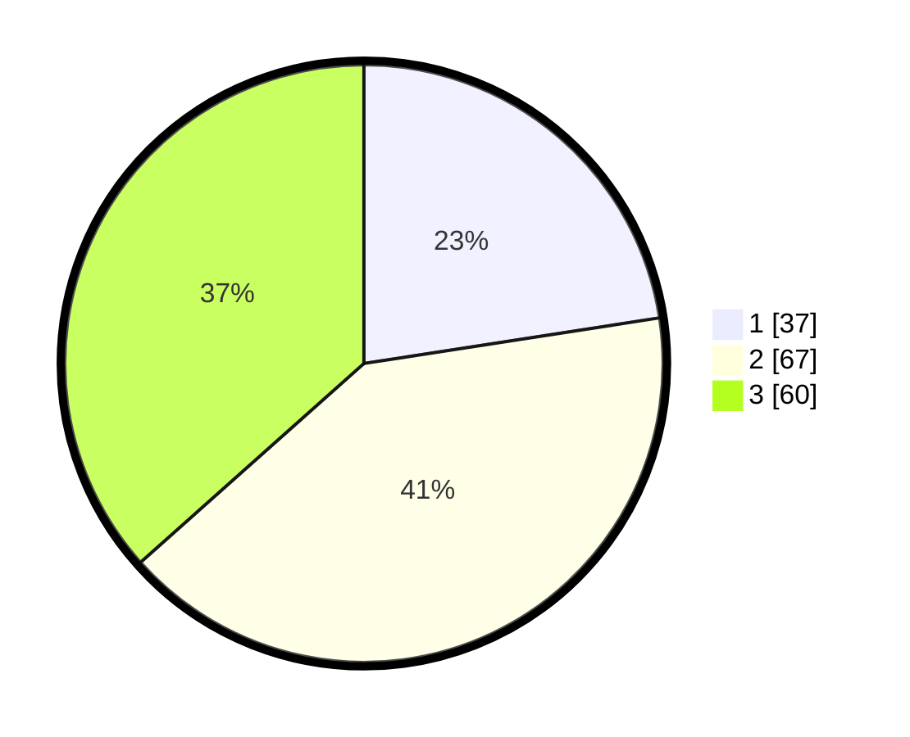

# Hasil

## Grafik

## Tabel

| No. | Nama Paslon    | Suara | Suara (raw) | Persentase |
|:--- |:-------------- | -----:| -----------:| ----------:|
| 1   | ANIES MUHAIMIN | 37    | [37][p-1]   | 22,56      |
| 2   | PRABOWO GIBRAN | 67    | [67][p-2]   | 40,85      |
| 3   | GANJAR MAHFUD  | 60    | [60][p-3]   | 36,59      |

[p-1]: https://github.com/gigit-pemilu/pemilu-2024-34-di-yogyakarta/blob/main/pilpres/hitung-suara/sub/34-di-yogyakarta/sub/02-bantul/sub/05-bambanglipuro/sub/2003-sumbermulyo/sub/024-tps/sub/paslon-1.txt
[p-2]: https://github.com/gigit-pemilu/pemilu-2024-34-di-yogyakarta/blob/main/pilpres/hitung-suara/sub/34-di-yogyakarta/sub/02-bantul/sub/05-bambanglipuro/sub/2003-sumbermulyo/sub/024-tps/sub/paslon-2.txt
[p-3]: https://github.com/gigit-pemilu/pemilu-2024-34-di-yogyakarta/blob/main/pilpres/hitung-suara/sub/34-di-yogyakarta/sub/02-bantul/sub/05-bambanglipuro/sub/2003-sumbermulyo/sub/024-tps/sub/paslon-3.txt

## Foto C Plano

https://sirekap-obj-formc.kpu.go.id/ceb0/pemilu/ppwp/34/02/05/20/03/3402052003024-20240216-084902--4741352f-9437-473b-8e49-4853f95bb62f.jpg

https://sirekap-obj-formc.kpu.go.id/ceb0/pemilu/ppwp/34/02/05/20/03/3402052003024-20240216-084908--3394e681-346d-4604-b2ed-d8c808befcfb.jpg

https://sirekap-obj-formc.kpu.go.id/ceb0/pemilu/ppwp/34/02/05/20/03/3402052003024-20240216-084906--08858a58-df80-46a7-9b82-91a4054f84ff.jpg

## Metadata

| Key        | Value               |
| ---------- | ------------------- |
| Time Stamp | 2024-02-20 10:00:00 |

## DATA PEMILIH TETAP

Jumlah pemilih dalam DPT: **187**.
 * L: **80**.
 * P: **107**.

## DATA PENGGUNA HAK PILIH

Jumlah pengguna hak pilih dalam DPT: **154**.
 * L: **66**.
 * P: **88**.

Jumlah pengguna hak pilih dalam DPTb: **6**.
 * L: **0**.
 * P: **6**.

Jumlah pengguna hak pilih dalam DPK: **6**.
 * L: **1**.
 * P: **5**.

Jumlah pengguna hak pilih: **166**.
 * L: **67**.
 * P: **99**.

## JUMLAH SUARA SAH DAN TIDAK SAH

JUMLAH SELURUH SUARA SAH: **164**.

JUMLAH SUARA TIDAK SAH: **2**.

JUMLAH SELURUH SUARA SAH DAN SUARA TIDAK SAH: **166**.

