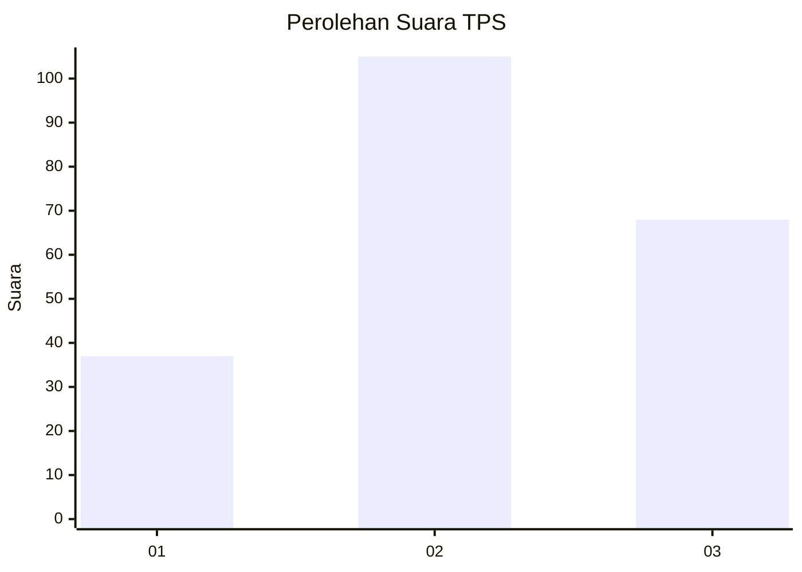
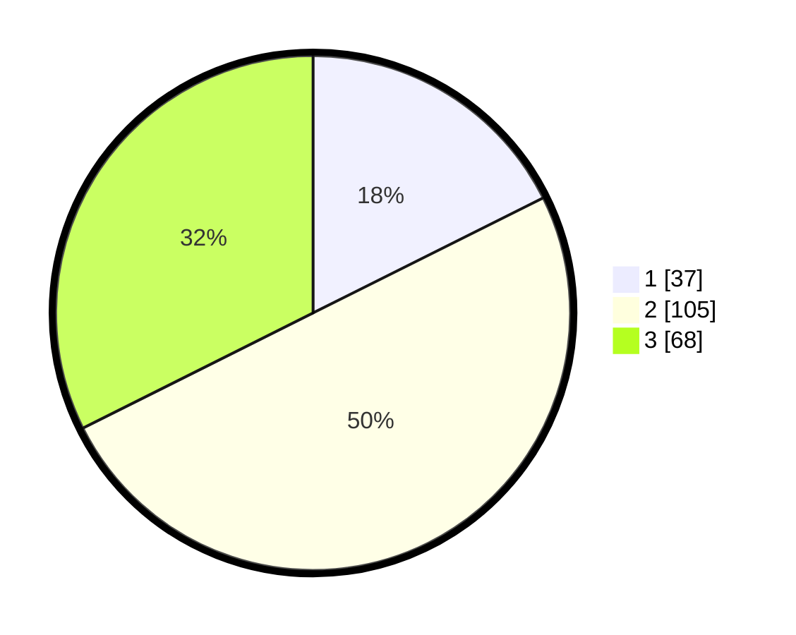

# Hasil

## Grafik

## Tabel

| No. | Nama Paslon    | Suara | Suara (raw) | Persentase |
|:--- |:-------------- | -----:| -----------:| ----------:|
| 1   | ANIES MUHAIMIN | 37    | [37][p-1]   | 17,62      |
| 2   | PRABOWO GIBRAN | 105   | [105][p-2]  | 50,00      |
| 3   | GANJAR MAHFUD  | 68    | [68][p-3]   | 32,38      |

[p-1]: https://github.com/gigit-pemilu/pemilu-2024-34-di-yogyakarta/blob/main/pilpres/hitung-suara/sub/34-di-yogyakarta/sub/02-bantul/sub/05-bambanglipuro/sub/2003-sumbermulyo/sub/031-tps/sub/paslon-1.txt
[p-2]: https://github.com/gigit-pemilu/pemilu-2024-34-di-yogyakarta/blob/main/pilpres/hitung-suara/sub/34-di-yogyakarta/sub/02-bantul/sub/05-bambanglipuro/sub/2003-sumbermulyo/sub/031-tps/sub/paslon-2.txt
[p-3]: https://github.com/gigit-pemilu/pemilu-2024-34-di-yogyakarta/blob/main/pilpres/hitung-suara/sub/34-di-yogyakarta/sub/02-bantul/sub/05-bambanglipuro/sub/2003-sumbermulyo/sub/031-tps/sub/paslon-3.txt

## Foto C Plano

https://sirekap-obj-formc.kpu.go.id/5563/pemilu/ppwp/34/02/05/20/03/3402052003031-20240215-022723--74368d17-d658-46fb-bde0-db5a8ac2f1c8.jpg

https://sirekap-obj-formc.kpu.go.id/5563/pemilu/ppwp/34/02/05/20/03/3402052003031-20240215-022537--e04b054f-4efb-4b13-9ae3-f2dec6e7200a.jpg

https://sirekap-obj-formc.kpu.go.id/5563/pemilu/ppwp/34/02/05/20/03/3402052003031-20240215-022625--8fc7e3da-e6d5-447d-92c1-af0b3b2ac8e5.jpg

## Metadata

| Key        | Value               |
| ---------- | ------------------- |
| Time Stamp | 2024-02-24 22:31:28 |

