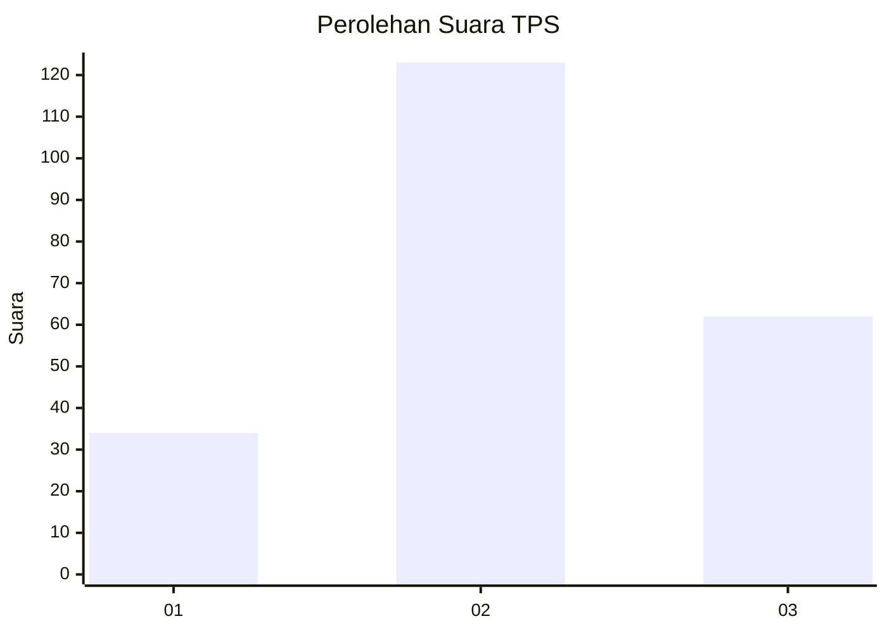
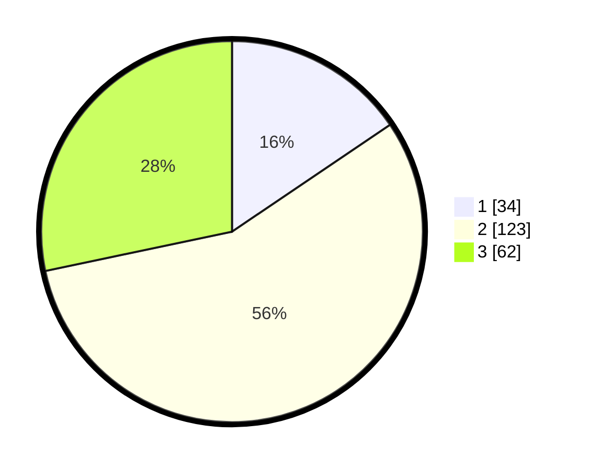

# Hasil

## Grafik

## Tabel

| No. | Nama Paslon    | Suara | Suara (raw) | Persentase |
|:--- |:-------------- | -----:| -----------:| ----------:|
| 1   | ANIES MUHAIMIN | 34    | [34][p-1]   | 15,53      |
| 2   | PRABOWO GIBRAN | 123   | [123][p-2]  | 56,16      |
| 3   | GANJAR MAHFUD  | 62    | [62][p-3]   | 28,31      |

[p-1]: https://github.com/gigit-pemilu/pemilu-2024-34-di-yogyakarta/blob/main/pilpres/hitung-suara/sub/34-di-yogyakarta/sub/02-bantul/sub/05-bambanglipuro/sub/2003-sumbermulyo/sub/036-tps/sub/paslon-1.txt
[p-2]: https://github.com/gigit-pemilu/pemilu-2024-34-di-yogyakarta/blob/main/pilpres/hitung-suara/sub/34-di-yogyakarta/sub/02-bantul/sub/05-bambanglipuro/sub/2003-sumbermulyo/sub/036-tps/sub/paslon-2.txt
[p-3]: https://github.com/gigit-pemilu/pemilu-2024-34-di-yogyakarta/blob/main/pilpres/hitung-suara/sub/34-di-yogyakarta/sub/02-bantul/sub/05-bambanglipuro/sub/2003-sumbermulyo/sub/036-tps/sub/paslon-3.txt

## Foto C Plano

https://sirekap-obj-formc.kpu.go.id/16c1/pemilu/ppwp/34/02/05/20/03/3402052003036-20240214-201555--1861ddff-699d-480d-8914-95a9fa3fe1bd.jpg

https://sirekap-obj-formc.kpu.go.id/16c1/pemilu/ppwp/34/02/05/20/03/3402052003036-20240214-200953--9d23f3f5-62cd-4c3f-9437-3af6146293b4.jpg

https://sirekap-obj-formc.kpu.go.id/16c1/pemilu/ppwp/34/02/05/20/03/3402052003036-20240214-201121--02732fcd-2e27-48fd-8bc3-6406ab275326.jpg

## Metadata

| Key        | Value               |
| ---------- | ------------------- |
| Time Stamp | 2024-02-14 21:46:01 |

