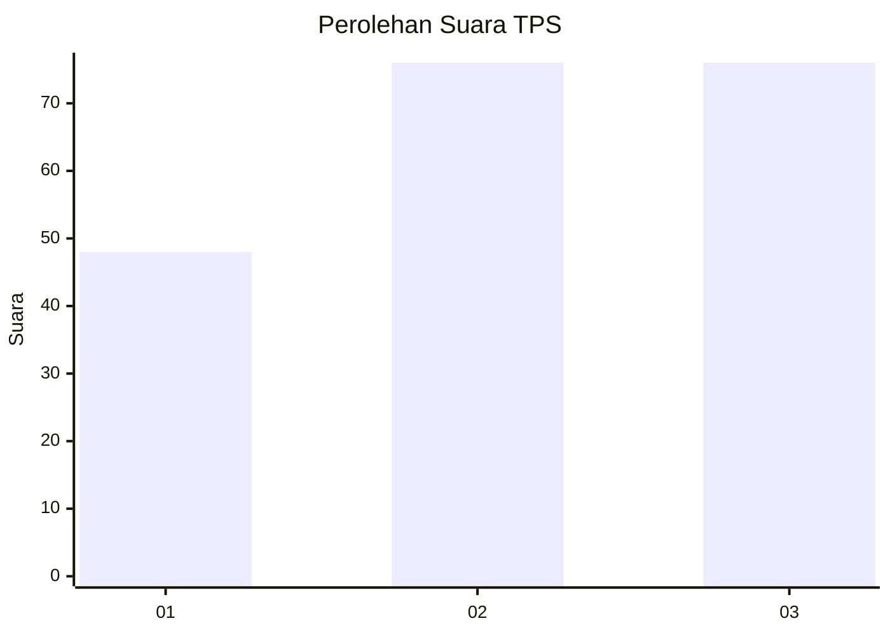
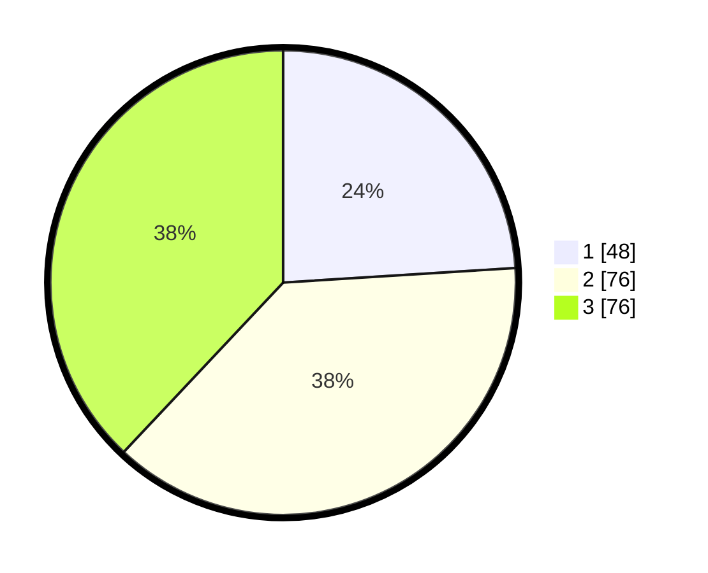

# Hasil

## Grafik

## Tabel

| No. | Nama Paslon    | Suara | Suara (raw) | Persentase |
|:--- |:-------------- | -----:| -----------:| ----------:|
| 1   | ANIES MUHAIMIN | 48    | [48][p-1]   | 24,00      |
| 2   | PRABOWO GIBRAN | 76    | [76][p-2]   | 38,00      |
| 3   | GANJAR MAHFUD  | 76    | [76][p-3]   | 38,00      |

[p-1]: https://github.com/gigit-pemilu/pemilu-2024-34-di-yogyakarta/blob/main/pilpres/hitung-suara/sub/34-di-yogyakarta/sub/02-bantul/sub/05-bambanglipuro/sub/2003-sumbermulyo/sub/037-tps/sub/paslon-1.txt
[p-2]: https://github.com/gigit-pemilu/pemilu-2024-34-di-yogyakarta/blob/main/pilpres/hitung-suara/sub/34-di-yogyakarta/sub/02-bantul/sub/05-bambanglipuro/sub/2003-sumbermulyo/sub/037-tps/sub/paslon-2.txt
[p-3]: https://github.com/gigit-pemilu/pemilu-2024-34-di-yogyakarta/blob/main/pilpres/hitung-suara/sub/34-di-yogyakarta/sub/02-bantul/sub/05-bambanglipuro/sub/2003-sumbermulyo/sub/037-tps/sub/paslon-3.txt

## Foto C Plano

https://sirekap-obj-formc.kpu.go.id/c231/pemilu/ppwp/34/02/05/20/03/3402052003037-20240215-213736--e135f867-f034-4120-9d22-720bd71299a4.jpg

https://sirekap-obj-formc.kpu.go.id/c231/pemilu/ppwp/34/02/05/20/03/3402052003037-20240214-220210--f18e3e63-1740-486e-b672-fe231cb4dab0.jpg

https://sirekap-obj-formc.kpu.go.id/c231/pemilu/ppwp/34/02/05/20/03/3402052003037-20240214-220523--2dc0f171-108d-4d28-85f0-dd58c33e55b0.jpg

## Metadata

| Key        | Value               |
| ---------- | ------------------- |
| Time Stamp | 2024-02-15 22:00:27 |

