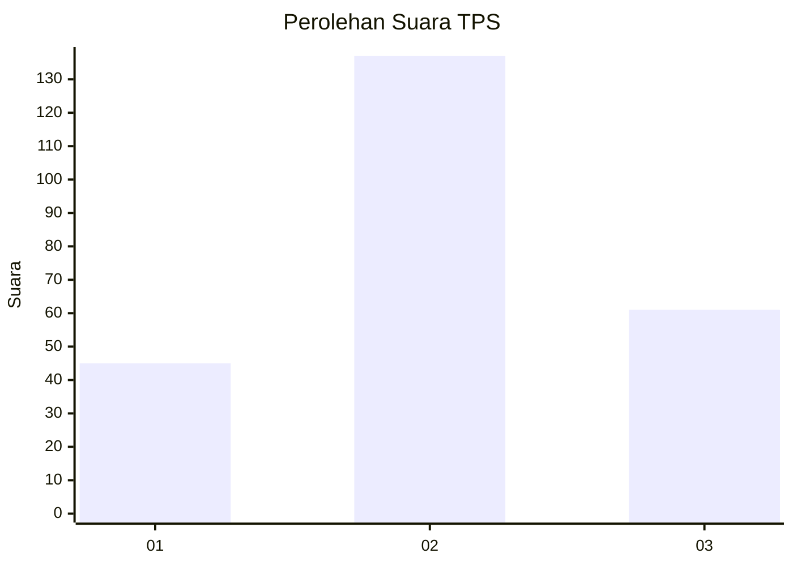
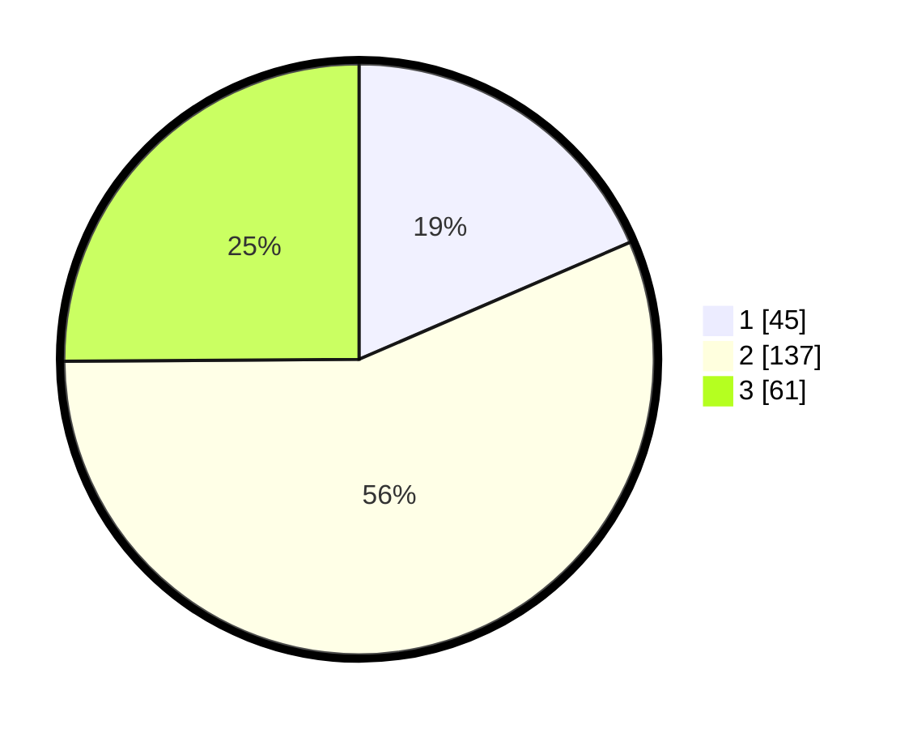

# Hasil

## Grafik

## Tabel

| No. | Nama Paslon    | Suara | Suara (raw) | Persentase |
|:--- |:-------------- | -----:| -----------:| ----------:|
| 1   | ANIES MUHAIMIN | 45    | [45][p-1]   | 18,52      |
| 2   | PRABOWO GIBRAN | 137   | [137][p-2]  | 56,38      |
| 3   | GANJAR MAHFUD  | 61    | [61][p-3]   | 25,10      |

[p-1]: https://github.com/gigit-pemilu/pemilu-2024-34-di-yogyakarta/blob/main/pilpres/hitung-suara/sub/34-di-yogyakarta/sub/02-bantul/sub/05-bambanglipuro/sub/2003-sumbermulyo/sub/039-tps/sub/paslon-1.txt
[p-2]: https://github.com/gigit-pemilu/pemilu-2024-34-di-yogyakarta/blob/main/pilpres/hitung-suara/sub/34-di-yogyakarta/sub/02-bantul/sub/05-bambanglipuro/sub/2003-sumbermulyo/sub/039-tps/sub/paslon-2.txt
[p-3]: https://github.com/gigit-pemilu/pemilu-2024-34-di-yogyakarta/blob/main/pilpres/hitung-suara/sub/34-di-yogyakarta/sub/02-bantul/sub/05-bambanglipuro/sub/2003-sumbermulyo/sub/039-tps/sub/paslon-3.txt

## Foto C Plano

https://sirekap-obj-formc.kpu.go.id/080e/pemilu/ppwp/34/02/05/20/03/3402052003039-20240214-225131--3d8737a6-15bc-40e2-9440-070822cdcd48.jpg

https://sirekap-obj-formc.kpu.go.id/080e/pemilu/ppwp/34/02/05/20/03/3402052003039-20240214-211504--c53777d9-a3c0-4cc2-a946-031ebba1ec23.jpg

https://sirekap-obj-formc.kpu.go.id/080e/pemilu/ppwp/34/02/05/20/03/3402052003039-20240214-211522--edf95bab-a0c9-4a41-a91c-2cc66fe8f597.jpg

## Metadata

| Key        | Value               |
| ---------- | ------------------- |
| Time Stamp | 2024-02-24 22:31:28 |

