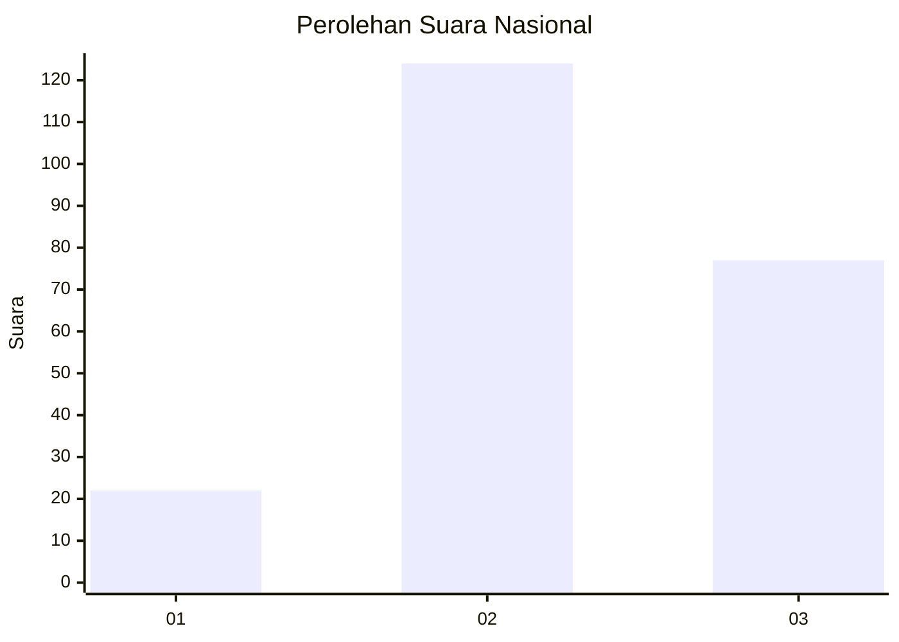
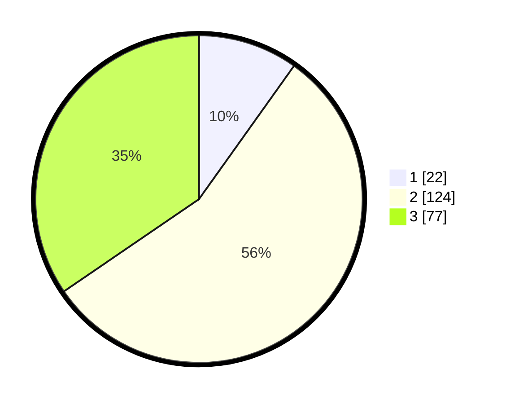

# Hasil

## Grafik

## Tabel

| No. | Nama Paslon    | Suara | Suara (raw) | Persentase |
|:--- |:-------------- | -----:| -----------:| ----------:|
| 1   | ANIES MUHAIMIN | 22    | [22][p-1]   | 9,87       |
| 2   | PRABOWO GIBRAN | 124   | [124][p-2]  | 55,61      |
| 3   | GANJAR MAHFUD  | 77    | [77][p-3]   | 34,53      |

[p-1]: https://github.com/gigit-pemilu/pemilu-2024/blob/main/pilpres/hitung-suara/sub/34-di-yogyakarta/sub/02-bantul/sub/05-bambanglipuro/sub/2003-sumbermulyo/sub/040-tps/sub/paslon-1.txt
[p-2]: https://github.com/gigit-pemilu/pemilu-2024/blob/main/pilpres/hitung-suara/sub/34-di-yogyakarta/sub/02-bantul/sub/05-bambanglipuro/sub/2003-sumbermulyo/sub/040-tps/sub/paslon-2.txt
[p-3]: https://github.com/gigit-pemilu/pemilu-2024/blob/main/pilpres/hitung-suara/sub/34-di-yogyakarta/sub/02-bantul/sub/05-bambanglipuro/sub/2003-sumbermulyo/sub/040-tps/sub/paslon-3.txt

## Foto C Plano

https://sirekap-obj-formc.kpu.go.id/053d/pemilu/ppwp/34/02/05/20/03/3402052003040-20240218-195411--55b990ef-f5b7-4825-bbb3-34c98122174b.jpg

https://sirekap-obj-formc.kpu.go.id/053d/pemilu/ppwp/34/02/05/20/03/3402052003040-20240218-195629--92064f4e-3dd2-4a3b-86dd-dd1d463894af.jpg

https://sirekap-obj-formc.kpu.go.id/053d/pemilu/ppwp/34/02/05/20/03/3402052003040-20240218-195753--da03857d-03f5-4d02-8287-412daead4f7e.jpg

## Metadata

| Key        | Value               |
| ---------- | ------------------- |
| Time Stamp | 2024-02-25 11:00:00 |

