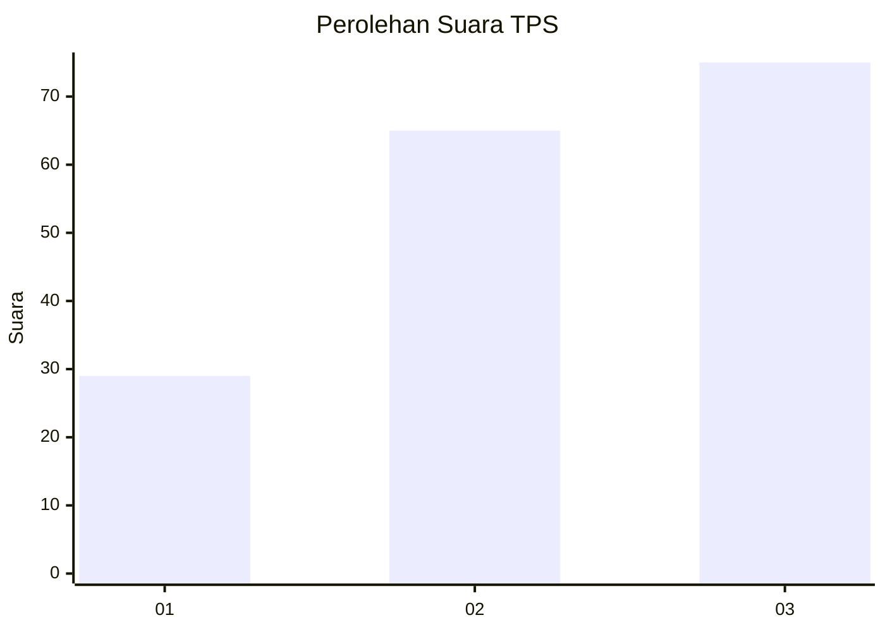
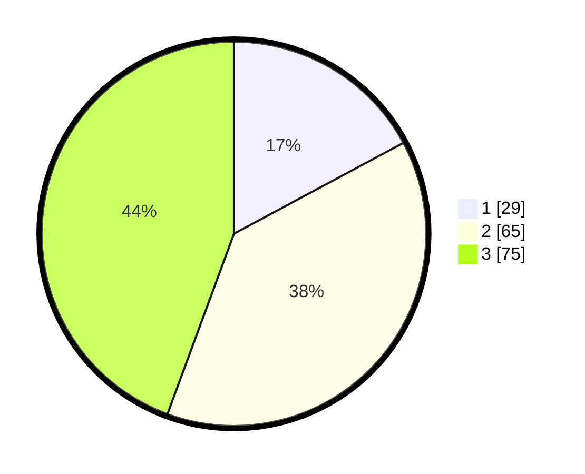

# Hasil

## Grafik

## Tabel

| No. | Nama Paslon    | Suara | Suara (raw) | Persentase |
|:--- |:-------------- | -----:| -----------:| ----------:|
| 1   | ANIES MUHAIMIN | 29    | [29][p-1]   | 17,16      |
| 2   | PRABOWO GIBRAN | 65    | [65][p-2]   | 38,46      |
| 3   | GANJAR MAHFUD  | 75    | [75][p-3]   | 44,38      |

[p-1]: https://github.com/gigit-pemilu/pemilu-2024-34-di-yogyakarta/blob/main/pilpres/hitung-suara/sub/34-di-yogyakarta/sub/02-bantul/sub/05-bambanglipuro/sub/2003-sumbermulyo/sub/042-tps/sub/paslon-1.txt
[p-2]: https://github.com/gigit-pemilu/pemilu-2024-34-di-yogyakarta/blob/main/pilpres/hitung-suara/sub/34-di-yogyakarta/sub/02-bantul/sub/05-bambanglipuro/sub/2003-sumbermulyo/sub/042-tps/sub/paslon-2.txt
[p-3]: https://github.com/gigit-pemilu/pemilu-2024-34-di-yogyakarta/blob/main/pilpres/hitung-suara/sub/34-di-yogyakarta/sub/02-bantul/sub/05-bambanglipuro/sub/2003-sumbermulyo/sub/042-tps/sub/paslon-3.txt

## Foto C Plano

https://sirekap-obj-formc.kpu.go.id/6d91/pemilu/ppwp/34/02/05/20/03/3402052003042-20240218-200502--65779f93-5b28-4f1a-81ca-c8ac3d673fb8.jpg

https://sirekap-obj-formc.kpu.go.id/6d91/pemilu/ppwp/34/02/05/20/03/3402052003042-20240218-200804--f37ec80b-062b-49ca-9ab3-a4c443d334d6.jpg

https://sirekap-obj-formc.kpu.go.id/6d91/pemilu/ppwp/34/02/05/20/03/3402052003042-20240215-000920--5866402b-55a8-425c-90e2-13c7ae3ca8a8.jpg

## Metadata

| Key        | Value               |
| ---------- | ------------------- |
| Time Stamp | 2024-02-24 22:31:28 |

