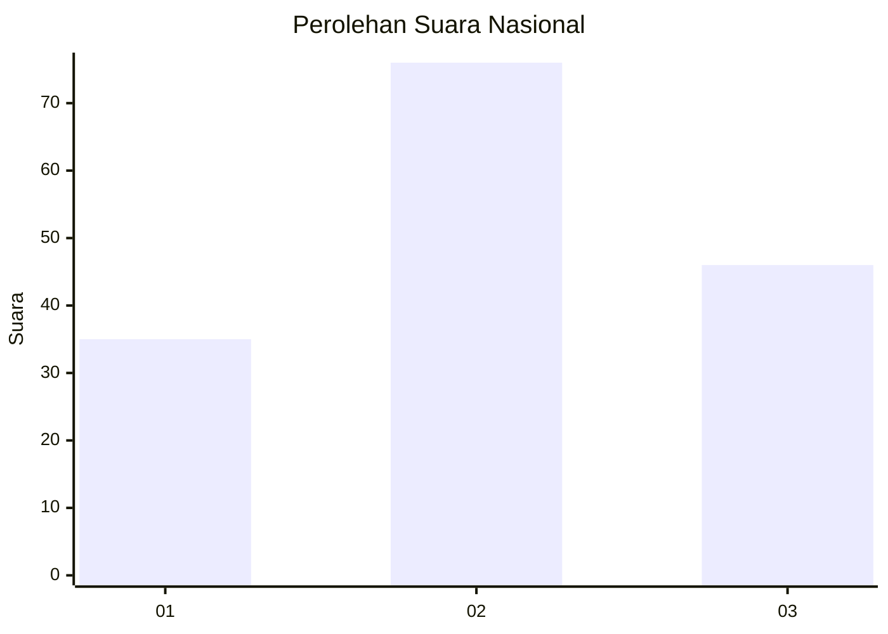
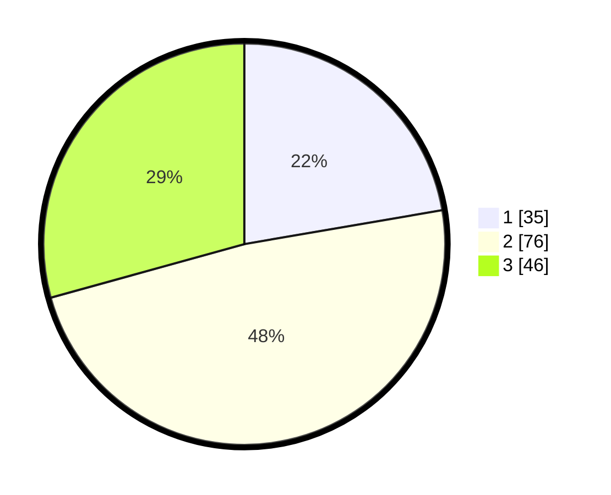

# Hasil

## Grafik

## Tabel

| No. | Nama Paslon    | Suara | Suara (raw) | Persentase |
|:--- |:-------------- | -----:| -----------:| ----------:|
| 1   | ANIES MUHAIMIN | 35    | [35][p-1]   | 22,29      |
| 2   | PRABOWO GIBRAN | 76    | [76][p-2]   | 48,41      |
| 3   | GANJAR MAHFUD  | 46    | [46][p-3]   | 29,30      |

[p-1]: https://github.com/gigit-pemilu/pemilu-2024/blob/main/pilpres/hitung-suara/sub/34-di-yogyakarta/sub/02-bantul/sub/05-bambanglipuro/sub/2003-sumbermulyo/sub/050-tps/sub/paslon-1.txt
[p-2]: https://github.com/gigit-pemilu/pemilu-2024/blob/main/pilpres/hitung-suara/sub/34-di-yogyakarta/sub/02-bantul/sub/05-bambanglipuro/sub/2003-sumbermulyo/sub/050-tps/sub/paslon-2.txt
[p-3]: https://github.com/gigit-pemilu/pemilu-2024/blob/main/pilpres/hitung-suara/sub/34-di-yogyakarta/sub/02-bantul/sub/05-bambanglipuro/sub/2003-sumbermulyo/sub/050-tps/sub/paslon-3.txt

## Foto C Plano

https://sirekap-obj-formc.kpu.go.id/3c67/pemilu/ppwp/34/02/05/20/03/3402052003050-20240218-194826--4efd2297-92ad-4acc-af33-2b1f3f523dcd.jpg

https://sirekap-obj-formc.kpu.go.id/3c67/pemilu/ppwp/34/02/05/20/03/3402052003050-20240218-194632--bcde4e0f-acf9-4dbe-baac-c1b1d3ff0fb8.jpg

https://sirekap-obj-formc.kpu.go.id/3c67/pemilu/ppwp/34/02/05/20/03/3402052003050-20240218-194733--f13bcc09-7c44-479e-8cd4-a0c57b7a344c.jpg

## Metadata

| Key        | Value               |
| ---------- | ------------------- |
| Time Stamp | 2024-02-25 14:00:00 |

