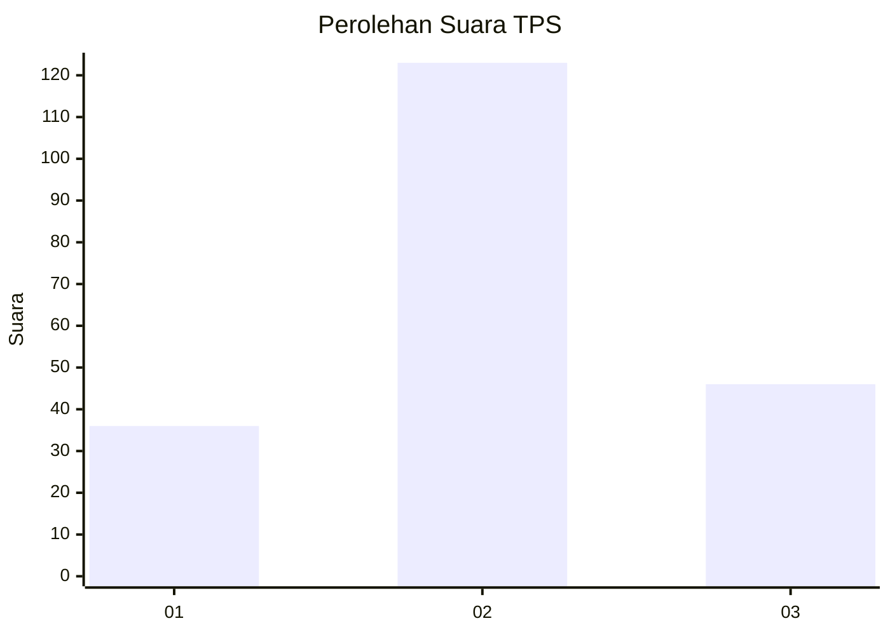
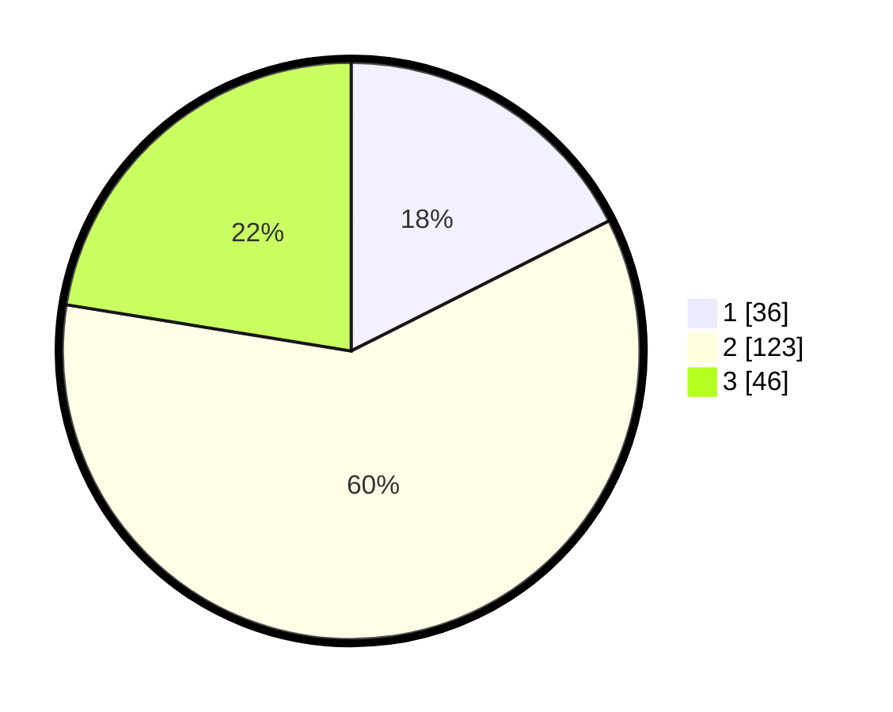

# Hasil

## Grafik

## Tabel

| No. | Nama Paslon    | Suara | Suara (raw) | Persentase |
|:--- |:-------------- | -----:| -----------:| ----------:|
| 1   | ANIES MUHAIMIN | 36    | [36][p-1]   | 17,56      |
| 2   | PRABOWO GIBRAN | 123   | [123][p-2]  | 60,00      |
| 3   | GANJAR MAHFUD  | 46    | [46][p-3]   | 22,44      |

[p-1]: https://github.com/gigit-pemilu/pemilu-2024-34-di-yogyakarta/blob/main/pilpres/hitung-suara/sub/34-di-yogyakarta/sub/02-bantul/sub/05-bambanglipuro/sub/2003-sumbermulyo/sub/052-tps/sub/paslon-1.txt
[p-2]: https://github.com/gigit-pemilu/pemilu-2024-34-di-yogyakarta/blob/main/pilpres/hitung-suara/sub/34-di-yogyakarta/sub/02-bantul/sub/05-bambanglipuro/sub/2003-sumbermulyo/sub/052-tps/sub/paslon-2.txt
[p-3]: https://github.com/gigit-pemilu/pemilu-2024-34-di-yogyakarta/blob/main/pilpres/hitung-suara/sub/34-di-yogyakarta/sub/02-bantul/sub/05-bambanglipuro/sub/2003-sumbermulyo/sub/052-tps/sub/paslon-3.txt

## Foto C Plano

https://sirekap-obj-formc.kpu.go.id/43e0/pemilu/ppwp/34/02/05/20/03/3402052003052-20240215-005505--515c94bb-b15e-4444-a49a-43aa80deb2ee.jpg

https://sirekap-obj-formc.kpu.go.id/43e0/pemilu/ppwp/34/02/05/20/03/3402052003052-20240214-215709--f378fb97-6469-4715-a93c-509147cfb4ab.jpg

https://sirekap-obj-formc.kpu.go.id/43e0/pemilu/ppwp/34/02/05/20/03/3402052003052-20240214-215713--41edfd7d-a849-4155-91c1-52037ba290f5.jpg

## Metadata

| Key        | Value               |
| ---------- | ------------------- |
| Time Stamp | 2024-02-25 12:00:00 |

