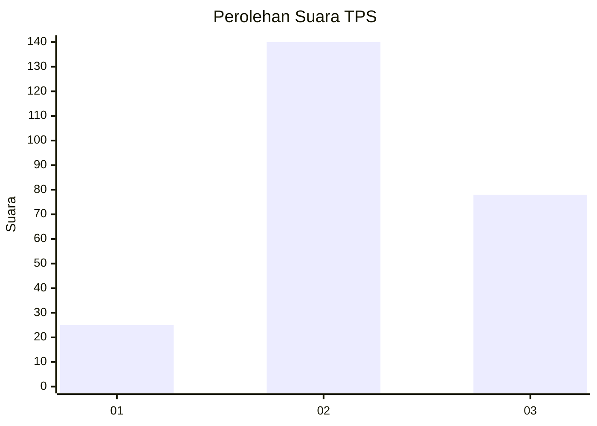
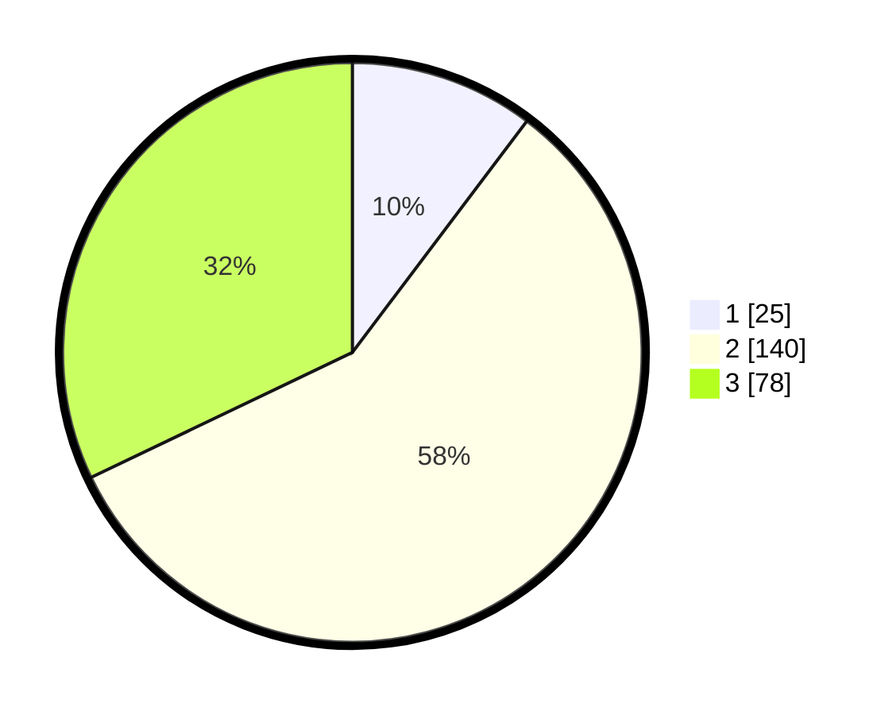

# Hasil

## Grafik

## Tabel

| No. | Nama Paslon    | Suara | Suara (raw) | Persentase |
|:--- |:-------------- | -----:| -----------:| ----------:|
| 1   | ANIES MUHAIMIN | 25    | [25][p-1]   | 10,29      |
| 2   | PRABOWO GIBRAN | 140   | [140][p-2]  | 57,61      |
| 3   | GANJAR MAHFUD  | 78    | [78][p-3]   | 32,10      |

[p-1]: https://github.com/gigit-pemilu/pemilu-2024-34-di-yogyakarta/blob/main/pilpres/hitung-suara/sub/34-di-yogyakarta/sub/02-bantul/sub/05-bambanglipuro/sub/2003-sumbermulyo/sub/054-tps/sub/paslon-1.txt
[p-2]: https://github.com/gigit-pemilu/pemilu-2024-34-di-yogyakarta/blob/main/pilpres/hitung-suara/sub/34-di-yogyakarta/sub/02-bantul/sub/05-bambanglipuro/sub/2003-sumbermulyo/sub/054-tps/sub/paslon-2.txt
[p-3]: https://github.com/gigit-pemilu/pemilu-2024-34-di-yogyakarta/blob/main/pilpres/hitung-suara/sub/34-di-yogyakarta/sub/02-bantul/sub/05-bambanglipuro/sub/2003-sumbermulyo/sub/054-tps/sub/paslon-3.txt

## Foto C Plano

https://sirekap-obj-formc.kpu.go.id/e028/pemilu/ppwp/34/02/05/20/03/3402052003054-20240218-194244--cd7ff9e4-2f4c-45d2-b0fc-f0d77ab42a6e.jpg

https://sirekap-obj-formc.kpu.go.id/e028/pemilu/ppwp/34/02/05/20/03/3402052003054-20240218-193923--78b19327-0c7d-46f5-87f5-40b2c6a2937a.jpg

https://sirekap-obj-formc.kpu.go.id/e028/pemilu/ppwp/34/02/05/20/03/3402052003054-20240218-194102--cf8e7acd-7c17-407d-99a8-8eb92ff81f49.jpg

## Metadata

| Key        | Value               |
| ---------- | ------------------- |
| Time Stamp | 2024-02-26 11:00:00 |

