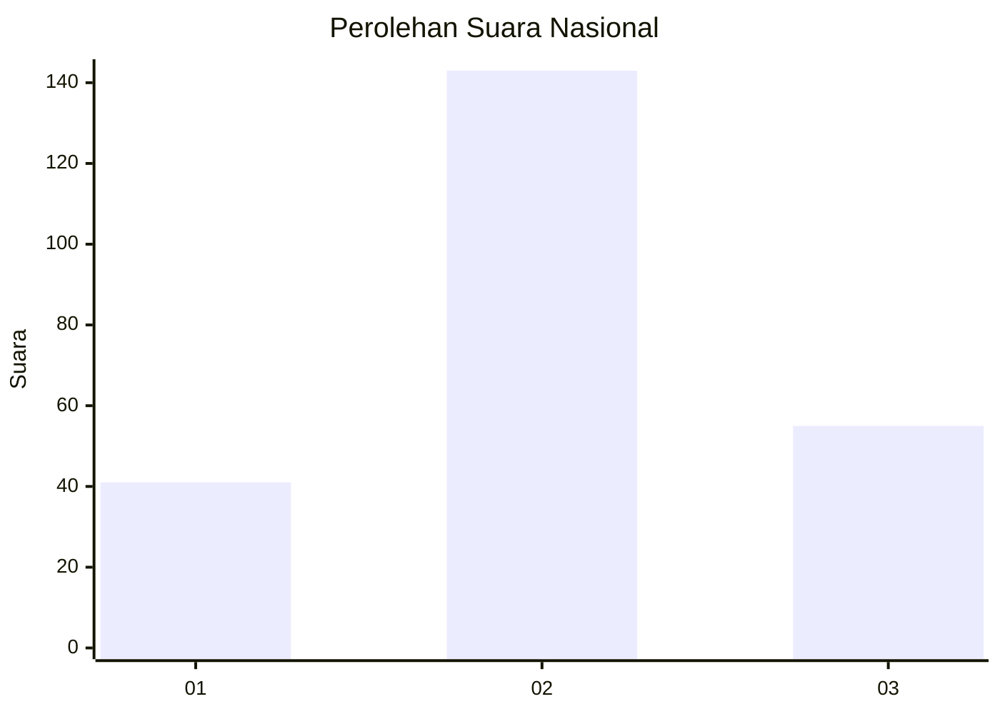
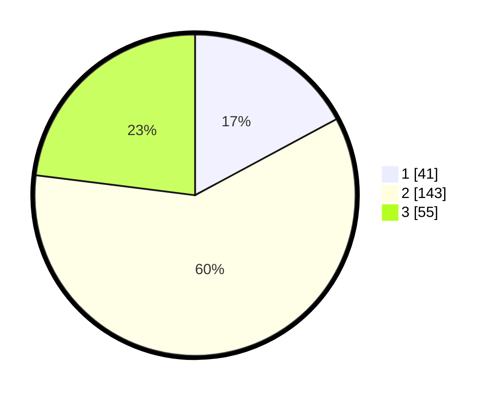

# Hasil

## Grafik

## Tabel

| No. | Nama Paslon    | Suara | Suara (raw) | Persentase |
|:--- |:-------------- | -----:| -----------:| ----------:|
| 1   | ANIES MUHAIMIN | 41    | [41][p-1]   | 17,15      |
| 2   | PRABOWO GIBRAN | 143   | [143][p-2]  | 59,83      |
| 3   | GANJAR MAHFUD  | 55    | [55][p-3]   | 23,01      |

[p-1]: https://github.com/gigit-pemilu/pemilu-2024/blob/main/pilpres/hitung-suara/sub/34-di-yogyakarta/sub/02-bantul/sub/06-pandak/sub/2001-caturharjo/sub/001-tps/sub/paslon-1.txt
[p-2]: https://github.com/gigit-pemilu/pemilu-2024/blob/main/pilpres/hitung-suara/sub/34-di-yogyakarta/sub/02-bantul/sub/06-pandak/sub/2001-caturharjo/sub/001-tps/sub/paslon-2.txt
[p-3]: https://github.com/gigit-pemilu/pemilu-2024/blob/main/pilpres/hitung-suara/sub/34-di-yogyakarta/sub/02-bantul/sub/06-pandak/sub/2001-caturharjo/sub/001-tps/sub/paslon-3.txt

## Foto C Plano

https://sirekap-obj-formc.kpu.go.id/12a6/pemilu/ppwp/34/02/06/20/01/3402062001001-20240215-030832--670a4435-01b5-4805-8d85-c49f7ced5fc9.jpg

https://sirekap-obj-formc.kpu.go.id/12a6/pemilu/ppwp/34/02/06/20/01/3402062001001-20240215-022827--9256e9b4-ef41-4191-a022-79e095b297f3.jpg

https://sirekap-obj-formc.kpu.go.id/12a6/pemilu/ppwp/34/02/06/20/01/3402062001001-20240215-022935--ad1235f7-a37b-493b-93f9-1a4eb7e79a9a.jpg

## Metadata

| Key        | Value               |
| ---------- | ------------------- |
| Time Stamp | 2024-02-25 14:00:00 |

