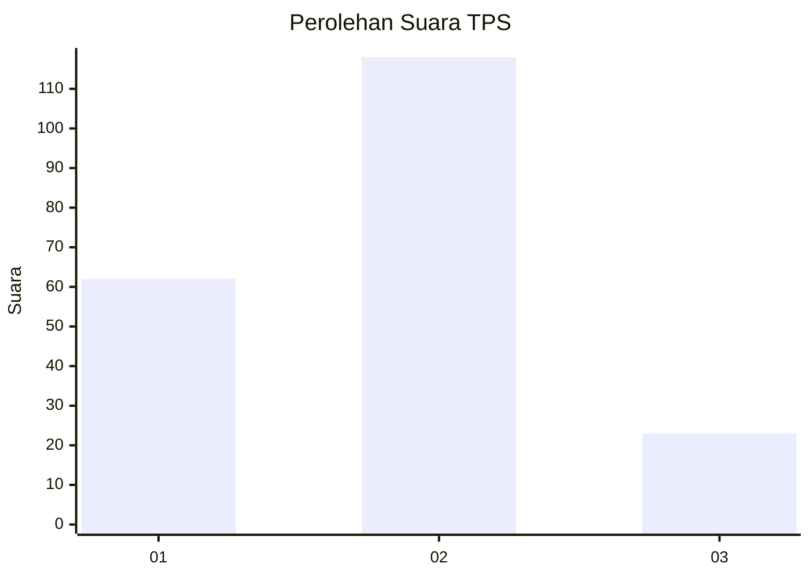
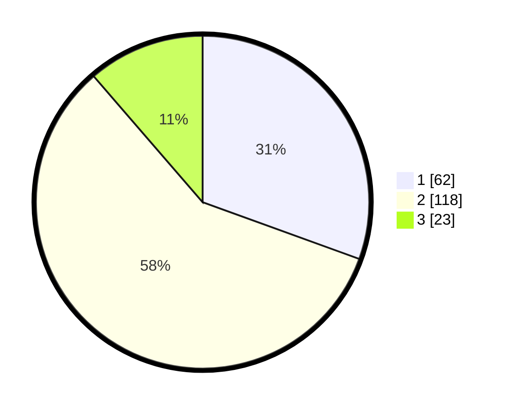

# Hasil

## Grafik

## Tabel

| No. | Nama Paslon    | Suara | Suara (raw) | Persentase |
|:--- |:-------------- | -----:| -----------:| ----------:|
| 1   | ANIES MUHAIMIN | 62    | [62][p-1]   | 30,54      |
| 2   | PRABOWO GIBRAN | 118   | [118][p-2]  | 58,13      |
| 3   | GANJAR MAHFUD  | 23    | [23][p-3]   | 11,33      |

[p-1]: https://github.com/gigit-pemilu/pemilu-2024-34-di-yogyakarta/blob/main/pilpres/hitung-suara/sub/34-di-yogyakarta/sub/02-bantul/sub/06-pandak/sub/2001-caturharjo/sub/002-tps/sub/paslon-1.txt
[p-2]: https://github.com/gigit-pemilu/pemilu-2024-34-di-yogyakarta/blob/main/pilpres/hitung-suara/sub/34-di-yogyakarta/sub/02-bantul/sub/06-pandak/sub/2001-caturharjo/sub/002-tps/sub/paslon-2.txt
[p-3]: https://github.com/gigit-pemilu/pemilu-2024-34-di-yogyakarta/blob/main/pilpres/hitung-suara/sub/34-di-yogyakarta/sub/02-bantul/sub/06-pandak/sub/2001-caturharjo/sub/002-tps/sub/paslon-3.txt

## Foto C Plano

https://sirekap-obj-formc.kpu.go.id/098e/pemilu/ppwp/34/02/06/20/01/3402062001002-20240215-012234--a773c15d-3c2f-4842-8887-7ffcf6cb8ca1.jpg

https://sirekap-obj-formc.kpu.go.id/098e/pemilu/ppwp/34/02/06/20/01/3402062001002-20240215-012520--d4cf60ad-e4e1-4bea-b31c-3d5495779539.jpg

https://sirekap-obj-formc.kpu.go.id/098e/pemilu/ppwp/34/02/06/20/01/3402062001002-20240215-012745--f401257b-5381-491f-8431-671268a0d5cc.jpg

## Metadata

| Key        | Value               |
| ---------- | ------------------- |
| Time Stamp | 2024-02-24 22:31:28 |

