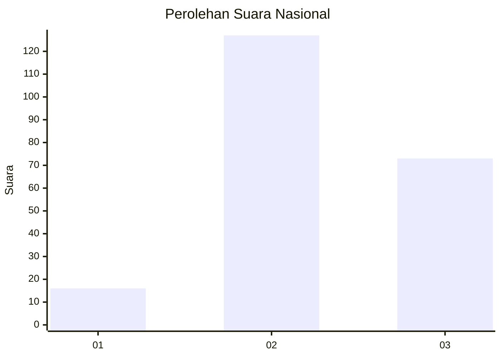
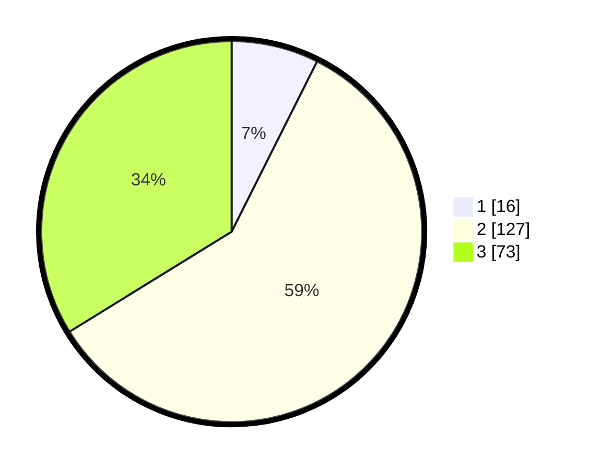

# Hasil

## Grafik

## Tabel

| No. | Nama Paslon    | Suara | Suara (raw) | Persentase |
|:--- |:-------------- | -----:| -----------:| ----------:|
| 1   | ANIES MUHAIMIN | 16    | [16][p-1]   | 7,41       |
| 2   | PRABOWO GIBRAN | 127   | [127][p-2]  | 58,80      |
| 3   | GANJAR MAHFUD  | 73    | [73][p-3]   | 33,80      |

[p-1]: https://github.com/gigit-pemilu/pemilu-2024/blob/main/pilpres/hitung-suara/sub/34-di-yogyakarta/sub/02-bantul/sub/06-pandak/sub/2001-caturharjo/sub/003-tps/sub/paslon-1.txt
[p-2]: https://github.com/gigit-pemilu/pemilu-2024/blob/main/pilpres/hitung-suara/sub/34-di-yogyakarta/sub/02-bantul/sub/06-pandak/sub/2001-caturharjo/sub/003-tps/sub/paslon-2.txt
[p-3]: https://github.com/gigit-pemilu/pemilu-2024/blob/main/pilpres/hitung-suara/sub/34-di-yogyakarta/sub/02-bantul/sub/06-pandak/sub/2001-caturharjo/sub/003-tps/sub/paslon-3.txt

## Foto C Plano

https://sirekap-obj-formc.kpu.go.id/1e40/pemilu/ppwp/34/02/06/20/01/3402062001003-20240216-145350--f1cf3997-4c32-448b-8dad-a0785b12a519.jpg

https://sirekap-obj-formc.kpu.go.id/1e40/pemilu/ppwp/34/02/06/20/01/3402062001003-20240216-145651--b67882ee-10fe-4e78-a1c7-0f49a96bbc61.jpg

https://sirekap-obj-formc.kpu.go.id/1e40/pemilu/ppwp/34/02/06/20/01/3402062001003-20240216-145913--4a659cd2-0612-41fb-8014-c7e8a770c50b.jpg

## Metadata

| Key        | Value               |
| ---------- | ------------------- |
| Time Stamp | 2024-02-24 22:31:28 |

