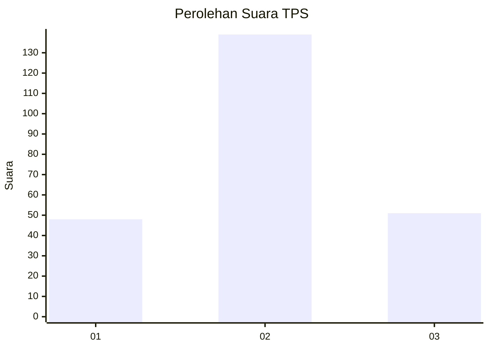
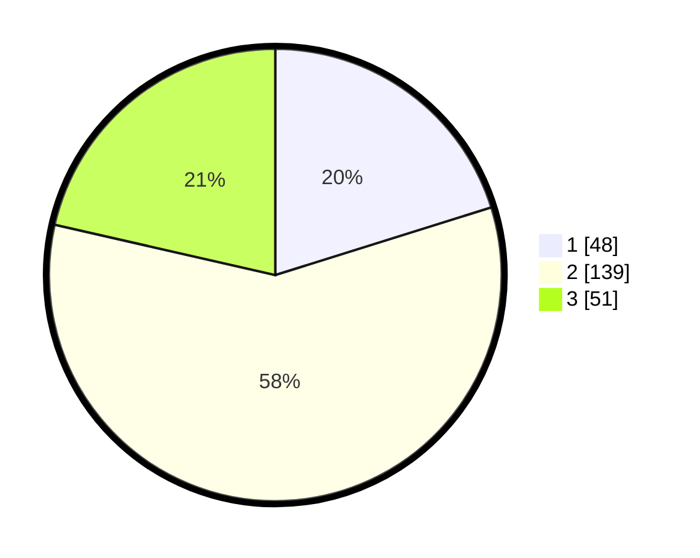

# Hasil

## Grafik

## Tabel

| No. | Nama Paslon    | Suara | Suara (raw) | Persentase |
|:--- |:-------------- | -----:| -----------:| ----------:|
| 1   | ANIES MUHAIMIN | 48    | [48][p-1]   | 20,17      |
| 2   | PRABOWO GIBRAN | 139   | [139][p-2]  | 58,40      |
| 3   | GANJAR MAHFUD  | 51    | [51][p-3]   | 21,43      |

[p-1]: https://github.com/gigit-pemilu/pemilu-2024-34-di-yogyakarta/blob/main/pilpres/hitung-suara/sub/34-di-yogyakarta/sub/02-bantul/sub/06-pandak/sub/2001-caturharjo/sub/004-tps/sub/paslon-1.txt
[p-2]: https://github.com/gigit-pemilu/pemilu-2024-34-di-yogyakarta/blob/main/pilpres/hitung-suara/sub/34-di-yogyakarta/sub/02-bantul/sub/06-pandak/sub/2001-caturharjo/sub/004-tps/sub/paslon-2.txt
[p-3]: https://github.com/gigit-pemilu/pemilu-2024-34-di-yogyakarta/blob/main/pilpres/hitung-suara/sub/34-di-yogyakarta/sub/02-bantul/sub/06-pandak/sub/2001-caturharjo/sub/004-tps/sub/paslon-3.txt

## Foto C Plano

https://sirekap-obj-formc.kpu.go.id/0d51/pemilu/ppwp/34/02/06/20/01/3402062001004-20240214-225612--66c986bf-2b70-40b0-a54f-1d6509b9c976.jpg

https://sirekap-obj-formc.kpu.go.id/0d51/pemilu/ppwp/34/02/06/20/01/3402062001004-20240214-225623--b79a9f18-e789-4c67-aea5-7aaacec737c0.jpg

https://sirekap-obj-formc.kpu.go.id/0d51/pemilu/ppwp/34/02/06/20/01/3402062001004-20240214-225633--2f50cf1d-973a-48a3-8b01-e4dca79c1e76.jpg

## Metadata

| Key        | Value               |
| ---------- | ------------------- |
| Time Stamp | 2024-02-26 12:00:00 |

