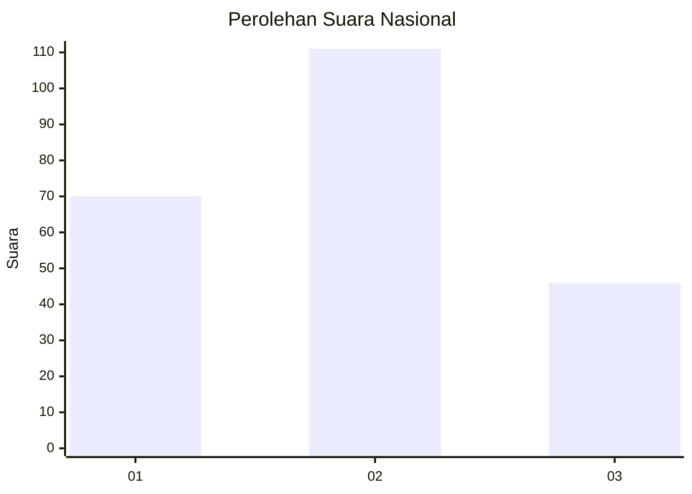
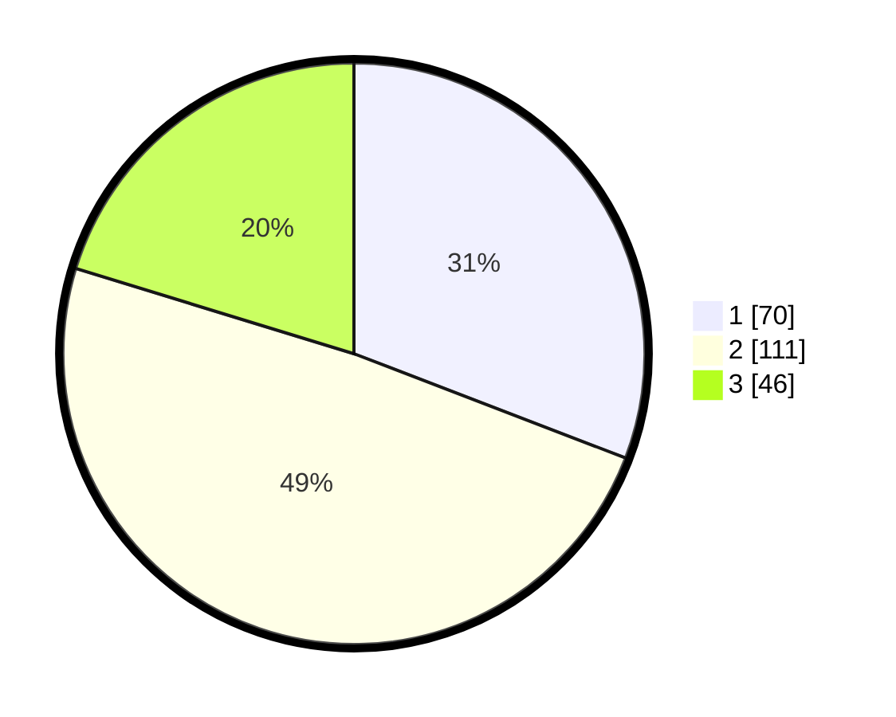

# Hasil

## Grafik

## Tabel

| No. | Nama Paslon    | Suara | Suara (raw) | Persentase |
|:--- |:-------------- | -----:| -----------:| ----------:|
| 1   | ANIES MUHAIMIN | 70    | [70][p-1]   | 30,84      |
| 2   | PRABOWO GIBRAN | 111   | [111][p-2]  | 48,90      |
| 3   | GANJAR MAHFUD  | 46    | [46][p-3]   | 20,26      |

[p-1]: https://github.com/gigit-pemilu/pemilu-2024/blob/main/pilpres/hitung-suara/sub/34-di-yogyakarta/sub/02-bantul/sub/06-pandak/sub/2001-caturharjo/sub/005-tps/sub/paslon-1.txt
[p-2]: https://github.com/gigit-pemilu/pemilu-2024/blob/main/pilpres/hitung-suara/sub/34-di-yogyakarta/sub/02-bantul/sub/06-pandak/sub/2001-caturharjo/sub/005-tps/sub/paslon-2.txt
[p-3]: https://github.com/gigit-pemilu/pemilu-2024/blob/main/pilpres/hitung-suara/sub/34-di-yogyakarta/sub/02-bantul/sub/06-pandak/sub/2001-caturharjo/sub/005-tps/sub/paslon-3.txt

## Foto C Plano

https://sirekap-obj-formc.kpu.go.id/28fd/pemilu/ppwp/34/02/06/20/01/3402062001005-20240214-201902--682658c9-c89a-493d-ba95-be98d7d32088.jpg

https://sirekap-obj-formc.kpu.go.id/28fd/pemilu/ppwp/34/02/06/20/01/3402062001005-20240214-202300--81e4c252-e6b2-453b-8f83-d792e2f2f220.jpg

https://sirekap-obj-formc.kpu.go.id/28fd/pemilu/ppwp/34/02/06/20/01/3402062001005-20240214-202527--6f6e292b-b27d-49ec-9620-176a61c5d31c.jpg

## Metadata

| Key        | Value               |
| ---------- | ------------------- |
| Time Stamp | 2024-02-24 22:31:28 |

