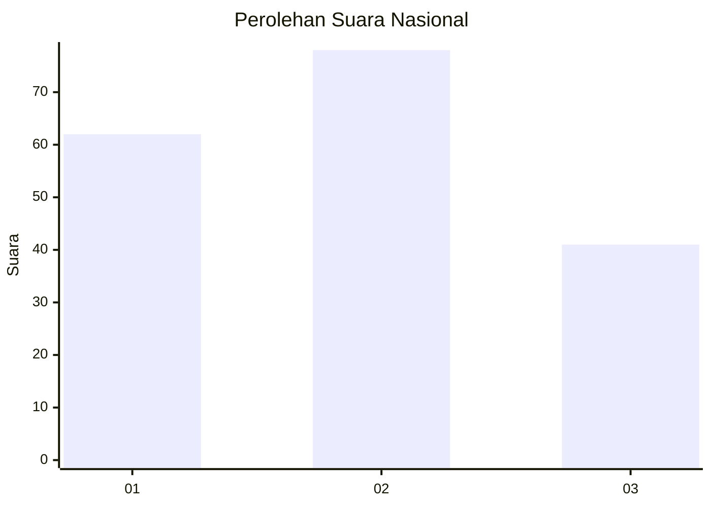
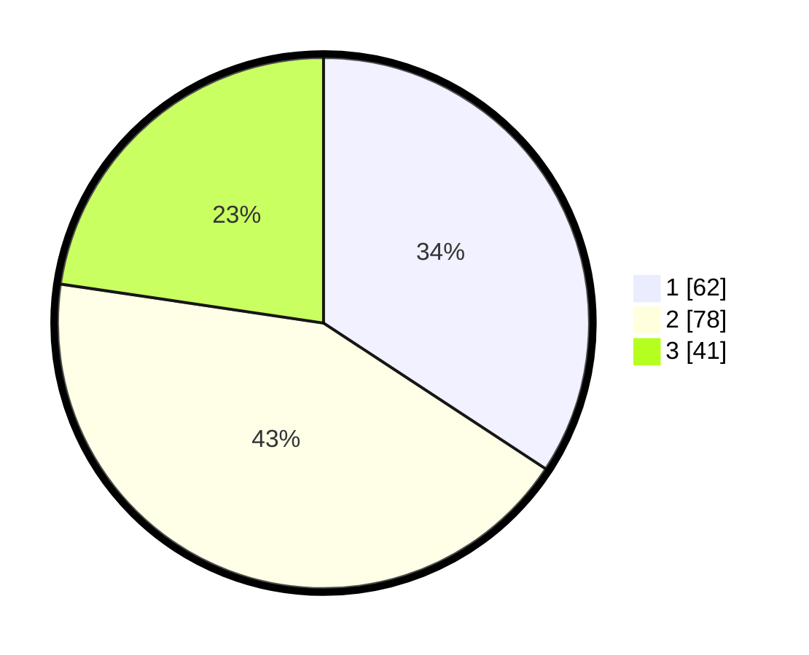

# Hasil

## Grafik

## Tabel

| No. | Nama Paslon    | Suara | Suara (raw) | Persentase |
|:--- |:-------------- | -----:| -----------:| ----------:|
| 1   | ANIES MUHAIMIN | 62    | [62][p-1]   | 34,25      |
| 2   | PRABOWO GIBRAN | 78    | [78][p-2]   | 43,09      |
| 3   | GANJAR MAHFUD  | 41    | [41][p-3]   | 22,65      |

[p-1]: https://github.com/gigit-pemilu/pemilu-2024/blob/main/pilpres/hitung-suara/sub/34-di-yogyakarta/sub/02-bantul/sub/06-pandak/sub/2001-caturharjo/sub/006-tps/sub/paslon-1.txt
[p-2]: https://github.com/gigit-pemilu/pemilu-2024/blob/main/pilpres/hitung-suara/sub/34-di-yogyakarta/sub/02-bantul/sub/06-pandak/sub/2001-caturharjo/sub/006-tps/sub/paslon-2.txt
[p-3]: https://github.com/gigit-pemilu/pemilu-2024/blob/main/pilpres/hitung-suara/sub/34-di-yogyakarta/sub/02-bantul/sub/06-pandak/sub/2001-caturharjo/sub/006-tps/sub/paslon-3.txt

## Foto C Plano

https://sirekap-obj-formc.kpu.go.id/5008/pemilu/ppwp/34/02/06/20/01/3402062001006-20240215-021118--358f9e0b-84b7-4215-afbf-ca7a160f1f8b.jpg

https://sirekap-obj-formc.kpu.go.id/5008/pemilu/ppwp/34/02/06/20/01/3402062001006-20240215-021203--a72ca996-f717-4997-b33b-63dcd7b687aa.jpg

https://sirekap-obj-formc.kpu.go.id/5008/pemilu/ppwp/34/02/06/20/01/3402062001006-20240215-021405--d57884ce-8bde-41d6-9ddf-fc3105ef5ec1.jpg

## Metadata

| Key        | Value               |
| ---------- | ------------------- |
| Time Stamp | 2024-02-25 12:00:00 |

