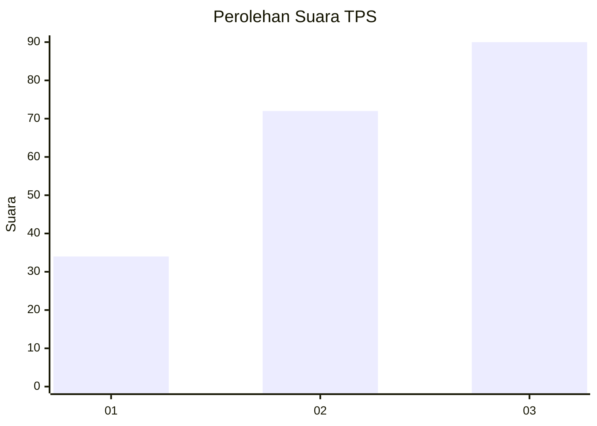
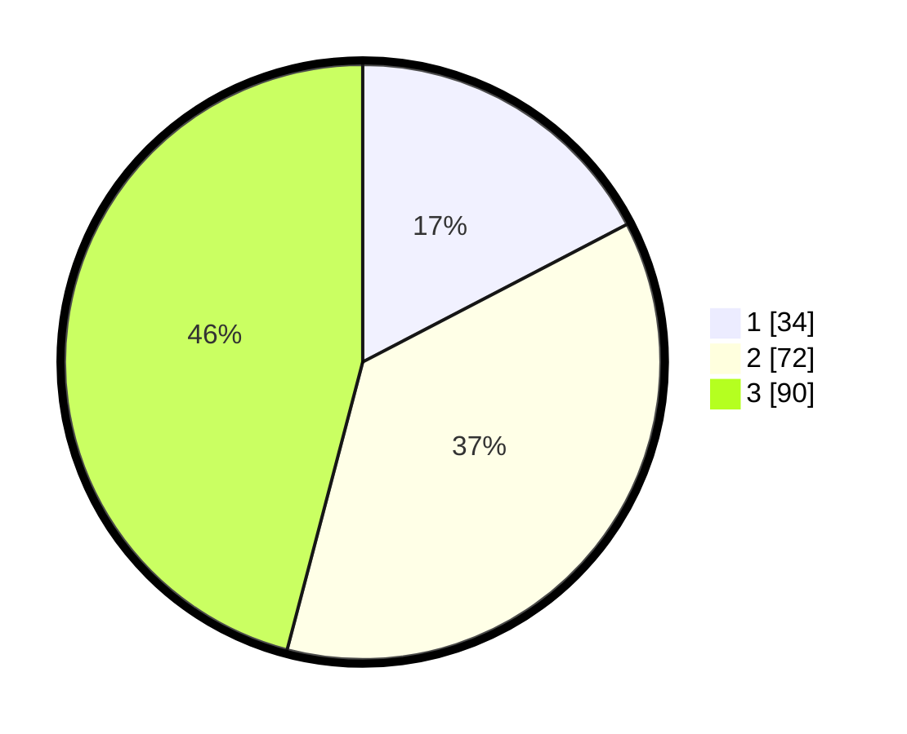

# Hasil

## Grafik

## Tabel

| No. | Nama Paslon    | Suara | Suara (raw) | Persentase |
|:--- |:-------------- | -----:| -----------:| ----------:|
| 1   | ANIES MUHAIMIN | 34    | [34][p-1]   | 17,35      |
| 2   | PRABOWO GIBRAN | 72    | [72][p-2]   | 36,73      |
| 3   | GANJAR MAHFUD  | 90    | [90][p-3]   | 45,92      |

[p-1]: https://github.com/gigit-pemilu/pemilu-2024-34-di-yogyakarta/blob/main/pilpres/hitung-suara/sub/34-di-yogyakarta/sub/02-bantul/sub/06-pandak/sub/2001-caturharjo/sub/007-tps/sub/paslon-1.txt
[p-2]: https://github.com/gigit-pemilu/pemilu-2024-34-di-yogyakarta/blob/main/pilpres/hitung-suara/sub/34-di-yogyakarta/sub/02-bantul/sub/06-pandak/sub/2001-caturharjo/sub/007-tps/sub/paslon-2.txt
[p-3]: https://github.com/gigit-pemilu/pemilu-2024-34-di-yogyakarta/blob/main/pilpres/hitung-suara/sub/34-di-yogyakarta/sub/02-bantul/sub/06-pandak/sub/2001-caturharjo/sub/007-tps/sub/paslon-3.txt

## Foto C Plano

https://sirekap-obj-formc.kpu.go.id/befc/pemilu/ppwp/34/02/06/20/01/3402062001007-20240214-225319--6667d3c9-912f-48ec-9620-6d9dcc44f8a6.jpg

https://sirekap-obj-formc.kpu.go.id/befc/pemilu/ppwp/34/02/06/20/01/3402062001007-20240214-225412--c11fe0db-1582-424e-8b52-9c904b6dc060.jpg

https://sirekap-obj-formc.kpu.go.id/befc/pemilu/ppwp/34/02/06/20/01/3402062001007-20240214-225454--c1ddde31-bc1d-4c63-be30-1234c25c91b3.jpg

## Metadata

| Key        | Value               |
| ---------- | ------------------- |
| Time Stamp | 2024-02-24 22:31:28 |

