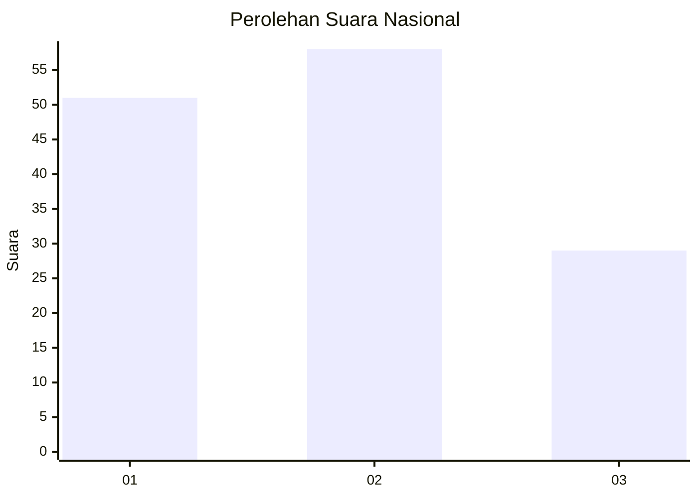
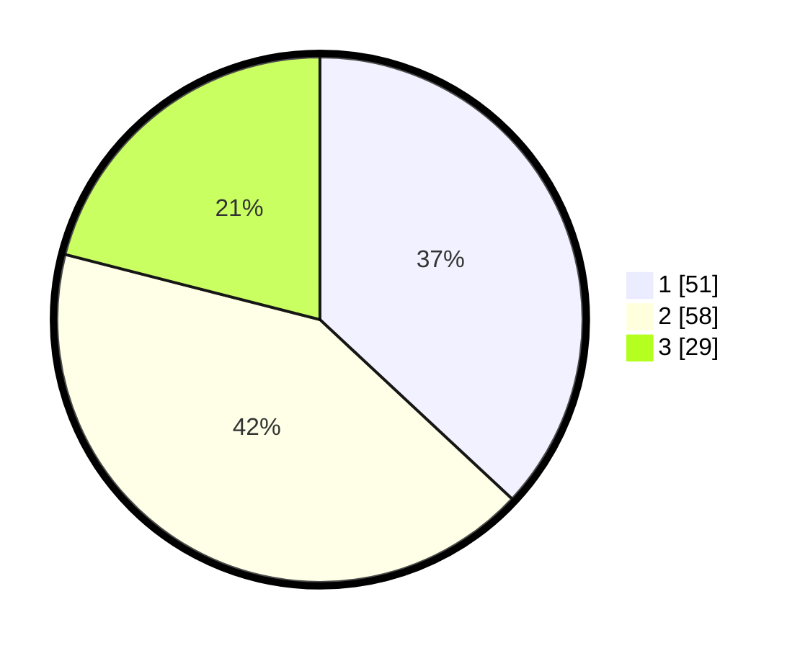

# Hasil

## Grafik

## Tabel

| No. | Nama Paslon    | Suara | Suara (raw) | Persentase |
|:--- |:-------------- | -----:| -----------:| ----------:|
| 1   | ANIES MUHAIMIN | 51    | [51][p-1]   | 36,96      |
| 2   | PRABOWO GIBRAN | 58    | [58][p-2]   | 42,03      |
| 3   | GANJAR MAHFUD  | 29    | [29][p-3]   | 21,01      |

[p-1]: https://github.com/gigit-pemilu/pemilu-2024/blob/main/pilpres/hitung-suara/sub/34-di-yogyakarta/sub/02-bantul/sub/06-pandak/sub/2001-caturharjo/sub/010-tps/sub/paslon-1.txt
[p-2]: https://github.com/gigit-pemilu/pemilu-2024/blob/main/pilpres/hitung-suara/sub/34-di-yogyakarta/sub/02-bantul/sub/06-pandak/sub/2001-caturharjo/sub/010-tps/sub/paslon-2.txt
[p-3]: https://github.com/gigit-pemilu/pemilu-2024/blob/main/pilpres/hitung-suara/sub/34-di-yogyakarta/sub/02-bantul/sub/06-pandak/sub/2001-caturharjo/sub/010-tps/sub/paslon-3.txt

## Foto C Plano

https://sirekap-obj-formc.kpu.go.id/37fc/pemilu/ppwp/34/02/06/20/01/3402062001010-20240214-230308--0217ef65-cbe5-4715-abb5-4450993de4be.jpg

https://sirekap-obj-formc.kpu.go.id/37fc/pemilu/ppwp/34/02/06/20/01/3402062001010-20240215-021119--2f2f581b-ae09-4331-92f2-c2c146954839.jpg

https://sirekap-obj-formc.kpu.go.id/37fc/pemilu/ppwp/34/02/06/20/01/3402062001010-20240215-021823--d8b41805-a581-42e0-9fc6-dd82a817695e.jpg

## Metadata

| Key        | Value               |
| ---------- | ------------------- |
| Time Stamp | 2024-02-19 11:00:00 |

