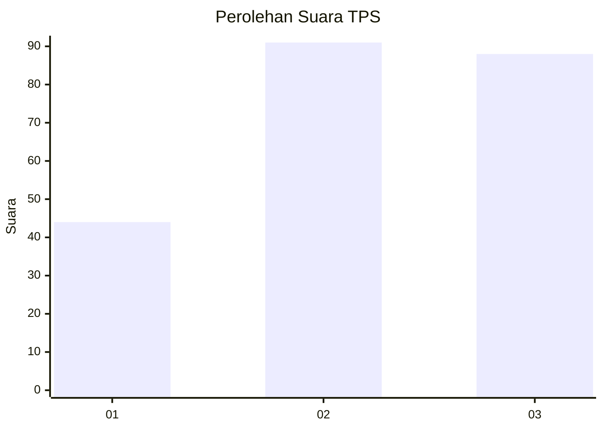
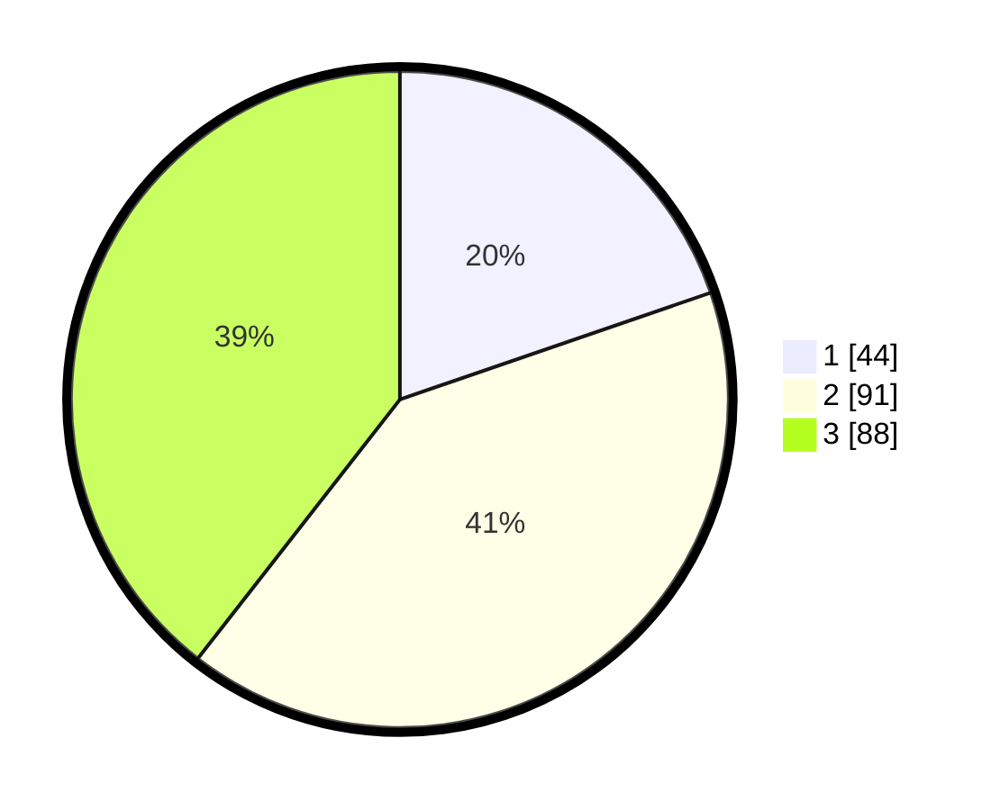

# Hasil

## Grafik

## Tabel

| No. | Nama Paslon    | Suara | Suara (raw) | Persentase |
|:--- |:-------------- | -----:| -----------:| ----------:|
| 1   | ANIES MUHAIMIN | 44    | [44][p-1]   | 19,73      |
| 2   | PRABOWO GIBRAN | 91    | [91][p-2]   | 40,81      |
| 3   | GANJAR MAHFUD  | 88    | [88][p-3]   | 39,46      |

[p-1]: https://github.com/gigit-pemilu/pemilu-2024-34-di-yogyakarta/blob/main/pilpres/hitung-suara/sub/34-di-yogyakarta/sub/02-bantul/sub/06-pandak/sub/2001-caturharjo/sub/011-tps/sub/paslon-1.txt
[p-2]: https://github.com/gigit-pemilu/pemilu-2024-34-di-yogyakarta/blob/main/pilpres/hitung-suara/sub/34-di-yogyakarta/sub/02-bantul/sub/06-pandak/sub/2001-caturharjo/sub/011-tps/sub/paslon-2.txt
[p-3]: https://github.com/gigit-pemilu/pemilu-2024-34-di-yogyakarta/blob/main/pilpres/hitung-suara/sub/34-di-yogyakarta/sub/02-bantul/sub/06-pandak/sub/2001-caturharjo/sub/011-tps/sub/paslon-3.txt

## Foto C Plano

https://sirekap-obj-formc.kpu.go.id/1c93/pemilu/ppwp/34/02/06/20/01/3402062001011-20240214-221302--03586973-08ca-4273-82dc-7edb71c18fcd.jpg

https://sirekap-obj-formc.kpu.go.id/1c93/pemilu/ppwp/34/02/06/20/01/3402062001011-20240214-221645--e50dbb71-fcd6-494d-b2c2-acb2b9d35a19.jpg

https://sirekap-obj-formc.kpu.go.id/1c93/pemilu/ppwp/34/02/06/20/01/3402062001011-20240214-221532--3422ffd0-41c1-4243-8519-daa9a1671dac.jpg

## Metadata

| Key        | Value               |
| ---------- | ------------------- |
| Time Stamp | 2024-02-24 22:31:28 |

