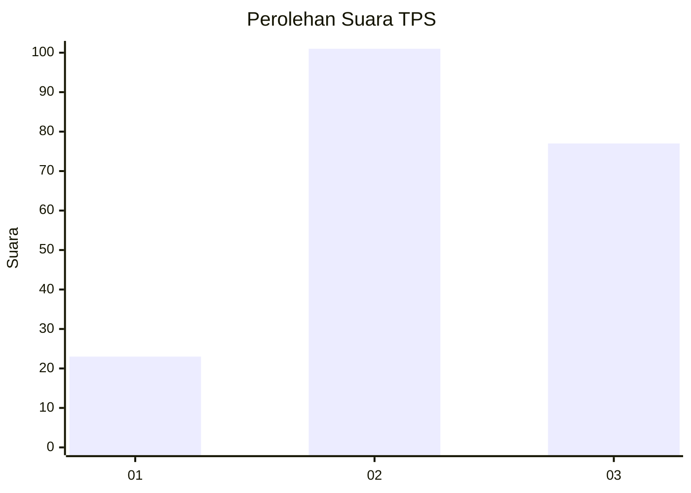
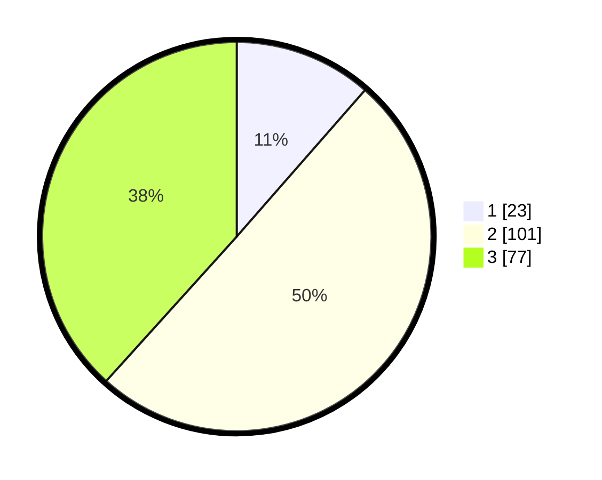

# Hasil

## Grafik

## Tabel

| No. | Nama Paslon    | Suara | Suara (raw) | Persentase |
|:--- |:-------------- | -----:| -----------:| ----------:|
| 1   | ANIES MUHAIMIN | 23    | [23][p-1]   | 11,44      |
| 2   | PRABOWO GIBRAN | 101   | [101][p-2]  | 50,25      |
| 3   | GANJAR MAHFUD  | 77    | [77][p-3]   | 38,31      |

[p-1]: https://github.com/gigit-pemilu/pemilu-2024-34-di-yogyakarta/blob/main/pilpres/hitung-suara/sub/34-di-yogyakarta/sub/02-bantul/sub/06-pandak/sub/2001-caturharjo/sub/012-tps/sub/paslon-1.txt
[p-2]: https://github.com/gigit-pemilu/pemilu-2024-34-di-yogyakarta/blob/main/pilpres/hitung-suara/sub/34-di-yogyakarta/sub/02-bantul/sub/06-pandak/sub/2001-caturharjo/sub/012-tps/sub/paslon-2.txt
[p-3]: https://github.com/gigit-pemilu/pemilu-2024-34-di-yogyakarta/blob/main/pilpres/hitung-suara/sub/34-di-yogyakarta/sub/02-bantul/sub/06-pandak/sub/2001-caturharjo/sub/012-tps/sub/paslon-3.txt

## Foto C Plano

https://sirekap-obj-formc.kpu.go.id/7421/pemilu/ppwp/34/02/06/20/01/3402062001012-20240214-233855--373aea69-0e48-4c73-84d7-bbb0a5497734.jpg

https://sirekap-obj-formc.kpu.go.id/7421/pemilu/ppwp/34/02/06/20/01/3402062001012-20240214-233958--b3fa9f59-9328-4185-99f9-4213827734c4.jpg

https://sirekap-obj-formc.kpu.go.id/7421/pemilu/ppwp/34/02/06/20/01/3402062001012-20240214-234054--f2fb1615-3784-4497-bb0e-51a887dd2ee9.jpg

## Metadata

| Key        | Value               |
| ---------- | ------------------- |
| Time Stamp | 2024-02-24 22:31:28 |

