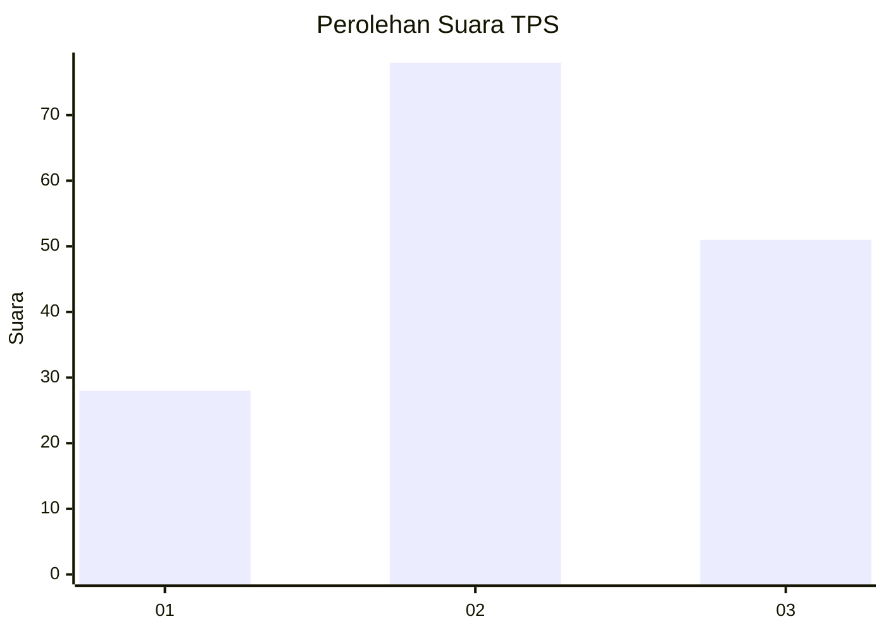
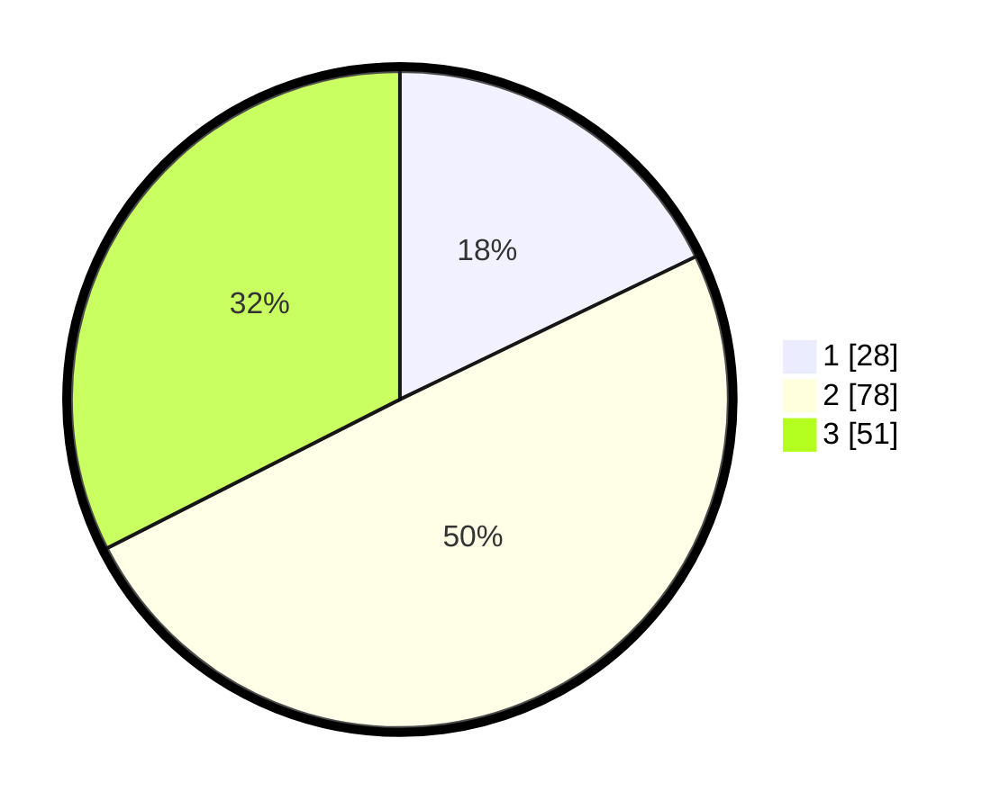

# Hasil

## Grafik

## Tabel

| No. | Nama Paslon    | Suara | Suara (raw) | Persentase |
|:--- |:-------------- | -----:| -----------:| ----------:|
| 1   | ANIES MUHAIMIN | 28    | [28][p-1]   | 17,83      |
| 2   | PRABOWO GIBRAN | 78    | [78][p-2]   | 49,68      |
| 3   | GANJAR MAHFUD  | 51    | [51][p-3]   | 32,48      |

[p-1]: https://github.com/gigit-pemilu/pemilu-2024-34-di-yogyakarta/blob/main/pilpres/hitung-suara/sub/34-di-yogyakarta/sub/02-bantul/sub/06-pandak/sub/2001-caturharjo/sub/017-tps/sub/paslon-1.txt
[p-2]: https://github.com/gigit-pemilu/pemilu-2024-34-di-yogyakarta/blob/main/pilpres/hitung-suara/sub/34-di-yogyakarta/sub/02-bantul/sub/06-pandak/sub/2001-caturharjo/sub/017-tps/sub/paslon-2.txt
[p-3]: https://github.com/gigit-pemilu/pemilu-2024-34-di-yogyakarta/blob/main/pilpres/hitung-suara/sub/34-di-yogyakarta/sub/02-bantul/sub/06-pandak/sub/2001-caturharjo/sub/017-tps/sub/paslon-3.txt

## Foto C Plano

https://sirekap-obj-formc.kpu.go.id/ee13/pemilu/ppwp/34/02/06/20/01/3402062001017-20240215-003407--1ffc5ce1-bbd8-476d-9b43-9e7ff4d37944.jpg

https://sirekap-obj-formc.kpu.go.id/ee13/pemilu/ppwp/34/02/06/20/01/3402062001017-20240215-003447--761a1595-e735-4429-8611-755b1e5bd39d.jpg

https://sirekap-obj-formc.kpu.go.id/ee13/pemilu/ppwp/34/02/06/20/01/3402062001017-20240215-003632--a0c7bcc0-8347-4e47-8b82-5e7543d2bd0c.jpg

## Metadata

| Key        | Value               |
| ---------- | ------------------- |
| Time Stamp | 2024-02-24 22:31:28 |

