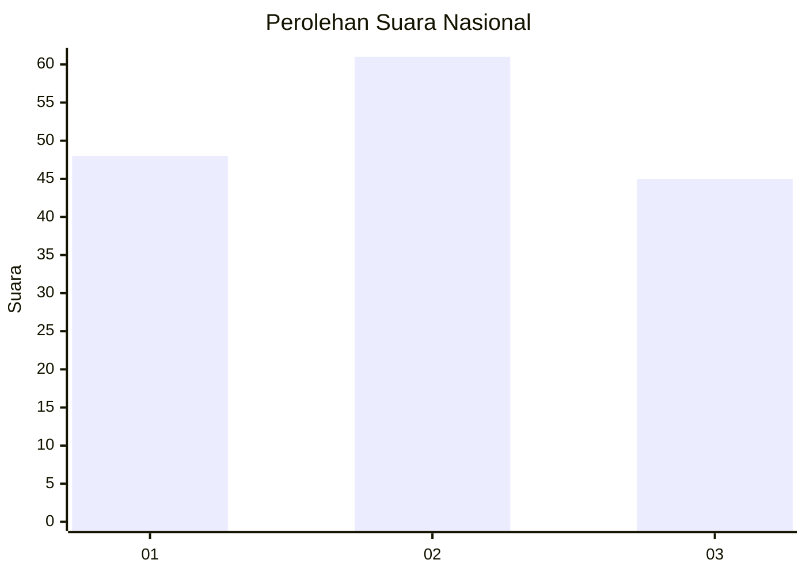
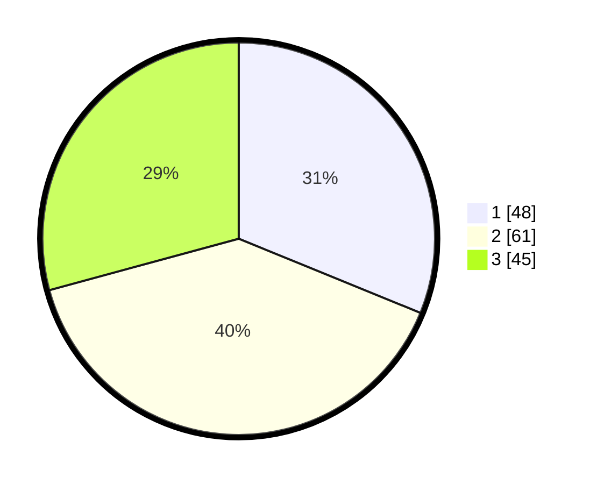

# Hasil

## Grafik

## Tabel

| No. | Nama Paslon    | Suara | Suara (raw) | Persentase |
|:--- |:-------------- | -----:| -----------:| ----------:|
| 1   | ANIES MUHAIMIN | 48    | [48][p-1]   | 31,17      |
| 2   | PRABOWO GIBRAN | 61    | [61][p-2]   | 39,61      |
| 3   | GANJAR MAHFUD  | 45    | [45][p-3]   | 29,22      |

[p-1]: https://github.com/gigit-pemilu/pemilu-2024/blob/main/pilpres/hitung-suara/sub/34-di-yogyakarta/sub/02-bantul/sub/06-pandak/sub/2001-caturharjo/sub/021-tps/sub/paslon-1.txt
[p-2]: https://github.com/gigit-pemilu/pemilu-2024/blob/main/pilpres/hitung-suara/sub/34-di-yogyakarta/sub/02-bantul/sub/06-pandak/sub/2001-caturharjo/sub/021-tps/sub/paslon-2.txt
[p-3]: https://github.com/gigit-pemilu/pemilu-2024/blob/main/pilpres/hitung-suara/sub/34-di-yogyakarta/sub/02-bantul/sub/06-pandak/sub/2001-caturharjo/sub/021-tps/sub/paslon-3.txt

## Foto C Plano

https://sirekap-obj-formc.kpu.go.id/248b/pemilu/ppwp/34/02/06/20/01/3402062001021-20240217-211212--92b3fc73-c3b0-43ca-bbb1-5f4fea31924b.jpg

https://sirekap-obj-formc.kpu.go.id/248b/pemilu/ppwp/34/02/06/20/01/3402062001021-20240214-141258--0412dd3e-a638-49ab-9ccc-cfb7a1bd261f.jpg

https://sirekap-obj-formc.kpu.go.id/248b/pemilu/ppwp/34/02/06/20/01/3402062001021-20240214-141444--21860bbb-8aac-4aa6-969a-0def883bc29d.jpg

## Metadata

| Key        | Value               |
| ---------- | ------------------- |
| Time Stamp | 2024-02-19 06:16:00 |

