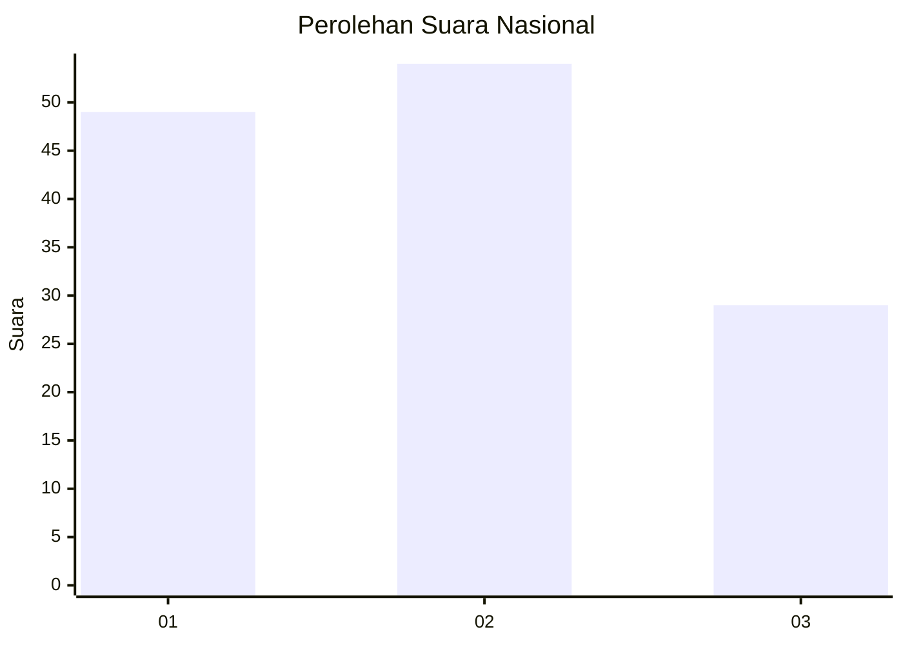
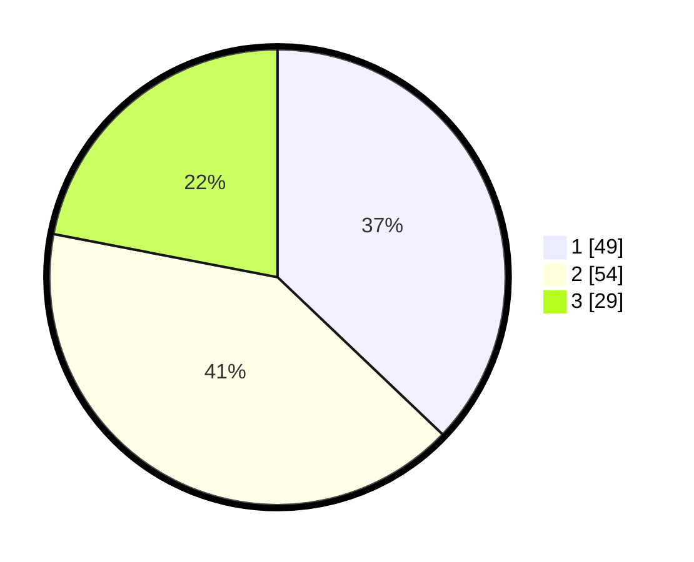

# Hasil

## Grafik

## Tabel

| No. | Nama Paslon    | Suara | Suara (raw) | Persentase |
|:--- |:-------------- | -----:| -----------:| ----------:|
| 1   | ANIES MUHAIMIN | 49    | [49][p-1]   | 37,12      |
| 2   | PRABOWO GIBRAN | 54    | [54][p-2]   | 40,91      |
| 3   | GANJAR MAHFUD  | 29    | [29][p-3]   | 21,97      |

[p-1]: https://github.com/gigit-pemilu/pemilu-2024/blob/main/pilpres/hitung-suara/sub/34-di-yogyakarta/sub/02-bantul/sub/06-pandak/sub/2001-caturharjo/sub/022-tps/sub/paslon-1.txt
[p-2]: https://github.com/gigit-pemilu/pemilu-2024/blob/main/pilpres/hitung-suara/sub/34-di-yogyakarta/sub/02-bantul/sub/06-pandak/sub/2001-caturharjo/sub/022-tps/sub/paslon-2.txt
[p-3]: https://github.com/gigit-pemilu/pemilu-2024/blob/main/pilpres/hitung-suara/sub/34-di-yogyakarta/sub/02-bantul/sub/06-pandak/sub/2001-caturharjo/sub/022-tps/sub/paslon-3.txt

## Foto C Plano

https://sirekap-obj-formc.kpu.go.id/139e/pemilu/ppwp/34/02/06/20/01/3402062001022-20240214-215008--1764ff83-8d90-499f-8d02-17923b2c4981.jpg

https://sirekap-obj-formc.kpu.go.id/139e/pemilu/ppwp/34/02/06/20/01/3402062001022-20240214-205555--893ea5b6-e862-40b5-a99d-a4dbd4e293de.jpg

https://sirekap-obj-formc.kpu.go.id/139e/pemilu/ppwp/34/02/06/20/01/3402062001022-20240215-001236--3a02b305-030c-4f0c-96e6-be8e710999ef.jpg

## Metadata

| Key        | Value               |
| ---------- | ------------------- |
| Time Stamp | 2024-02-15 00:41:44 |

