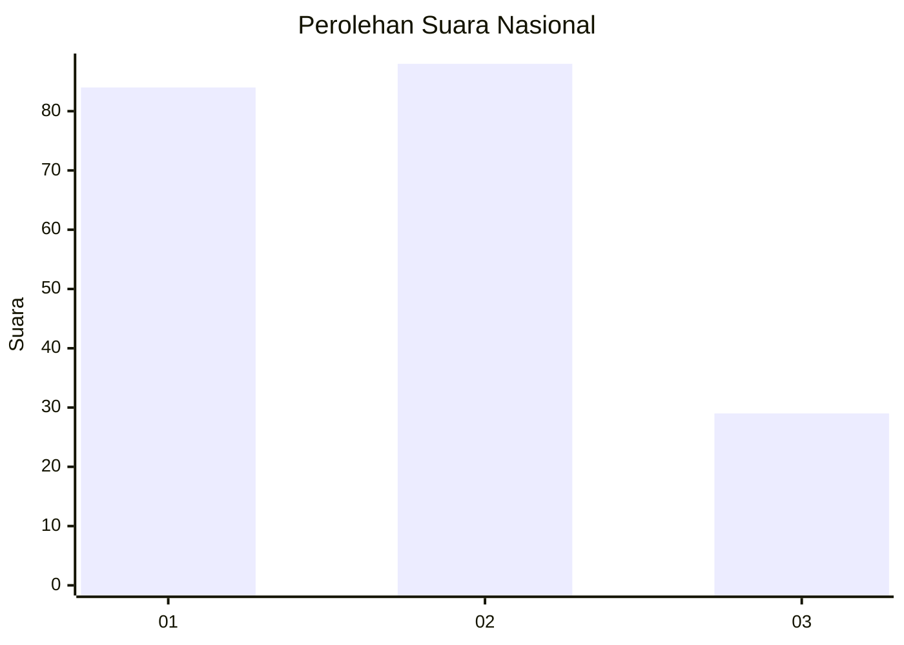
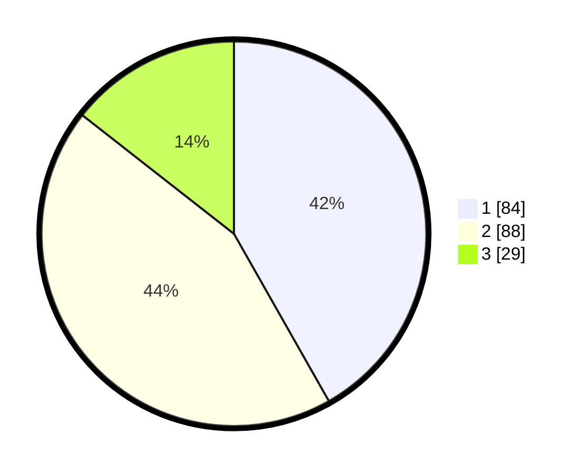

# Hasil

## Grafik

## Tabel

| No. | Nama Paslon    | Suara | Suara (raw) | Persentase |
|:--- |:-------------- | -----:| -----------:| ----------:|
| 1   | ANIES MUHAIMIN | 84    | [84][p-1]   | 41,79      |
| 2   | PRABOWO GIBRAN | 88    | [88][p-2]   | 43,78      |
| 3   | GANJAR MAHFUD  | 29    | [29][p-3]   | 14,43      |

[p-1]: https://github.com/gigit-pemilu/pemilu-2024/blob/main/pilpres/hitung-suara/sub/34-di-yogyakarta/sub/02-bantul/sub/06-pandak/sub/2001-caturharjo/sub/023-tps/sub/paslon-1.txt
[p-2]: https://github.com/gigit-pemilu/pemilu-2024/blob/main/pilpres/hitung-suara/sub/34-di-yogyakarta/sub/02-bantul/sub/06-pandak/sub/2001-caturharjo/sub/023-tps/sub/paslon-2.txt
[p-3]: https://github.com/gigit-pemilu/pemilu-2024/blob/main/pilpres/hitung-suara/sub/34-di-yogyakarta/sub/02-bantul/sub/06-pandak/sub/2001-caturharjo/sub/023-tps/sub/paslon-3.txt

## Foto C Plano

https://sirekap-obj-formc.kpu.go.id/46a4/pemilu/ppwp/34/02/06/20/01/3402062001023-20240218-105919--2cff1270-d1db-4666-bbb8-d9b3beda29c8.jpg

https://sirekap-obj-formc.kpu.go.id/46a4/pemilu/ppwp/34/02/06/20/01/3402062001023-20240218-110001--55605a4b-0b0b-4f2d-a49a-6fff1eca0425.jpg

https://sirekap-obj-formc.kpu.go.id/46a4/pemilu/ppwp/34/02/06/20/01/3402062001023-20240218-110046--34667e58-ff96-477d-baf4-1e52b54fd620.jpg

## Metadata

| Key        | Value               |
| ---------- | ------------------- |
| Time Stamp | 2024-02-24 22:31:28 |

