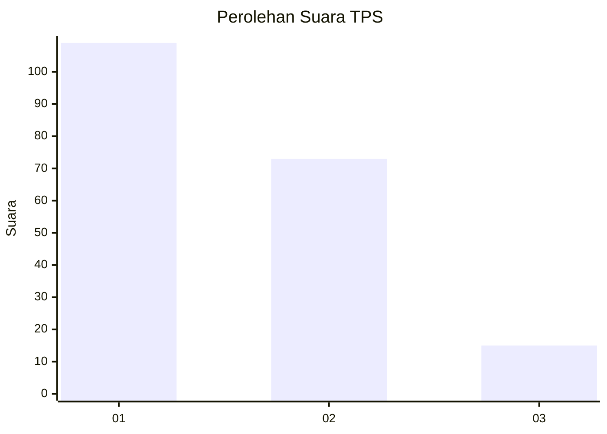
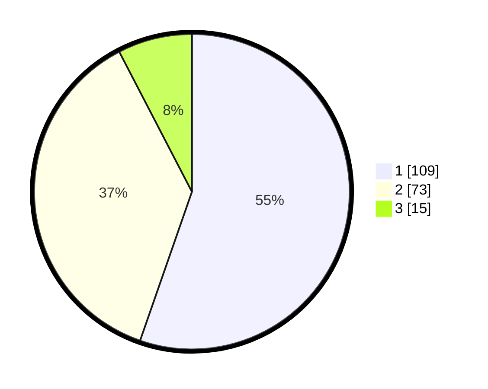

# Hasil

## Grafik

## Tabel

| No. | Nama Paslon    | Suara | Suara (raw) | Persentase |
|:--- |:-------------- | -----:| -----------:| ----------:|
| 1   | ANIES MUHAIMIN | 109   | [109][p-1]  | 55,33      |
| 2   | PRABOWO GIBRAN | 73    | [73][p-2]   | 37,06      |
| 3   | GANJAR MAHFUD  | 15    | [15][p-3]   | 7,61       |

[p-1]: https://github.com/gigit-pemilu/pemilu-2024-34-di-yogyakarta/blob/main/pilpres/hitung-suara/sub/34-di-yogyakarta/sub/02-bantul/sub/06-pandak/sub/2001-caturharjo/sub/024-tps/sub/paslon-1.txt
[p-2]: https://github.com/gigit-pemilu/pemilu-2024-34-di-yogyakarta/blob/main/pilpres/hitung-suara/sub/34-di-yogyakarta/sub/02-bantul/sub/06-pandak/sub/2001-caturharjo/sub/024-tps/sub/paslon-2.txt
[p-3]: https://github.com/gigit-pemilu/pemilu-2024-34-di-yogyakarta/blob/main/pilpres/hitung-suara/sub/34-di-yogyakarta/sub/02-bantul/sub/06-pandak/sub/2001-caturharjo/sub/024-tps/sub/paslon-3.txt

## Foto C Plano

https://sirekap-obj-formc.kpu.go.id/45a9/pemilu/ppwp/34/02/06/20/01/3402062001024-20240218-114507--e616c02a-98a5-4d92-8aed-679a88b2c89b.jpg

https://sirekap-obj-formc.kpu.go.id/45a9/pemilu/ppwp/34/02/06/20/01/3402062001024-20240218-114536--51ac2d6d-e3ab-478e-95a7-bf81ccb51c08.jpg

https://sirekap-obj-formc.kpu.go.id/45a9/pemilu/ppwp/34/02/06/20/01/3402062001024-20240218-114602--73fc15c6-d085-48e9-a682-667c8550e143.jpg

## Metadata

| Key        | Value               |
| ---------- | ------------------- |
| Time Stamp | 2024-02-24 22:31:28 |

