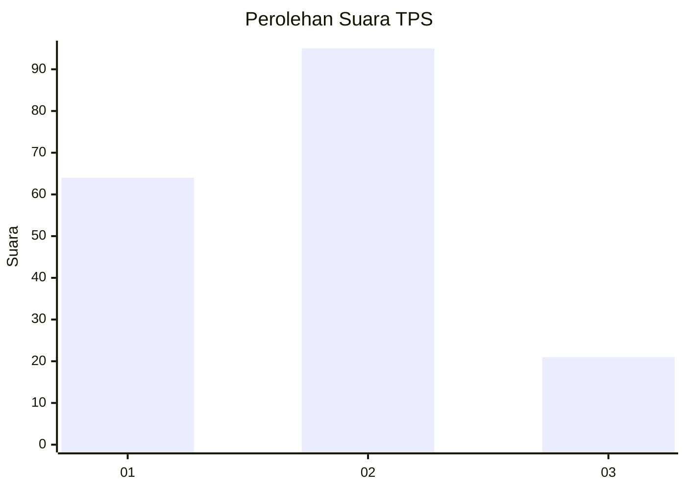
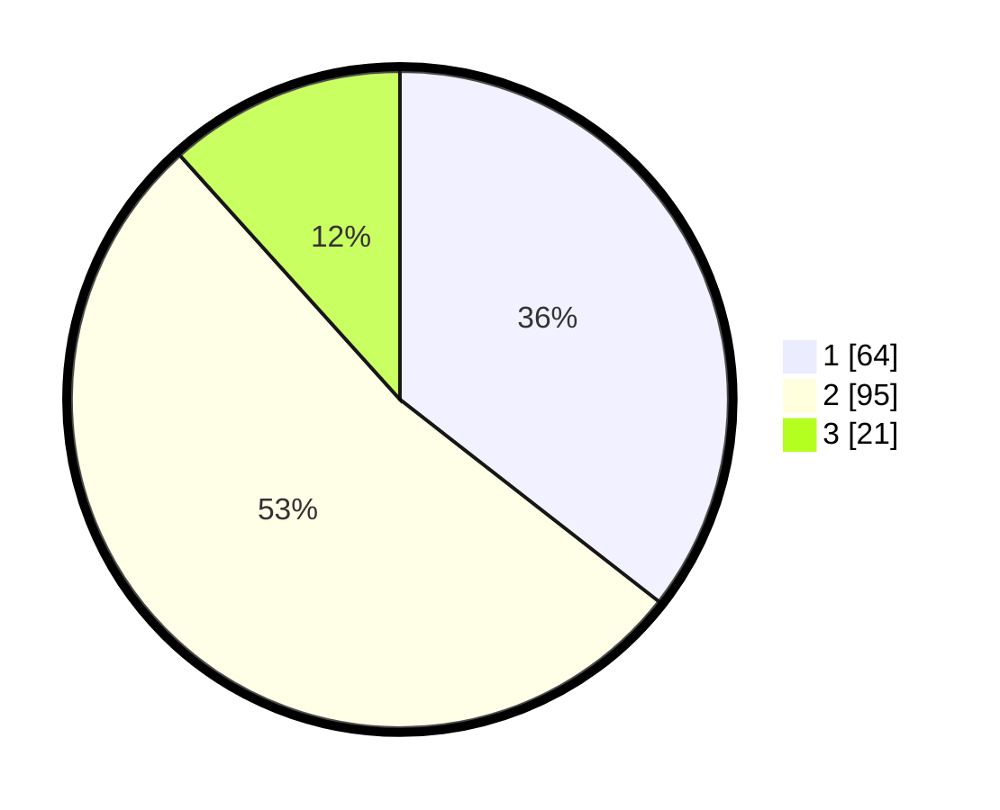

# Hasil

## Grafik

## Tabel

| No. | Nama Paslon    | Suara | Suara (raw) | Persentase |
|:--- |:-------------- | -----:| -----------:| ----------:|
| 1   | ANIES MUHAIMIN | 64    | [64][p-1]   | 35,56      |
| 2   | PRABOWO GIBRAN | 95    | [95][p-2]   | 52,78      |
| 3   | GANJAR MAHFUD  | 21    | [21][p-3]   | 11,67      |

[p-1]: https://github.com/gigit-pemilu/pemilu-2024-34-di-yogyakarta/blob/main/pilpres/hitung-suara/sub/34-di-yogyakarta/sub/02-bantul/sub/06-pandak/sub/2001-caturharjo/sub/026-tps/sub/paslon-1.txt
[p-2]: https://github.com/gigit-pemilu/pemilu-2024-34-di-yogyakarta/blob/main/pilpres/hitung-suara/sub/34-di-yogyakarta/sub/02-bantul/sub/06-pandak/sub/2001-caturharjo/sub/026-tps/sub/paslon-2.txt
[p-3]: https://github.com/gigit-pemilu/pemilu-2024-34-di-yogyakarta/blob/main/pilpres/hitung-suara/sub/34-di-yogyakarta/sub/02-bantul/sub/06-pandak/sub/2001-caturharjo/sub/026-tps/sub/paslon-3.txt

## Foto C Plano

https://sirekap-obj-formc.kpu.go.id/e35e/pemilu/ppwp/34/02/06/20/01/3402062001026-20240221-203332--ededf6d5-a9d9-4fc3-a613-2942d49bbbd1.jpg

https://sirekap-obj-formc.kpu.go.id/e35e/pemilu/ppwp/34/02/06/20/01/3402062001026-20240221-203353--98fd233d-b39f-4898-8b38-dc4231ce9278.jpg

https://sirekap-obj-formc.kpu.go.id/e35e/pemilu/ppwp/34/02/06/20/01/3402062001026-20240221-203422--c3436554-4c56-4324-807b-97896778901f.jpg

## Metadata

| Key        | Value               |
| ---------- | ------------------- |
| Time Stamp | 2024-02-24 22:31:28 |

