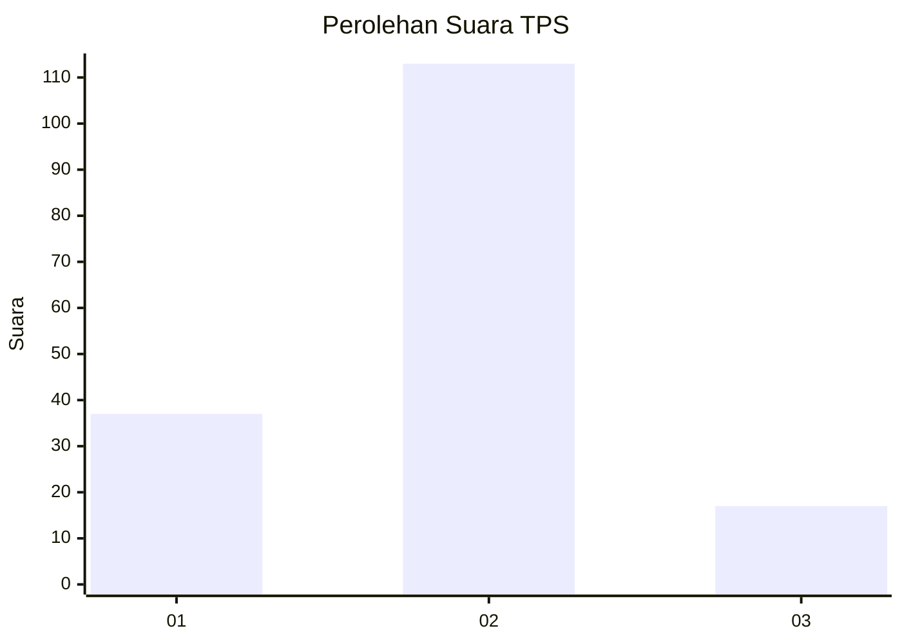

# Hasil

## Grafik

## Tabel

| No. | Nama Paslon    | Suara | Suara (raw) | Persentase |
|:--- |:-------------- | -----:| -----------:| ----------:|
| 1   | ANIES MUHAIMIN | 37    | [37][p-1]   | 22,16      |
| 2   | PRABOWO GIBRAN | 113   | [113][p-2]  | 67,66      |
| 3   | GANJAR MAHFUD  | 17    | [17][p-3]   | 10,18      |

[p-1]: https://github.com/gigit-pemilu/pemilu-2024-34-di-yogyakarta/blob/main/pilpres/hitung-suara/sub/34-di-yogyakarta/sub/02-bantul/sub/06-pandak/sub/2001-caturharjo/sub/027-tps/sub/paslon-1.txt
[p-2]: https://github.com/gigit-pemilu/pemilu-2024-34-di-yogyakarta/blob/main/pilpres/hitung-suara/sub/34-di-yogyakarta/sub/02-bantul/sub/06-pandak/sub/2001-caturharjo/sub/027-tps/sub/paslon-2.txt
[p-3]: https://github.com/gigit-pemilu/pemilu-2024-34-di-yogyakarta/blob/main/pilpres/hitung-suara/sub/34-di-yogyakarta/sub/02-bantul/sub/06-pandak/sub/2001-caturharjo/sub/027-tps/sub/paslon-3.txt

## Foto C Plano

https://sirekap-obj-formc.kpu.go.id/d384/pemilu/ppwp/34/02/06/20/01/3402062001027-20240218-161532--bcfaad13-1263-4cdb-8f3f-24e94bf6ba63.jpg

https://sirekap-obj-formc.kpu.go.id/d384/pemilu/ppwp/34/02/06/20/01/3402062001027-20240218-161200--3db22579-c193-4c0a-8a4c-42dcc6c5299e.jpg

https://sirekap-obj-formc.kpu.go.id/d384/pemilu/ppwp/34/02/06/20/01/3402062001027-20240218-162005--cdb65145-da10-422f-8fea-af779909f4f6.jpg

## Metadata

| Key        | Value               |
| ---------- | ------------------- |
| Time Stamp | 2024-02-24 22:31:28 |

