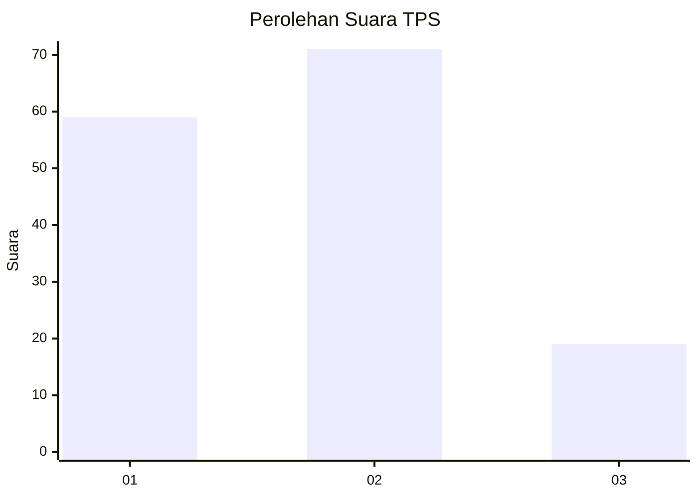
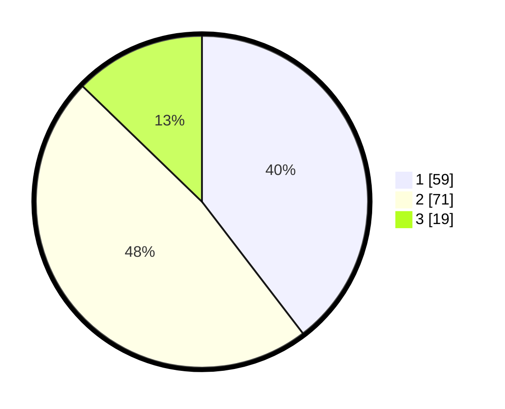

# Hasil

## Grafik

## Tabel

| No. | Nama Paslon    | Suara | Suara (raw) | Persentase |
|:--- |:-------------- | -----:| -----------:| ----------:|
| 1   | ANIES MUHAIMIN | 59    | [59][p-1]   | 39,60      |
| 2   | PRABOWO GIBRAN | 71    | [71][p-2]   | 47,65      |
| 3   | GANJAR MAHFUD  | 19    | [19][p-3]   | 12,75      |

[p-1]: https://github.com/gigit-pemilu/pemilu-2024-34-di-yogyakarta/blob/main/pilpres/hitung-suara/sub/34-di-yogyakarta/sub/02-bantul/sub/06-pandak/sub/2001-caturharjo/sub/030-tps/sub/paslon-1.txt
[p-2]: https://github.com/gigit-pemilu/pemilu-2024-34-di-yogyakarta/blob/main/pilpres/hitung-suara/sub/34-di-yogyakarta/sub/02-bantul/sub/06-pandak/sub/2001-caturharjo/sub/030-tps/sub/paslon-2.txt
[p-3]: https://github.com/gigit-pemilu/pemilu-2024-34-di-yogyakarta/blob/main/pilpres/hitung-suara/sub/34-di-yogyakarta/sub/02-bantul/sub/06-pandak/sub/2001-caturharjo/sub/030-tps/sub/paslon-3.txt

## Foto C Plano

https://sirekap-obj-formc.kpu.go.id/0f29/pemilu/ppwp/34/02/06/20/01/3402062001030-20240218-175026--90ea4962-656e-486b-bdc1-6a07bfb1fe60.jpg

https://sirekap-obj-formc.kpu.go.id/0f29/pemilu/ppwp/34/02/06/20/01/3402062001030-20240218-175109--bc69c91b-8e1c-4924-ac72-9c4f23bf0fe5.jpg

https://sirekap-obj-formc.kpu.go.id/0f29/pemilu/ppwp/34/02/06/20/01/3402062001030-20240218-180208--daaabfca-219c-4f73-b0ab-cb33b5f6a4c5.jpg

## Metadata

| Key        | Value               |
| ---------- | ------------------- |
| Time Stamp | 2024-02-19 06:16:00 |

