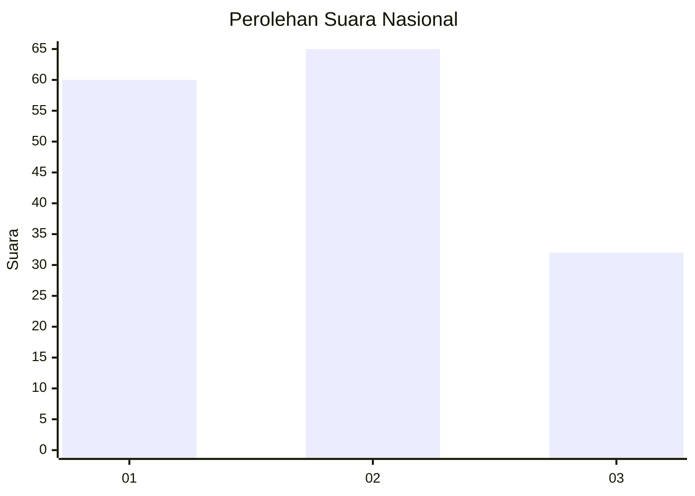
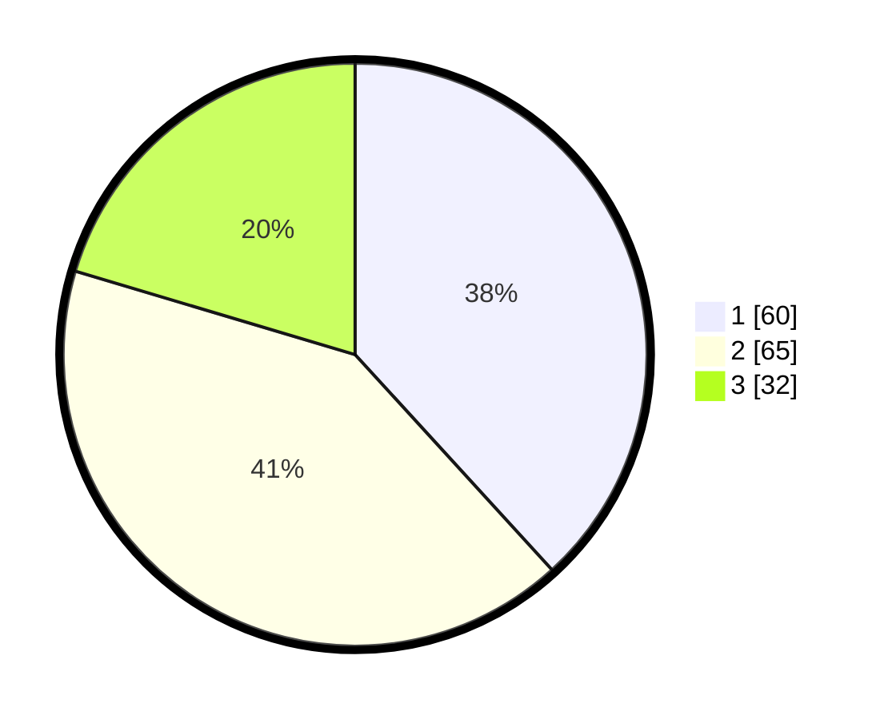

# Hasil

## Grafik

## Tabel

| No. | Nama Paslon    | Suara | Suara (raw) | Persentase |
|:--- |:-------------- | -----:| -----------:| ----------:|
| 1   | ANIES MUHAIMIN | 60    | [60][p-1]   | 38,22      |
| 2   | PRABOWO GIBRAN | 65    | [65][p-2]   | 41,40      |
| 3   | GANJAR MAHFUD  | 32    | [32][p-3]   | 20,38      |

[p-1]: https://github.com/gigit-pemilu/pemilu-2024/blob/main/pilpres/hitung-suara/sub/34-di-yogyakarta/sub/02-bantul/sub/06-pandak/sub/2001-caturharjo/sub/032-tps/sub/paslon-1.txt
[p-2]: https://github.com/gigit-pemilu/pemilu-2024/blob/main/pilpres/hitung-suara/sub/34-di-yogyakarta/sub/02-bantul/sub/06-pandak/sub/2001-caturharjo/sub/032-tps/sub/paslon-2.txt
[p-3]: https://github.com/gigit-pemilu/pemilu-2024/blob/main/pilpres/hitung-suara/sub/34-di-yogyakarta/sub/02-bantul/sub/06-pandak/sub/2001-caturharjo/sub/032-tps/sub/paslon-3.txt

## Foto C Plano

https://sirekap-obj-formc.kpu.go.id/235a/pemilu/ppwp/34/02/06/20/01/3402062001032-20240218-212038--c2d5aed1-d487-4cea-b6c3-c6ebbd0ae64d.jpg

https://sirekap-obj-formc.kpu.go.id/235a/pemilu/ppwp/34/02/06/20/01/3402062001032-20240218-211330--61a9a3a5-174c-43f0-9ee1-00956660fadc.jpg

https://sirekap-obj-formc.kpu.go.id/235a/pemilu/ppwp/34/02/06/20/01/3402062001032-20240218-212405--7bf1fdd3-0c47-45ec-9de7-2fb4ddaa1c8c.jpg

## Metadata

| Key        | Value               |
| ---------- | ------------------- |
| Time Stamp | 2024-02-25 15:00:00 |

