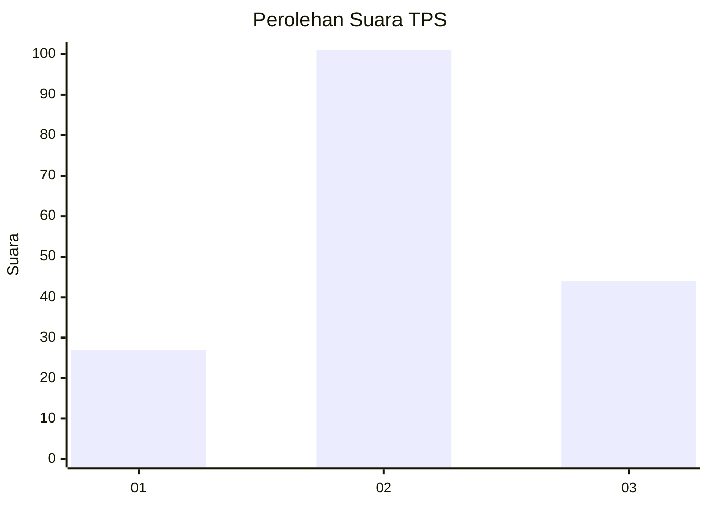
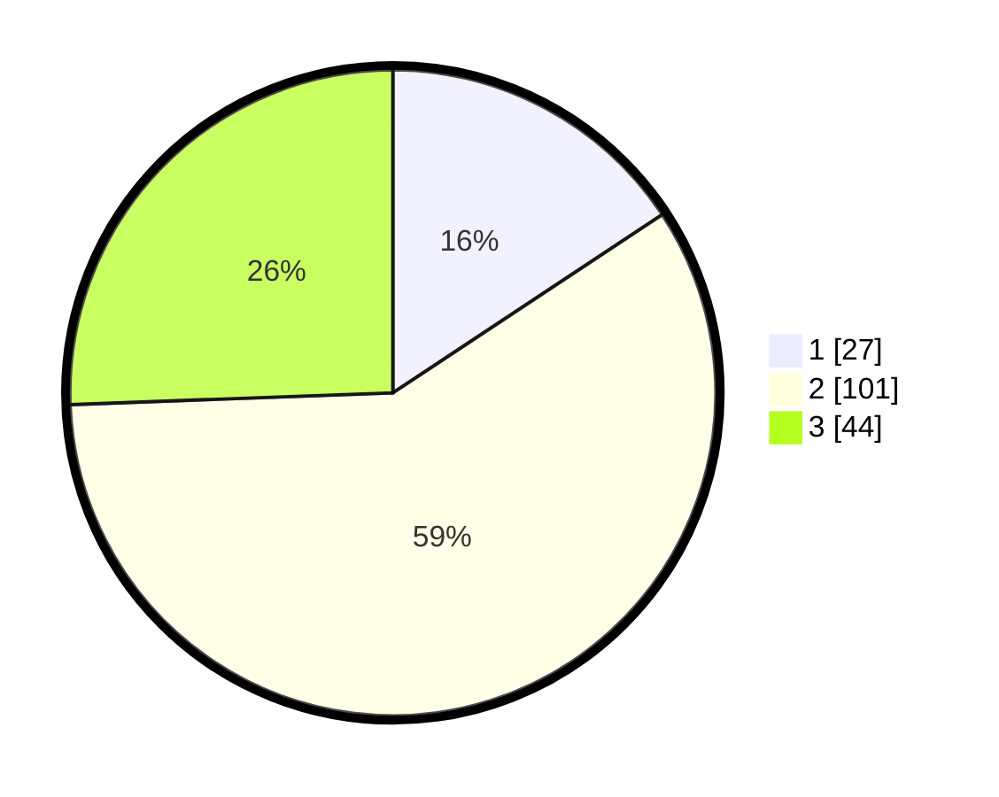

# Hasil

## Grafik

## Tabel

| No. | Nama Paslon    | Suara | Suara (raw) | Persentase |
|:--- |:-------------- | -----:| -----------:| ----------:|
| 1   | ANIES MUHAIMIN | 27    | [27][p-1]   | 15,70      |
| 2   | PRABOWO GIBRAN | 101   | [101][p-2]  | 58,72      |
| 3   | GANJAR MAHFUD  | 44    | [44][p-3]   | 25,58      |

[p-1]: https://github.com/gigit-pemilu/pemilu-2024-34-di-yogyakarta/blob/main/pilpres/hitung-suara/sub/34-di-yogyakarta/sub/02-bantul/sub/06-pandak/sub/2001-caturharjo/sub/034-tps/sub/paslon-1.txt
[p-2]: https://github.com/gigit-pemilu/pemilu-2024-34-di-yogyakarta/blob/main/pilpres/hitung-suara/sub/34-di-yogyakarta/sub/02-bantul/sub/06-pandak/sub/2001-caturharjo/sub/034-tps/sub/paslon-2.txt
[p-3]: https://github.com/gigit-pemilu/pemilu-2024-34-di-yogyakarta/blob/main/pilpres/hitung-suara/sub/34-di-yogyakarta/sub/02-bantul/sub/06-pandak/sub/2001-caturharjo/sub/034-tps/sub/paslon-3.txt

## Foto C Plano

https://sirekap-obj-formc.kpu.go.id/dc8a/pemilu/ppwp/34/02/06/20/01/3402062001034-20240214-155658--e2d4c678-4e33-407d-8f9d-070707256cf2.jpg

https://sirekap-obj-formc.kpu.go.id/dc8a/pemilu/ppwp/34/02/06/20/01/3402062001034-20240214-155333--b7c7b733-2050-44de-843e-96a945e53a49.jpg

https://sirekap-obj-formc.kpu.go.id/dc8a/pemilu/ppwp/34/02/06/20/01/3402062001034-20240214-155814--b5104284-94df-4d64-b803-a2eb8e168668.jpg

## Metadata

| Key        | Value               |
| ---------- | ------------------- |
| Time Stamp | 2024-02-14 21:46:01 |

