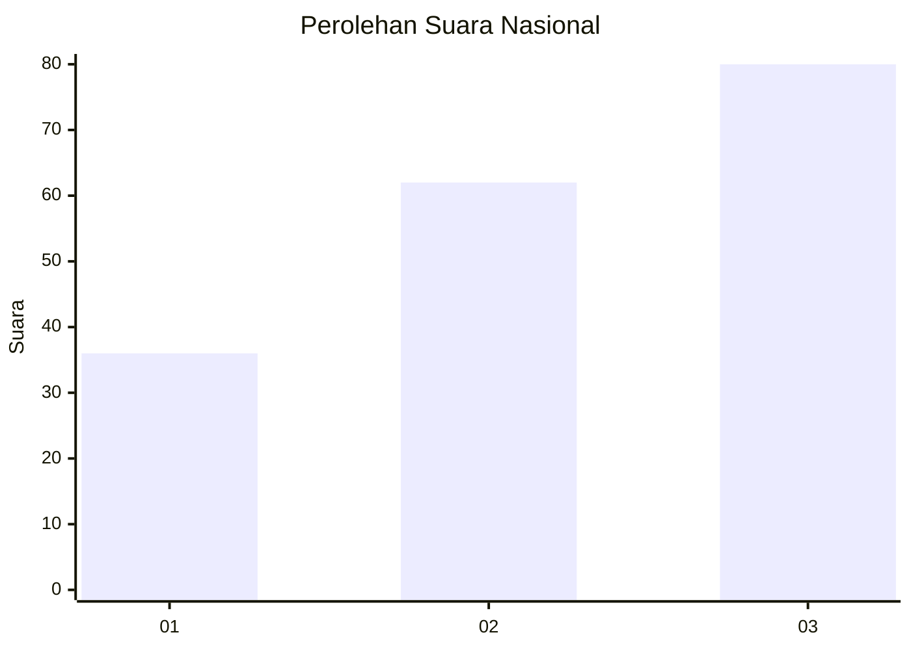
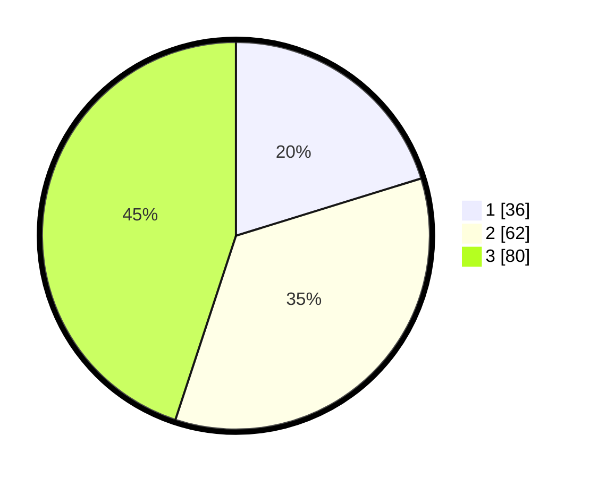

# Hasil

## Grafik

## Tabel

| No. | Nama Paslon    | Suara | Suara (raw) | Persentase |
|:--- |:-------------- | -----:| -----------:| ----------:|
| 1   | ANIES MUHAIMIN | 36    | [36][p-1]   | 20,22      |
| 2   | PRABOWO GIBRAN | 62    | [62][p-2]   | 34,83      |
| 3   | GANJAR MAHFUD  | 80    | [80][p-3]   | 44,94      |

[p-1]: https://github.com/gigit-pemilu/pemilu-2024/blob/main/pilpres/hitung-suara/sub/34-di-yogyakarta/sub/02-bantul/sub/06-pandak/sub/2001-caturharjo/sub/035-tps/sub/paslon-1.txt
[p-2]: https://github.com/gigit-pemilu/pemilu-2024/blob/main/pilpres/hitung-suara/sub/34-di-yogyakarta/sub/02-bantul/sub/06-pandak/sub/2001-caturharjo/sub/035-tps/sub/paslon-2.txt
[p-3]: https://github.com/gigit-pemilu/pemilu-2024/blob/main/pilpres/hitung-suara/sub/34-di-yogyakarta/sub/02-bantul/sub/06-pandak/sub/2001-caturharjo/sub/035-tps/sub/paslon-3.txt

## Foto C Plano

https://sirekap-obj-formc.kpu.go.id/312d/pemilu/ppwp/34/02/06/20/01/3402062001035-20240214-234630--90c04c06-db03-4935-8667-5c9435a63cde.jpg

https://sirekap-obj-formc.kpu.go.id/312d/pemilu/ppwp/34/02/06/20/01/3402062001035-20240214-234711--faadca83-c126-454b-8439-d34e0d3a2125.jpg

https://sirekap-obj-formc.kpu.go.id/312d/pemilu/ppwp/34/02/06/20/01/3402062001035-20240214-234840--c7a55665-1e1b-4da5-bb8e-5e30150a06c9.jpg

## Metadata

| Key        | Value               |
| ---------- | ------------------- |
| Time Stamp | 2024-02-15 15:00:29 |

