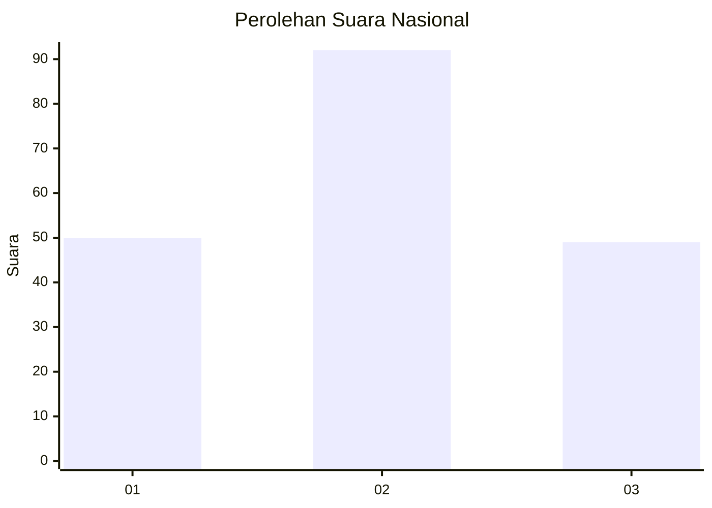
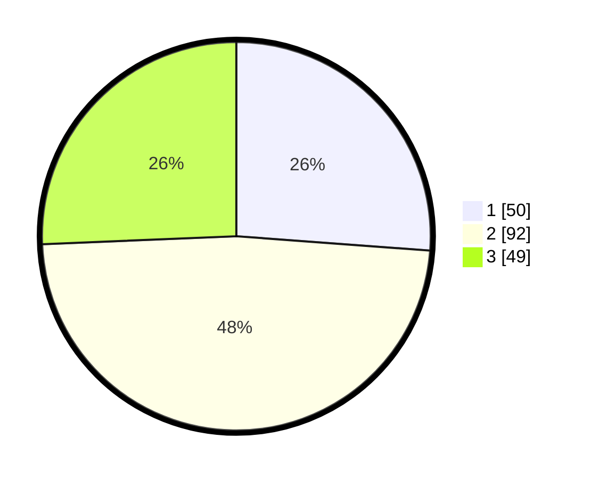

# Hasil

## Grafik

## Tabel

| No. | Nama Paslon    | Suara | Suara (raw) | Persentase |
|:--- |:-------------- | -----:| -----------:| ----------:|
| 1   | ANIES MUHAIMIN | 50    | [50][p-1]   | 26,18      |
| 2   | PRABOWO GIBRAN | 92    | [92][p-2]   | 48,17      |
| 3   | GANJAR MAHFUD  | 49    | [49][p-3]   | 25,65      |

[p-1]: https://github.com/gigit-pemilu/pemilu-2024/blob/main/pilpres/hitung-suara/sub/34-di-yogyakarta/sub/02-bantul/sub/06-pandak/sub/2001-caturharjo/sub/036-tps/sub/paslon-1.txt
[p-2]: https://github.com/gigit-pemilu/pemilu-2024/blob/main/pilpres/hitung-suara/sub/34-di-yogyakarta/sub/02-bantul/sub/06-pandak/sub/2001-caturharjo/sub/036-tps/sub/paslon-2.txt
[p-3]: https://github.com/gigit-pemilu/pemilu-2024/blob/main/pilpres/hitung-suara/sub/34-di-yogyakarta/sub/02-bantul/sub/06-pandak/sub/2001-caturharjo/sub/036-tps/sub/paslon-3.txt

## Foto C Plano

https://sirekap-obj-formc.kpu.go.id/be4e/pemilu/ppwp/34/02/06/20/01/3402062001036-20240214-235732--fed293d8-3911-40b4-a9ab-8e3e6995daca.jpg

https://sirekap-obj-formc.kpu.go.id/be4e/pemilu/ppwp/34/02/06/20/01/3402062001036-20240214-235827--a1b1fcd5-700c-4e26-af68-c36506388058.jpg

https://sirekap-obj-formc.kpu.go.id/be4e/pemilu/ppwp/34/02/06/20/01/3402062001036-20240214-235950--19cdfc86-4f80-4f70-9558-9c3699c668dc.jpg

## Metadata

| Key        | Value               |
| ---------- | ------------------- |
| Time Stamp | 2024-02-27 16:00:00 |

