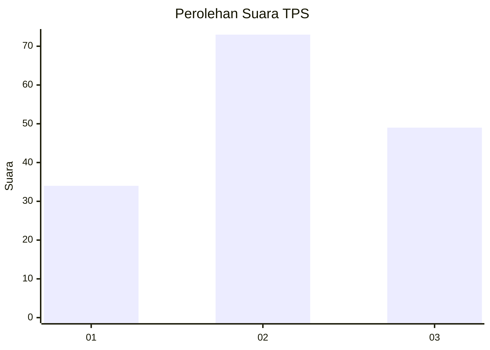
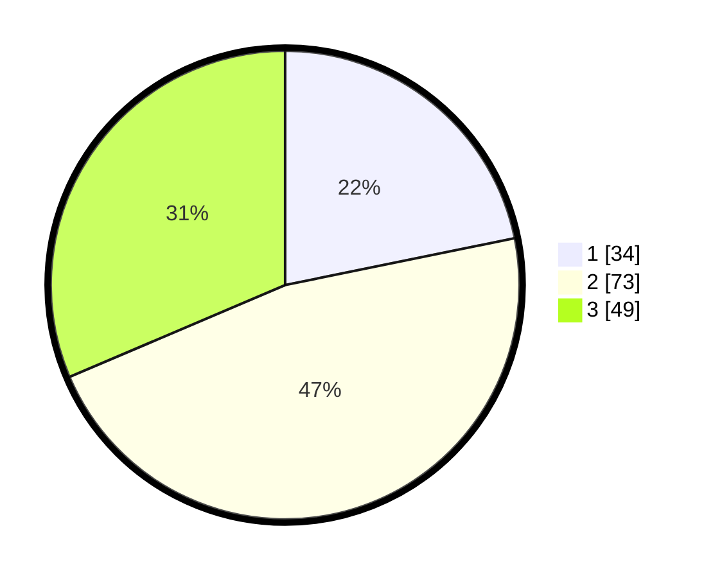

# Hasil

## Grafik

## Tabel

| No. | Nama Paslon    | Suara | Suara (raw) | Persentase |
|:--- |:-------------- | -----:| -----------:| ----------:|
| 1   | ANIES MUHAIMIN | 34    | [34][p-1]   | 21,79      |
| 2   | PRABOWO GIBRAN | 73    | [73][p-2]   | 46,79      |
| 3   | GANJAR MAHFUD  | 49    | [49][p-3]   | 31,41      |

[p-1]: https://github.com/gigit-pemilu/pemilu-2024-34-di-yogyakarta/blob/main/pilpres/hitung-suara/sub/34-di-yogyakarta/sub/02-bantul/sub/06-pandak/sub/2001-caturharjo/sub/038-tps/sub/paslon-1.txt
[p-2]: https://github.com/gigit-pemilu/pemilu-2024-34-di-yogyakarta/blob/main/pilpres/hitung-suara/sub/34-di-yogyakarta/sub/02-bantul/sub/06-pandak/sub/2001-caturharjo/sub/038-tps/sub/paslon-2.txt
[p-3]: https://github.com/gigit-pemilu/pemilu-2024-34-di-yogyakarta/blob/main/pilpres/hitung-suara/sub/34-di-yogyakarta/sub/02-bantul/sub/06-pandak/sub/2001-caturharjo/sub/038-tps/sub/paslon-3.txt

## Foto C Plano

https://sirekap-obj-formc.kpu.go.id/0806/pemilu/ppwp/34/02/06/20/01/3402062001038-20240215-000351--642ffff3-e740-48f6-9ada-a13885c5d662.jpg

https://sirekap-obj-formc.kpu.go.id/0806/pemilu/ppwp/34/02/06/20/01/3402062001038-20240215-000453--5e92119c-2cff-40dc-92c8-e36f70982882.jpg

https://sirekap-obj-formc.kpu.go.id/0806/pemilu/ppwp/34/02/06/20/01/3402062001038-20240215-000558--456934e0-bf36-4fd4-b1b6-1f9944fec1bf.jpg

## Metadata

| Key        | Value               |
| ---------- | ------------------- |
| Time Stamp | 2024-02-25 10:00:00 |

