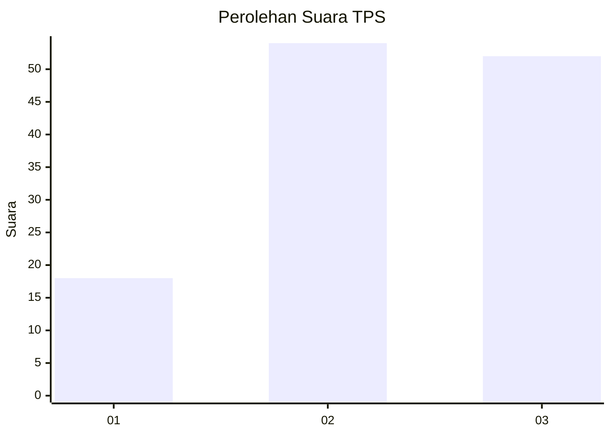
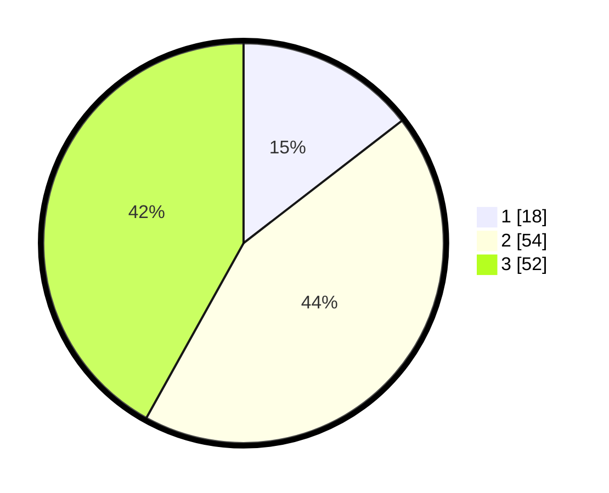

# Hasil

## Grafik

## Tabel

| No. | Nama Paslon    | Suara | Suara (raw) | Persentase |
|:--- |:-------------- | -----:| -----------:| ----------:|
| 1   | ANIES MUHAIMIN | 18    | [18][p-1]   | 14,52      |
| 2   | PRABOWO GIBRAN | 54    | [54][p-2]   | 43,55      |
| 3   | GANJAR MAHFUD  | 52    | [52][p-3]   | 41,94      |

[p-1]: https://github.com/gigit-pemilu/pemilu-2024-34-di-yogyakarta/blob/main/pilpres/hitung-suara/sub/34-di-yogyakarta/sub/02-bantul/sub/06-pandak/sub/2001-caturharjo/sub/039-tps/sub/paslon-1.txt
[p-2]: https://github.com/gigit-pemilu/pemilu-2024-34-di-yogyakarta/blob/main/pilpres/hitung-suara/sub/34-di-yogyakarta/sub/02-bantul/sub/06-pandak/sub/2001-caturharjo/sub/039-tps/sub/paslon-2.txt
[p-3]: https://github.com/gigit-pemilu/pemilu-2024-34-di-yogyakarta/blob/main/pilpres/hitung-suara/sub/34-di-yogyakarta/sub/02-bantul/sub/06-pandak/sub/2001-caturharjo/sub/039-tps/sub/paslon-3.txt

## Foto C Plano

https://sirekap-obj-formc.kpu.go.id/4678/pemilu/ppwp/34/02/06/20/01/3402062001039-20240219-113931--f8c9ee14-0bbf-4952-af7e-f3105f678b69.jpg

https://sirekap-obj-formc.kpu.go.id/4678/pemilu/ppwp/34/02/06/20/01/3402062001039-20240219-113413--ae079d49-4748-415c-96fd-ea119cbcf4b5.jpg

https://sirekap-obj-formc.kpu.go.id/4678/pemilu/ppwp/34/02/06/20/01/3402062001039-20240219-114230--278c2751-4a68-408e-b0f9-62483ffbd1d8.jpg

## Metadata

| Key        | Value               |
| ---------- | ------------------- |
| Time Stamp | 2024-02-20 11:00:00 |

## DATA PEMILIH TETAP

Jumlah pemilih dalam DPT: **138**.
 * L: **69**.
 * P: **69**.

## DATA PENGGUNA HAK PILIH

Jumlah pengguna hak pilih dalam DPT: **127**.
 * L: **61**.
 * P: **66**.

Jumlah pengguna hak pilih dalam DPTb: **4**.
 * L: **3**.
 * P: **1**.

Jumlah pengguna hak pilih dalam DPK: **0**.
 * L: **0**.
 * P: **0**.

Jumlah pengguna hak pilih: **131**.
 * L: **64**.
 * P: **67**.

## JUMLAH SUARA SAH DAN TIDAK SAH

JUMLAH SELURUH SUARA SAH: **124**.

JUMLAH SUARA TIDAK SAH: **7**.

JUMLAH SELURUH SUARA SAH DAN SUARA TIDAK SAH: **131**.

