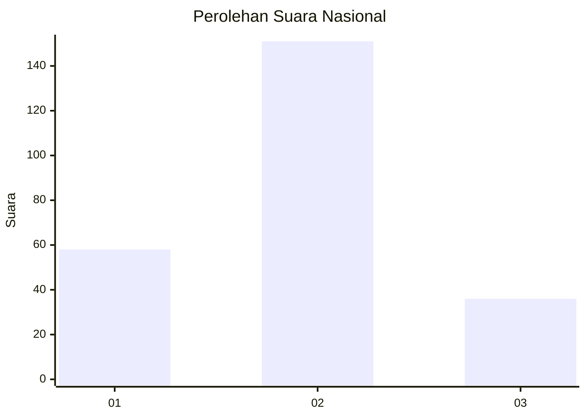
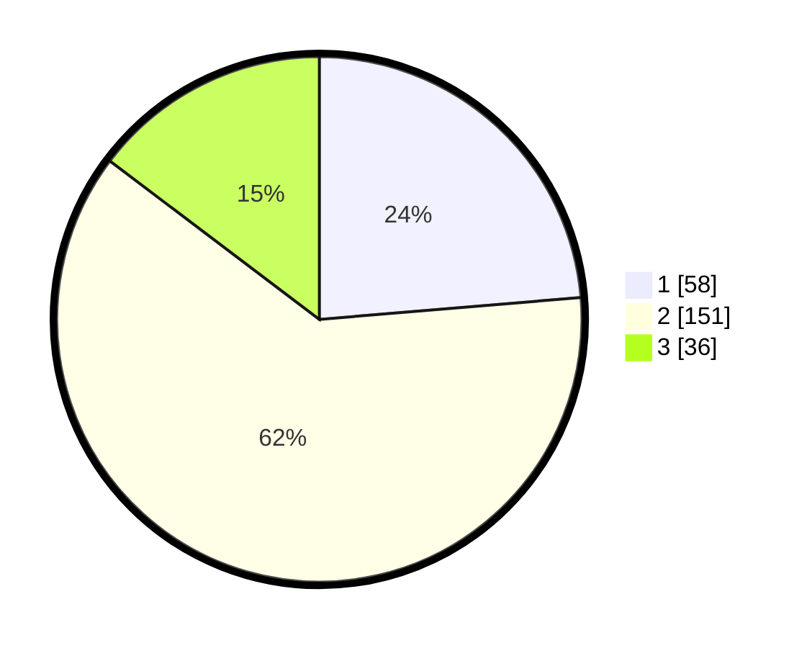

# Hasil

## Grafik

## Tabel

| No. | Nama Paslon    | Suara | Suara (raw) | Persentase |
|:--- |:-------------- | -----:| -----------:| ----------:|
| 1   | ANIES MUHAIMIN | 58    | [58][p-1]   | 23,67      |
| 2   | PRABOWO GIBRAN | 151   | [151][p-2]  | 61,63      |
| 3   | GANJAR MAHFUD  | 36    | [36][p-3]   | 14,69      |

[p-1]: https://github.com/gigit-pemilu/pemilu-2024/blob/main/pilpres/hitung-suara/sub/34-di-yogyakarta/sub/02-bantul/sub/06-pandak/sub/2001-caturharjo/sub/042-tps/sub/paslon-1.txt
[p-2]: https://github.com/gigit-pemilu/pemilu-2024/blob/main/pilpres/hitung-suara/sub/34-di-yogyakarta/sub/02-bantul/sub/06-pandak/sub/2001-caturharjo/sub/042-tps/sub/paslon-2.txt
[p-3]: https://github.com/gigit-pemilu/pemilu-2024/blob/main/pilpres/hitung-suara/sub/34-di-yogyakarta/sub/02-bantul/sub/06-pandak/sub/2001-caturharjo/sub/042-tps/sub/paslon-3.txt

## Foto C Plano

https://sirekap-obj-formc.kpu.go.id/990d/pemilu/ppwp/34/02/06/20/01/3402062001042-20240221-202855--a39813d3-f683-4a37-b771-4bf05ad8549e.jpg

https://sirekap-obj-formc.kpu.go.id/990d/pemilu/ppwp/34/02/06/20/01/3402062001042-20240221-202915--c970f2c8-e4b9-4978-a148-26f2a7bd0ce0.jpg

https://sirekap-obj-formc.kpu.go.id/990d/pemilu/ppwp/34/02/06/20/01/3402062001042-20240221-202950--ad298e48-a4a7-42c6-89d4-a15211e9cc90.jpg

## Metadata

| Key        | Value               |
| ---------- | ------------------- |
| Time Stamp | 2024-02-24 22:31:28 |

