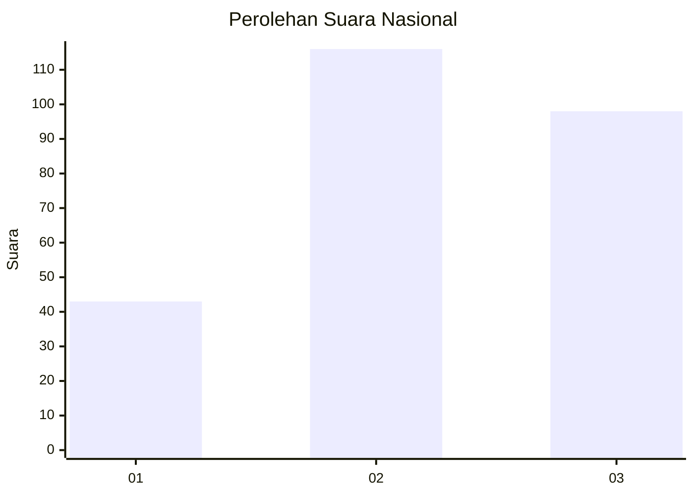
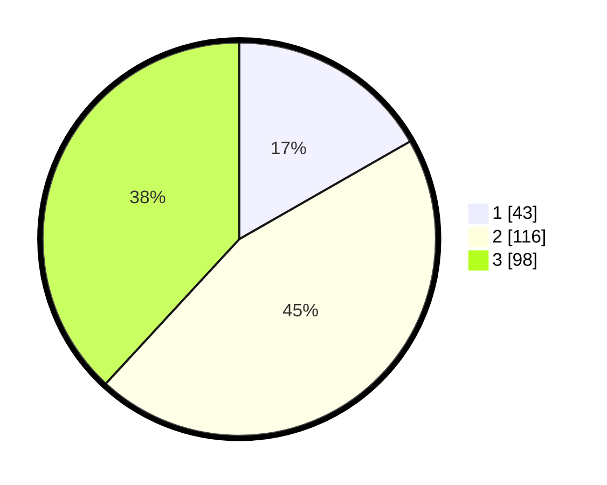

# Hasil

## Grafik

## Tabel

| No. | Nama Paslon    | Suara | Suara (raw) | Persentase |
|:--- |:-------------- | -----:| -----------:| ----------:|
| 1   | ANIES MUHAIMIN | 43    | [43][p-1]   | 16,73      |
| 2   | PRABOWO GIBRAN | 116   | [116][p-2]  | 45,14      |
| 3   | GANJAR MAHFUD  | 98    | [98][p-3]   | 38,13      |

[p-1]: https://github.com/gigit-pemilu/pemilu-2024/blob/main/pilpres/hitung-suara/sub/34-di-yogyakarta/sub/02-bantul/sub/06-pandak/sub/2002-triharjo/sub/001-tps/sub/paslon-1.txt
[p-2]: https://github.com/gigit-pemilu/pemilu-2024/blob/main/pilpres/hitung-suara/sub/34-di-yogyakarta/sub/02-bantul/sub/06-pandak/sub/2002-triharjo/sub/001-tps/sub/paslon-2.txt
[p-3]: https://github.com/gigit-pemilu/pemilu-2024/blob/main/pilpres/hitung-suara/sub/34-di-yogyakarta/sub/02-bantul/sub/06-pandak/sub/2002-triharjo/sub/001-tps/sub/paslon-3.txt

## Foto C Plano

https://sirekap-obj-formc.kpu.go.id/8ccb/pemilu/ppwp/34/02/06/20/02/3402062002001-20240214-221415--24cd9572-2312-4ba2-af1a-07b6451fb0b3.jpg

https://sirekap-obj-formc.kpu.go.id/8ccb/pemilu/ppwp/34/02/06/20/02/3402062002001-20240214-221630--74c945a3-776c-43b3-bb9f-f25c09b480ba.jpg

https://sirekap-obj-formc.kpu.go.id/8ccb/pemilu/ppwp/34/02/06/20/02/3402062002001-20240214-221822--75639a28-ec38-4823-89cf-7c1f73eda70b.jpg

## Metadata

| Key        | Value               |
| ---------- | ------------------- |
| Time Stamp | 2024-02-25 18:00:00 |

