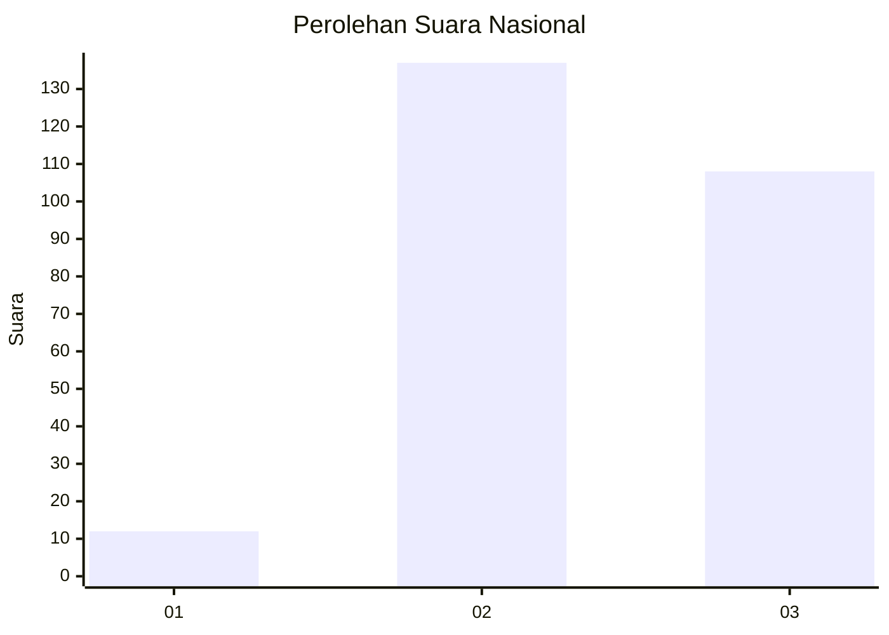
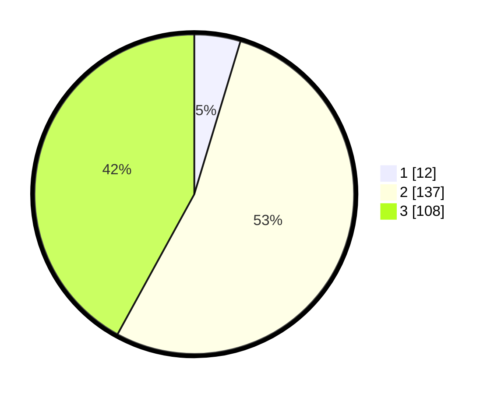

# Hasil

## Grafik

## Tabel

| No. | Nama Paslon    | Suara | Suara (raw) | Persentase |
|:--- |:-------------- | -----:| -----------:| ----------:|
| 1   | ANIES MUHAIMIN | 12    | [12][p-1]   | 4,67       |
| 2   | PRABOWO GIBRAN | 137   | [137][p-2]  | 53,31      |
| 3   | GANJAR MAHFUD  | 108   | [108][p-3]  | 42,02      |

[p-1]: https://github.com/gigit-pemilu/pemilu-2024/blob/main/pilpres/hitung-suara/sub/34-di-yogyakarta/sub/02-bantul/sub/06-pandak/sub/2002-triharjo/sub/002-tps/sub/paslon-1.txt
[p-2]: https://github.com/gigit-pemilu/pemilu-2024/blob/main/pilpres/hitung-suara/sub/34-di-yogyakarta/sub/02-bantul/sub/06-pandak/sub/2002-triharjo/sub/002-tps/sub/paslon-2.txt
[p-3]: https://github.com/gigit-pemilu/pemilu-2024/blob/main/pilpres/hitung-suara/sub/34-di-yogyakarta/sub/02-bantul/sub/06-pandak/sub/2002-triharjo/sub/002-tps/sub/paslon-3.txt

## Foto C Plano

https://sirekap-obj-formc.kpu.go.id/362e/pemilu/ppwp/34/02/06/20/02/3402062002002-20240216-165441--83e7f4c1-d42b-41f0-89e8-0d026340890f.jpg

https://sirekap-obj-formc.kpu.go.id/362e/pemilu/ppwp/34/02/06/20/02/3402062002002-20240216-165932--56de923b-a847-469f-b596-607e6a0e5928.jpg

https://sirekap-obj-formc.kpu.go.id/362e/pemilu/ppwp/34/02/06/20/02/3402062002002-20240216-170006--605d0714-cb20-4e40-8db4-e3e75c9fc411.jpg

## Metadata

| Key        | Value               |
| ---------- | ------------------- |
| Time Stamp | 2024-02-25 17:00:00 |

