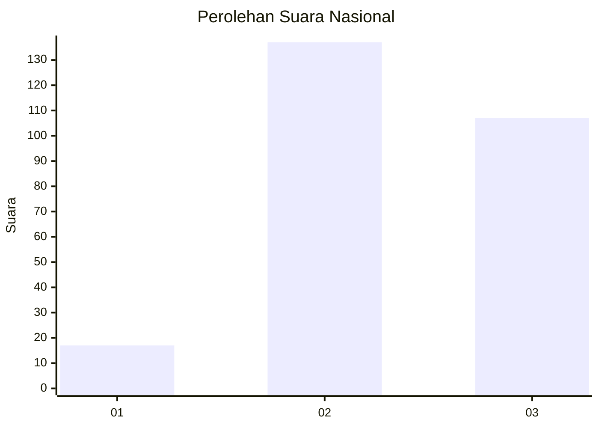
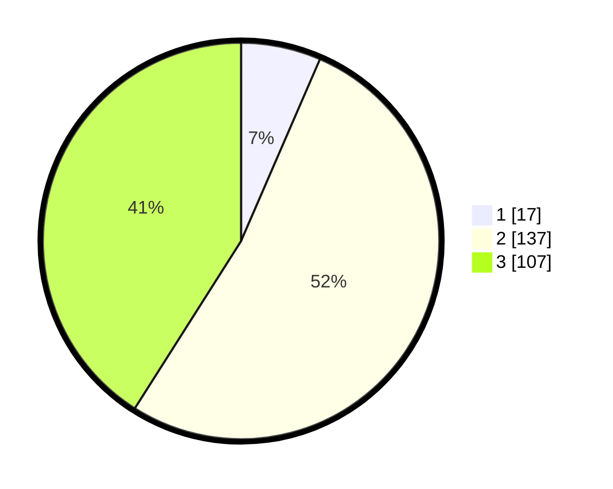

# Hasil

## Grafik

## Tabel

| No. | Nama Paslon    | Suara | Suara (raw) | Persentase |
|:--- |:-------------- | -----:| -----------:| ----------:|
| 1   | ANIES MUHAIMIN | 17    | [17][p-1]   | 6,51       |
| 2   | PRABOWO GIBRAN | 137   | [137][p-2]  | 52,49      |
| 3   | GANJAR MAHFUD  | 107   | [107][p-3]  | 41,00      |

[p-1]: https://github.com/gigit-pemilu/pemilu-2024/blob/main/pilpres/hitung-suara/sub/34-di-yogyakarta/sub/02-bantul/sub/06-pandak/sub/2002-triharjo/sub/003-tps/sub/paslon-1.txt
[p-2]: https://github.com/gigit-pemilu/pemilu-2024/blob/main/pilpres/hitung-suara/sub/34-di-yogyakarta/sub/02-bantul/sub/06-pandak/sub/2002-triharjo/sub/003-tps/sub/paslon-2.txt
[p-3]: https://github.com/gigit-pemilu/pemilu-2024/blob/main/pilpres/hitung-suara/sub/34-di-yogyakarta/sub/02-bantul/sub/06-pandak/sub/2002-triharjo/sub/003-tps/sub/paslon-3.txt

## Foto C Plano

https://sirekap-obj-formc.kpu.go.id/fc73/pemilu/ppwp/34/02/06/20/02/3402062002003-20240216-175353--d6a0526c-aefa-4670-bc1b-ec02815fcc1f.jpg

https://sirekap-obj-formc.kpu.go.id/fc73/pemilu/ppwp/34/02/06/20/02/3402062002003-20240216-175428--9f3e2a2f-d983-4d99-9c83-dd00e6dcb090.jpg

https://sirekap-obj-formc.kpu.go.id/fc73/pemilu/ppwp/34/02/06/20/02/3402062002003-20240216-175456--ec8681ef-f895-4178-94b5-e4d6277ce39d.jpg

## Metadata

| Key        | Value               |
| ---------- | ------------------- |
| Time Stamp | 2024-02-24 22:31:28 |

