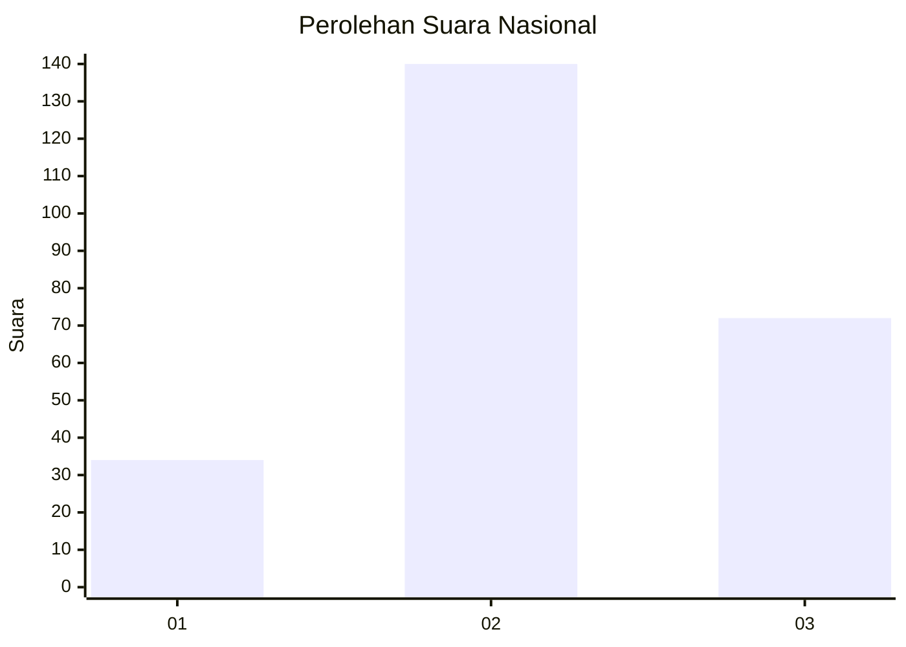
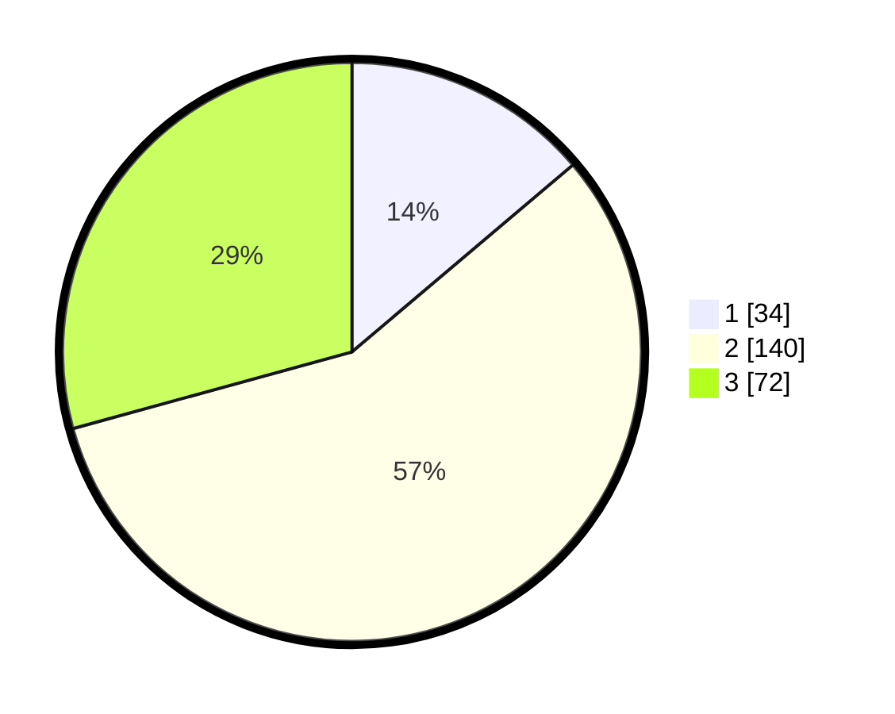

# Hasil

## Grafik

## Tabel

| No. | Nama Paslon    | Suara | Suara (raw) | Persentase |
|:--- |:-------------- | -----:| -----------:| ----------:|
| 1   | ANIES MUHAIMIN | 34    | [34][p-1]   | 13,82      |
| 2   | PRABOWO GIBRAN | 140   | [140][p-2]  | 56,91      |
| 3   | GANJAR MAHFUD  | 72    | [72][p-3]   | 29,27      |

[p-1]: https://github.com/gigit-pemilu/pemilu-2024/blob/main/pilpres/hitung-suara/sub/34-di-yogyakarta/sub/02-bantul/sub/06-pandak/sub/2002-triharjo/sub/005-tps/sub/paslon-1.txt
[p-2]: https://github.com/gigit-pemilu/pemilu-2024/blob/main/pilpres/hitung-suara/sub/34-di-yogyakarta/sub/02-bantul/sub/06-pandak/sub/2002-triharjo/sub/005-tps/sub/paslon-2.txt
[p-3]: https://github.com/gigit-pemilu/pemilu-2024/blob/main/pilpres/hitung-suara/sub/34-di-yogyakarta/sub/02-bantul/sub/06-pandak/sub/2002-triharjo/sub/005-tps/sub/paslon-3.txt

## Foto C Plano

https://sirekap-obj-formc.kpu.go.id/4d9f/pemilu/ppwp/34/02/06/20/02/3402062002005-20240214-232426--aa9f00cd-0c4e-4034-b6f6-15233b13d889.jpg

https://sirekap-obj-formc.kpu.go.id/4d9f/pemilu/ppwp/34/02/06/20/02/3402062002005-20240214-232504--731a7987-aa7f-4065-91a2-28288264f6ad.jpg

https://sirekap-obj-formc.kpu.go.id/4d9f/pemilu/ppwp/34/02/06/20/02/3402062002005-20240214-232545--951c3443-99f6-44fc-ace1-018b4e9ea7a1.jpg

## Metadata

| Key        | Value               |
| ---------- | ------------------- |
| Time Stamp | 2024-02-24 22:31:28 |

