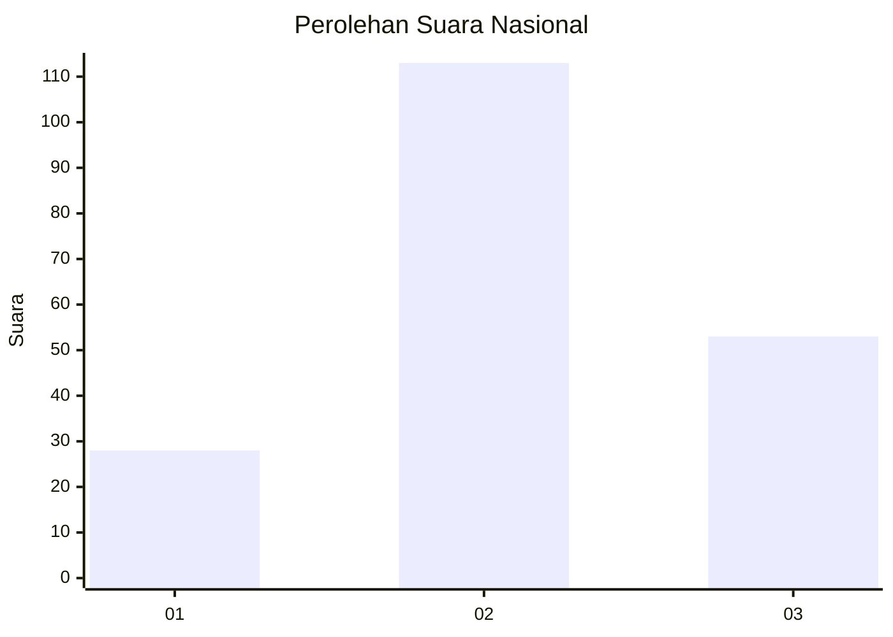
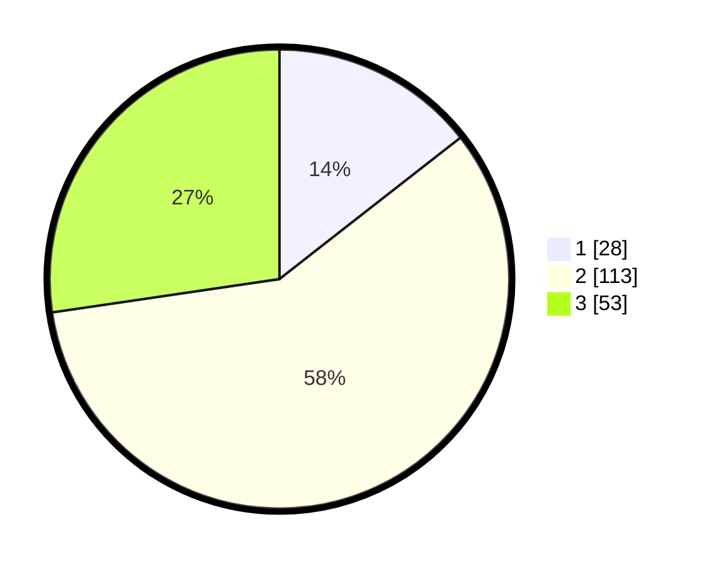

# Hasil

## Grafik

## Tabel

| No. | Nama Paslon    | Suara | Suara (raw) | Persentase |
|:--- |:-------------- | -----:| -----------:| ----------:|
| 1   | ANIES MUHAIMIN | 28    | [28][p-1]   | 14,43      |
| 2   | PRABOWO GIBRAN | 113   | [113][p-2]  | 58,25      |
| 3   | GANJAR MAHFUD  | 53    | [53][p-3]   | 27,32      |

[p-1]: https://github.com/gigit-pemilu/pemilu-2024/blob/main/pilpres/hitung-suara/sub/34-di-yogyakarta/sub/02-bantul/sub/06-pandak/sub/2002-triharjo/sub/006-tps/sub/paslon-1.txt
[p-2]: https://github.com/gigit-pemilu/pemilu-2024/blob/main/pilpres/hitung-suara/sub/34-di-yogyakarta/sub/02-bantul/sub/06-pandak/sub/2002-triharjo/sub/006-tps/sub/paslon-2.txt
[p-3]: https://github.com/gigit-pemilu/pemilu-2024/blob/main/pilpres/hitung-suara/sub/34-di-yogyakarta/sub/02-bantul/sub/06-pandak/sub/2002-triharjo/sub/006-tps/sub/paslon-3.txt

## Foto C Plano

https://sirekap-obj-formc.kpu.go.id/982e/pemilu/ppwp/34/02/06/20/02/3402062002006-20240216-214206--d7a5549b-b3d4-43a2-95f8-7617c2c00082.jpg

https://sirekap-obj-formc.kpu.go.id/982e/pemilu/ppwp/34/02/06/20/02/3402062002006-20240216-214233--25cd5331-4ff4-4f03-b55b-8c07834b6138.jpg

https://sirekap-obj-formc.kpu.go.id/982e/pemilu/ppwp/34/02/06/20/02/3402062002006-20240216-214303--56cb0b5c-f8a9-47a3-b4a6-687498097597.jpg

## Metadata

| Key        | Value               |
| ---------- | ------------------- |
| Time Stamp | 2024-02-24 22:31:28 |

