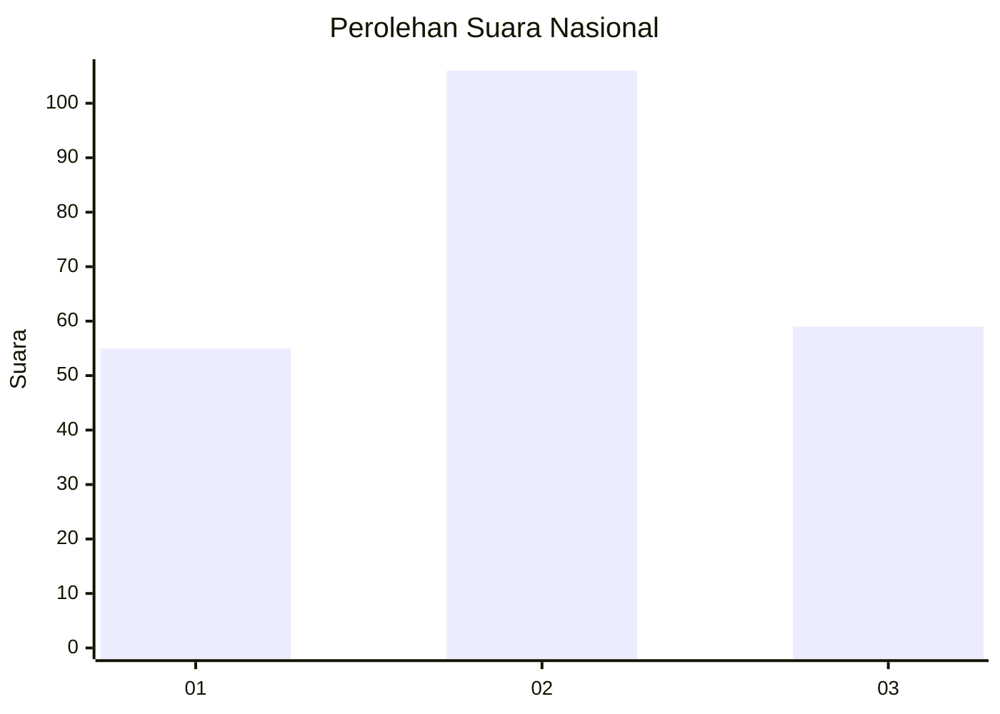
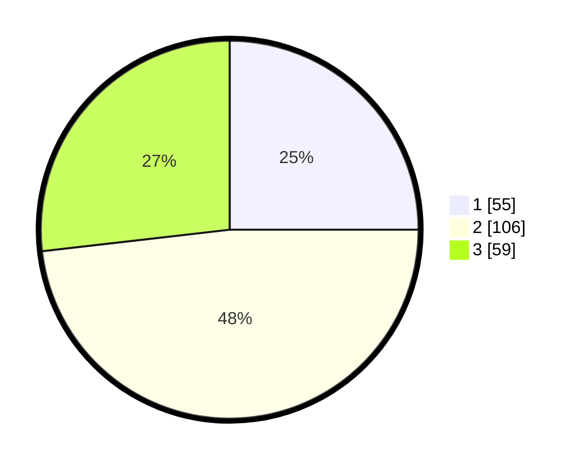

# Hasil

## Grafik

## Tabel

| No. | Nama Paslon    | Suara | Suara (raw) | Persentase |
|:--- |:-------------- | -----:| -----------:| ----------:|
| 1   | ANIES MUHAIMIN | 55    | [55][p-1]   | 25,00      |
| 2   | PRABOWO GIBRAN | 106   | [106][p-2]  | 48,18      |
| 3   | GANJAR MAHFUD  | 59    | [59][p-3]   | 26,82      |

[p-1]: https://github.com/gigit-pemilu/pemilu-2024/blob/main/pilpres/hitung-suara/sub/34-di-yogyakarta/sub/02-bantul/sub/06-pandak/sub/2002-triharjo/sub/007-tps/sub/paslon-1.txt
[p-2]: https://github.com/gigit-pemilu/pemilu-2024/blob/main/pilpres/hitung-suara/sub/34-di-yogyakarta/sub/02-bantul/sub/06-pandak/sub/2002-triharjo/sub/007-tps/sub/paslon-2.txt
[p-3]: https://github.com/gigit-pemilu/pemilu-2024/blob/main/pilpres/hitung-suara/sub/34-di-yogyakarta/sub/02-bantul/sub/06-pandak/sub/2002-triharjo/sub/007-tps/sub/paslon-3.txt

## Foto C Plano

https://sirekap-obj-formc.kpu.go.id/15e4/pemilu/ppwp/34/02/06/20/02/3402062002007-20240217-100108--42876d12-5f25-402a-8e98-02e261978675.jpg

https://sirekap-obj-formc.kpu.go.id/15e4/pemilu/ppwp/34/02/06/20/02/3402062002007-20240217-100140--4ee6e005-1b89-47a0-a2b1-5c44b807e073.jpg

https://sirekap-obj-formc.kpu.go.id/15e4/pemilu/ppwp/34/02/06/20/02/3402062002007-20240217-100423--97cb4d75-db14-4d02-bd23-aa748ed9932f.jpg

## Metadata

| Key        | Value               |
| ---------- | ------------------- |
| Time Stamp | 2024-02-24 22:31:28 |

