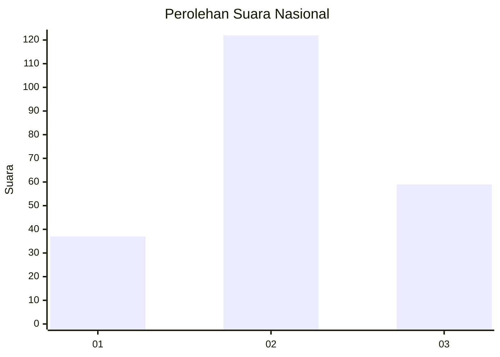
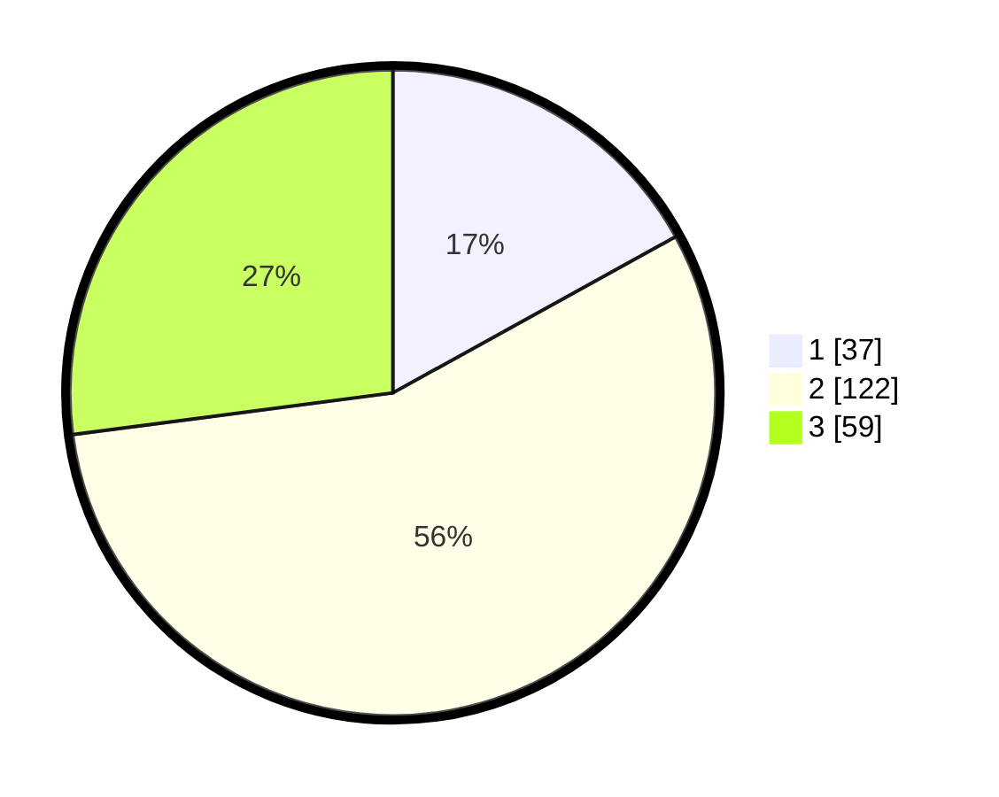

# Hasil

## Grafik

## Tabel

| No. | Nama Paslon    | Suara | Suara (raw) | Persentase |
|:--- |:-------------- | -----:| -----------:| ----------:|
| 1   | ANIES MUHAIMIN | 37    | [37][p-1]   | 16,97      |
| 2   | PRABOWO GIBRAN | 122   | [122][p-2]  | 55,96      |
| 3   | GANJAR MAHFUD  | 59    | [59][p-3]   | 27,06      |

[p-1]: https://github.com/gigit-pemilu/pemilu-2024/blob/main/pilpres/hitung-suara/sub/34-di-yogyakarta/sub/02-bantul/sub/06-pandak/sub/2002-triharjo/sub/008-tps/sub/paslon-1.txt
[p-2]: https://github.com/gigit-pemilu/pemilu-2024/blob/main/pilpres/hitung-suara/sub/34-di-yogyakarta/sub/02-bantul/sub/06-pandak/sub/2002-triharjo/sub/008-tps/sub/paslon-2.txt
[p-3]: https://github.com/gigit-pemilu/pemilu-2024/blob/main/pilpres/hitung-suara/sub/34-di-yogyakarta/sub/02-bantul/sub/06-pandak/sub/2002-triharjo/sub/008-tps/sub/paslon-3.txt

## Foto C Plano

https://sirekap-obj-formc.kpu.go.id/02fb/pemilu/ppwp/34/02/06/20/02/3402062002008-20240217-111751--1027cd80-83e3-4c14-a0da-21727c5e187e.jpg

https://sirekap-obj-formc.kpu.go.id/02fb/pemilu/ppwp/34/02/06/20/02/3402062002008-20240217-111814--99e3abc4-0bc4-4583-ae12-919fcb8aeb52.jpg

https://sirekap-obj-formc.kpu.go.id/02fb/pemilu/ppwp/34/02/06/20/02/3402062002008-20240217-112117--a5b655ee-5f28-455d-bd85-949395641821.jpg

## Metadata

| Key        | Value               |
| ---------- | ------------------- |
| Time Stamp | 2024-02-24 22:31:28 |

