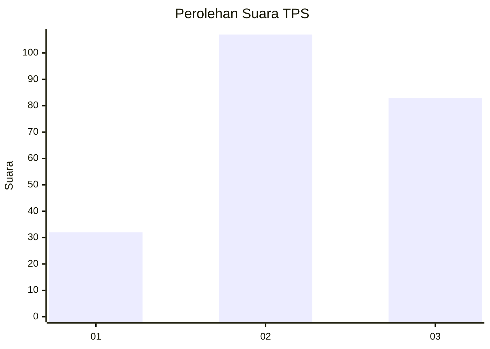
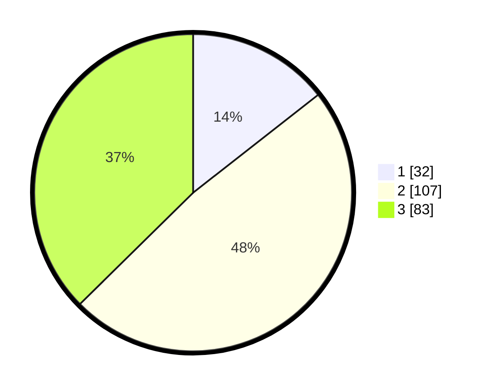

# Hasil

## Grafik

## Tabel

| No. | Nama Paslon    | Suara | Suara (raw) | Persentase |
|:--- |:-------------- | -----:| -----------:| ----------:|
| 1   | ANIES MUHAIMIN | 32    | [32][p-1]   | 14,41      |
| 2   | PRABOWO GIBRAN | 107   | [107][p-2]  | 48,20      |
| 3   | GANJAR MAHFUD  | 83    | [83][p-3]   | 37,39      |

[p-1]: https://github.com/gigit-pemilu/pemilu-2024-34-di-yogyakarta/blob/main/pilpres/hitung-suara/sub/34-di-yogyakarta/sub/02-bantul/sub/06-pandak/sub/2002-triharjo/sub/009-tps/sub/paslon-1.txt
[p-2]: https://github.com/gigit-pemilu/pemilu-2024-34-di-yogyakarta/blob/main/pilpres/hitung-suara/sub/34-di-yogyakarta/sub/02-bantul/sub/06-pandak/sub/2002-triharjo/sub/009-tps/sub/paslon-2.txt
[p-3]: https://github.com/gigit-pemilu/pemilu-2024-34-di-yogyakarta/blob/main/pilpres/hitung-suara/sub/34-di-yogyakarta/sub/02-bantul/sub/06-pandak/sub/2002-triharjo/sub/009-tps/sub/paslon-3.txt

## Foto C Plano

https://sirekap-obj-formc.kpu.go.id/468c/pemilu/ppwp/34/02/06/20/02/3402062002009-20240217-120822--9c512dcd-39a6-4866-a2a1-8336d771254e.jpg

https://sirekap-obj-formc.kpu.go.id/468c/pemilu/ppwp/34/02/06/20/02/3402062002009-20240217-120841--54a94e1d-bfcc-4327-b83e-4989c8577edb.jpg

https://sirekap-obj-formc.kpu.go.id/468c/pemilu/ppwp/34/02/06/20/02/3402062002009-20240217-121015--ed259258-a396-4a93-b5e7-e526968c5ff9.jpg

## Metadata

| Key        | Value               |
| ---------- | ------------------- |
| Time Stamp | 2024-02-24 22:31:28 |

