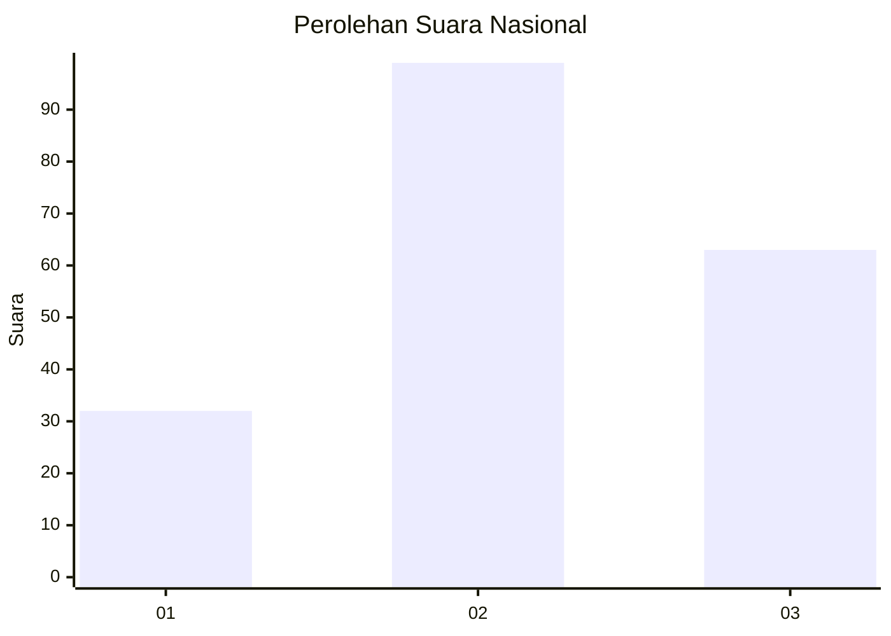
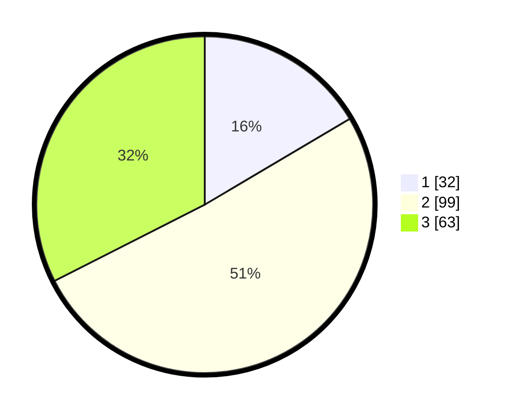

# Hasil

## Grafik

## Tabel

| No. | Nama Paslon    | Suara | Suara (raw) | Persentase |
|:--- |:-------------- | -----:| -----------:| ----------:|
| 1   | ANIES MUHAIMIN | 32    | [32][p-1]   | 16,49      |
| 2   | PRABOWO GIBRAN | 99    | [99][p-2]   | 51,03      |
| 3   | GANJAR MAHFUD  | 63    | [63][p-3]   | 32,47      |

[p-1]: https://github.com/gigit-pemilu/pemilu-2024/blob/main/pilpres/hitung-suara/sub/34-di-yogyakarta/sub/02-bantul/sub/06-pandak/sub/2002-triharjo/sub/011-tps/sub/paslon-1.txt
[p-2]: https://github.com/gigit-pemilu/pemilu-2024/blob/main/pilpres/hitung-suara/sub/34-di-yogyakarta/sub/02-bantul/sub/06-pandak/sub/2002-triharjo/sub/011-tps/sub/paslon-2.txt
[p-3]: https://github.com/gigit-pemilu/pemilu-2024/blob/main/pilpres/hitung-suara/sub/34-di-yogyakarta/sub/02-bantul/sub/06-pandak/sub/2002-triharjo/sub/011-tps/sub/paslon-3.txt

## Foto C Plano

https://sirekap-obj-formc.kpu.go.id/bd7a/pemilu/ppwp/34/02/06/20/02/3402062002011-20240217-135250--15677e43-fc8c-4814-a554-a9771ba9c08f.jpg

https://sirekap-obj-formc.kpu.go.id/bd7a/pemilu/ppwp/34/02/06/20/02/3402062002011-20240217-135310--88b4417e-db92-4980-8ab1-526ebfaaa8e3.jpg

https://sirekap-obj-formc.kpu.go.id/bd7a/pemilu/ppwp/34/02/06/20/02/3402062002011-20240217-135352--dc0ed4a1-0068-4e14-9a54-1c9e45414f89.jpg

## Metadata

| Key        | Value               |
| ---------- | ------------------- |
| Time Stamp | 2024-02-24 22:31:28 |

